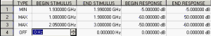
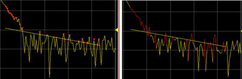
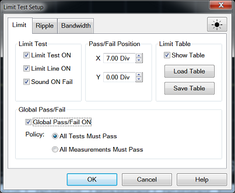
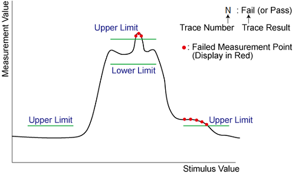
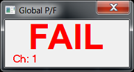
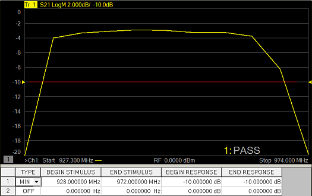
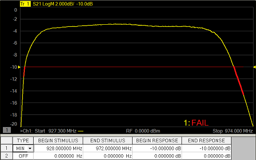

# Using Limit Lines

* * *

Limit lines allow you to compare measurement data to performance constraints
that you define.

  * [Overview](Use_Limits_to_Test_Devices.md#limits)

  * [Create and Edit Limit Lines](Use_Limits_to_Test_Devices.md#limit_lines)

  * [Display and Test with Limit Lines](Use_Limits_to_Test_Devices.md#limit_testing)

  * [Limit Test Setup](use_limits_to_test_devices.md#LimitSetup)

  * [Point Limit Test](use_limits_to_test_devices.md#Point_Limit_Test)

  * [Saving/Recalling Limit Table](use_limits_to_test_devices.md#SaveRecallTable)

  * [Displaying Judgement Result of Limit Test](use_limits_to_test_devices.md#JudgeResult)

  * [Testing with Sufficient Data Points](Use_Limits_to_Test_Devices.md#Testing)

[Other Analyze Data topics](Analyze_Data.md)

Overview

Limit lines are visual representations on the VNA screen of the specified
limits for a measurement. You can use limit lines to do the following:

  * Give the operator visual guides when tuning devices.

  * Provide standard criteria for meeting device specification.

  * Show the comparison of data versus specifications.

Limit testing compares the measured data with defined limits, and provides
optional Pass or Fail information for each measured data point.

You can have up to 100 discrete lines for each measurement trace allowing you
to test all aspects of your DUT response.

Limit lines and limit testing are NOT available with Smith Chart or Polar
display format. If limit lines are ON and you change to Smith Chart or Polar
format, the analyzer will automatically disable the limit lines and limit
testing.

By default, limit lines are drawn in the same color as the trace on which they
are created. However, all limit lines can be drawn in Red by setting a
preference. [Learn more](../System/Preferences.md#RedLimitLines).

Create and Edit Limit Lines

You can create limit lines for all measurement traces. The limit lines are the
same color as the measurement trace.

Limit lines are made up of discrete lines with four coordinates:

  * BEGIN and END stimulus - X-axis values.

  * BEGIN and END response - Y-axis values.

Limit Table

#### How to turn Limit Table ON/OFF  
  
---  
Using Hardkey/SoftTab/Softkey  
  
  1. Press Math > Analysis.
  2. Click Limit Table > Limit to turn ON/OFF the Limit Table.

  
  
  

Note: To ADD a limit line to the table, change the last limit line to either
MAX or MIN

  1. In the Type area of the Limit Table, select MIN or MAX for Limit Line 1.

     * The MIN value will fail measurements BELOW this limit.

     * The MAX value will fail measurements ABOVE this limit.

  2. Click BEGIN STIMULUS for Limit Segment 1. Enter the desired value.

  3. Click END STIMULUS for Limit Segment 1. Enter the desired value.

  4. Click BEGIN RESPONSE for Limit Segment 1. Enter the desired value.

  5. Click END RESPONSE for Limit Segment 1. Enter the desired value.

  6. Repeat Steps 1-5 for each desired limit line.

Displaying and Testing with Limit Lines

After creating limit lines, you can then choose to display or hide them for
each trace. The specified limits remain valid even if limit lines are not
displayed.

Limit testing cannot be performed on memory traces.

You can choose to provide a visual and / or audible PASS / FAIL indication.

With limit testing turned ON:

  * Any portion of the measurement trace that fails is displayed in red.

  * Any portion of the measurement trace that does NOT fail remains unchanged and silent.

### Display failed trace points or trace segments

You can display the data points that fail limit line testing as red dots or as
a red trace segment. The default behavior (red trace) can be changed with a
Preference setting. [Learn how.](../System/Preferences.md#dots)

  
---  
Red dots |  Red trace segment  
  
### PASS is the default mode of Pass / Fail testing.

A data point will FAIL only if a measured point falls outside of the limits.

  * If the limit line is set to OFF, the entire trace will PASS.

  * If there is no measured data point at a limit line stimulus setting, that point will PASS.

## Limit Test Setup

#### How to set Limit Test Setup  
  
---  
Using Hardkey/SoftTab/Softkey  
  
  1. Press Math > Analysis.
  2. Click Limits... and then select Limit tab on the dialog box.

  
  
Limit Test dialog box help  
---  

### Limit Test

Limit Test ON Check the box to compare the data trace to the limits and
display PASS or FAIL. Limit Line ON Check the box to make the limits visible
on the screen. (Testing still occurs if the limits are not visible.) Sound ON
Fail Check the box to make the VNA beep when a point on the data trace fails
the limit test.

### Pass/Fail Position

Sets the position of the Limit Line Pass/Fail status indicator on the VNA
screen. X \- X-axis position. 0 is far left; 10 is far right. Y \- X-axis
position. 0 is bottom; 10 is top. Show Table Shows the table that allows you
to create and edit limits. Load Table \- Recall the saved limit table. [Learn
more.](use_limits_to_test_devices.htm#SaveRecallTable) Save Table \- Save the
limit table. [Learn more.](use_limits_to_test_devices.md#SaveRecallTable)
Note: To ADD a limit line to the table, change the last limit line to either
MAX or MIN.

### Global Pass/Fail

The Pass/Fail indicator provides an easy way to monitor the status of ALL
measurements. Global Pass/Fail ON Check to display the Global Pass/Fail
status. Policy: Choose which of the following must occur for the Global
Pass/Fail status to display PASS:

  * All Tests (with Limit Test ON) Must Pass \- This setting reads the results from the Limit Tests. If all tests (with Limit Test ON) PASS, then the Global Pass/Fail status will PASS.
  * All Measurements Must Pass \- This more critical setting shows FAIL unless all measured data points fall within established test limits and Limit Test is ON. Note: In this mode, if one measurement does NOT have Limit Test ON, Global Pass/Fail will show FAIL.

Note: In this mode, if one measurement does NOT have Limit Test ON, Global
Pass/Fail will show FAIL. [Learn more about displaying and testing with Limits
(scroll up)](Use_Limits_to_Test_Devices.htm#limit_testing)  
  
## Saving/Recalling Limit Test Table

The limit test table can be saved in a file and recalled later for use on the
screen. The file is saved in the csv format (with the extension *.csv), and
values are saved as a character string with the unit. The csv formatted file
can also be reused in spreadsheet software made for PCs.

#### How to turn Save or Load Limit Test Table  
  
---  
Using Hardkey/SoftTab/Softkey  
  
  1. Press Math > Analysis.
  2. Click Limits... and then select Limit tab on the dialog box.
  3. Click Load Table to recall the saved Limit Table.
  4. Click Save Table to save the Limit Table.

  
No Programming are available for this feature  
  
Load Table

  1. To recall the saved limit table, click Load Table from the Limit Test Setup dialog and a Recall dialog box is open. At this time, CSV Files (with the extension *.csv) is selected as the file type.

  2. Specify the folder that contains the file and then select the file. Click Recall to recall the saved limit table on the screen.

Note: You can recall a limit table from a trace on any channel independently
of the channel and trace that were active when the limit table was saved to
the file.

Save Table

  1. To save the limit table, click Save Table from the Limit Test Setup dialog and a Save As dialog box is open. At this time, CSV Files (with the extension *.csv) is selected as the file type.

  2. Specify any folder in which you want to save the file and enter the file name. Click Save to save the limit table displayed on the screen to a file.

### The limit table is saved in the following format:

  * First line indicates the type of limit test of the instrument.

  * Second line indicates the revision of the limit test.

  * Third line indicates a header for the segment items that are output from the fourth line onward.

  * From the fourth line onward, the segment data are output.

Sample Limit table saved format:

"# E5080 Limit Test"

"# Revision: 1.00"

TYPE, BEGIN STIMULUS, END STIMULUS, BEGIN RESPONSE, END RESPONSE

MIN, 5.600000 GHz, 7.500000 GHz, -30.000000dB, -30.000000dB

MAX, 4.700000 GHz, 5.800000 GHz, -10.000000dB, -10.000000dB

MAX, 6.200000 GHz, 8.000000 GHz, -10.000000dB, -10.000000dB

OFF, 0.000000 Hz, 0.0000000 Hz, 0.00dB

## Displaying Judgement Result of Limit Test

### Judgment result of measurement points and trace

Measurement points that fail are displayed in red on the screen. The judgment
result of the trace is indicated by Pass or Fail displayed at the right bottom
of screen by default and its position can be edited.

### Judgment Result of Channels

If a channel has a judgment result of fail, the result is displayed at Global
Pass/Fail dialog box when the [Global Pass/Fail
ON](use_limits_to_test_devices.htm#GlobalPassFail) is checked (ON). It will be
judged as failed if one or more unsatisfactory trace exists in any of the
limit test within the channel.

#### How to turn ON/OFF Global Pass/Fail  
  
---  
Using Hardkey/SoftTab/Softkey  
  
  1. Press Math > Analysis.
  2. Click Limits... and then select Limit tab on the dialog box.
  3. Checked the box to turn ON the Global Pass/Fail.
  4. Clear the box to turn OFF the Global Pass/Fail.

  
  
  
Testing with Sufficient Data Points

When System > System Setup > Preferences, Limit: Test the nearest measurement
point is NOT checked, limits are checked only at the actual measured data
points. Therefore, It is possible for a device to be out of specification
without a limit test failure indication if the data point density is
insufficient.

The following image is a data trace of an actual filter using 11 data points
(approximately one every vertical graticule). The filter is being tested with
a minimum limit line (any data point under the limit line fails).

Although the data trace is clearly below the limit line on both sides of the
filter skirts, there is a PASS indication because there is no data point being
measured at these frequencies.

The following image shows the exact same conditions, except the number of data
points is increased to 1601. The filter now fails the minimum limit test
indicated by the red data trace.

When System > System Setup > Preferences, Limit: Test the nearest measurement
point is checked, the limit is compared with the nearest measurement point.

## Limit Test at certain point

The limit test at a certain frequency point is available. This function is the
similar with one in the E5071C. When (Begin Stimulus = End Stimulus) and
(Begin Response = End Response) in the limit test table, the point is defined
as point limit test and v (for max) or ^ (for min) symbol is displayed.

When you use the point limit test, confirm if System > System Setup >
Preferences, Limit: Test the nearest measurement point is checked. In this
setting, even if the test point (= Begin Stimulus = End Stimulus) is not
located at measurement point, the result is determined using the nearest
measurement point.

* * *

