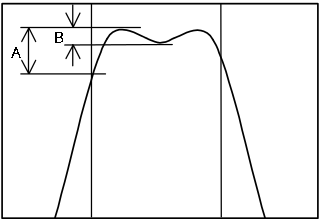
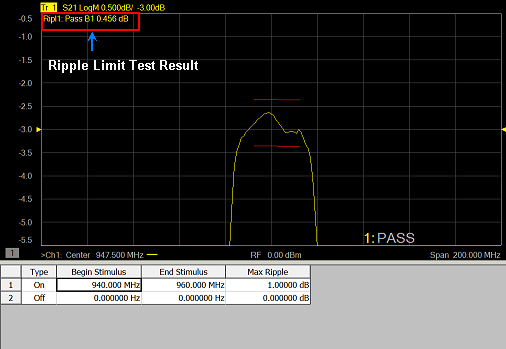
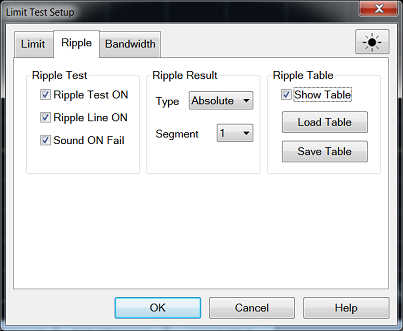

# Use Ripple Limit Test

  * Overview

  * [Concept of Ripple Limit Test](use_ripple_limit_test.md#ConceptRipple)

  * [Create and Edit Ripple Limit Lines](use_ripple_limit_test.md#CreateEditRipple)

  * [Displaying Ripple Limit Test Results](use_ripple_limit_test.md#DisplayRipple)

  * [Ripple Limit Test Setup](use_ripple_limit_test.md#RippleSetup)

  * [Saving/Recalling Ripple Limit Table](use_ripple_limit_test.md#SaveRecallTable)

[Other 'Analyze Data' topics](analyze_data.md)

## Overview

The ripple limit function can be executed independently of limit test
function. Independently of the limit test, you can evaluate the measurement
results on a PASS/FAIL basis by setting a limit for the ripple. This function
is called the Ripple Limit Test.

In this picture, A is greater than B. Therefore, A is considered as the ripple
of the specified stimulus range.

The ripple limit function evaluates the measurement point values only.
Interpolated values are not used.

## Concept of Ripple Limit Test

The ripple limit test is a function for evaluating the results on a Pass/Fail
basis based on the ripple limit, which is set using the ripple limit table.
Ripple is defined as the difference between the largest and smallest value
within a specified stimulus range. You can specify up to 12 frequency bands,
which permits a test for each frequency band.

The ripple limit test judges the measurement as "Pass" when the ripple value
specified with the ripple limit is not exceeded by any of the measurement
points on the trace; Otherwise, it judges the measurement as "Fail." For the
measurement points in a stimulus range without a specified ripple limit, the
test judges the measurement as "Pass."

Note: The measurement point alone is the target of evaluation for pass/fail.
The interpolated part between measurement points is not evaluated.

The ripple limit is defined with the start point stimulus value, end point
stimulus value, ripple limit value and type (on/off). For detailed
information, see [Ripple Limit Table](use_ripple_limit_test.md#RippleTable).

While the ripple limit test function is turned on, the measurement points
corresponding to a "FAIL" judgment will be indicated in red on the screen and
the trace's test results based on the results of each measurement point will
be displayed (judged as "Fail" if one or more red measurement point exist on
the trace). For information on how to display the results, see [Ripple Limit
Setup](use_ripple_limit_test.htm#RippleSetup). You can also confirm the
channel test results on the screen (judged as "Fail" if one or more failed
traces appear in the limit test, ripple limit test or bandwidth limit test
within the channel).

## Create and Edit Ripple Limit Lines

You can create ripple limit lines for all measurement traces. The ripple limit
lines are the same color as the measurement trace.

Ripple limit lines are made up of discrete lines with three coordinates:

  * Begin Stimulus and End Stimulus - X-axis values.

  * Max Ripple - Y-axis values.

### Ripple Limit Table

You must configure the ripple limit before you can use the ripple limit test
function. You can specify a ripple limit table for each trace, where up to 12
ripple limit bands (frequency bands) can be configured.

#### How to turn ON/OFF Ripple Limit Table  
  
---  
Using Hardkey/SoftTab/Softkey  
  
  1. Press Math > Analysis.
  2. Click Limit Table > Ripple to turn ON/OFF the Ripple Table.

  
  
  
Note: To ADD a frequency band to the ripple limit table, change the last
ripple limit line to either ON or OFF.

Note: No frequency band is provided in the ripple limit table by default.

  1. In the Type area of the Ripple Limit Table, select ON or OFF for Ripple Limit Line 1.

     * ON - Band used for the ripple limit test.

     * OFF - Band not used for the ripple limit test.

  2. Click Begin Stimulus for Ripple Limit Segment 1. Enter the desired value.

  3. Click End Stimulus for Ripple Limit Segment 1. Enter the desired value.

  4. Click Max Ripple for Ripple Limit Segment 1. Enter the desired value.

  5. Repeat Steps 1-4 for each desired ripple limit line.

[How to turn ON/OFF the Ripple Limit
Table](use_ripple_limit_test.htm#RippleTable)

Note: Acceptable range for the stimulus value: -500G to +500G. If any out
ranging value is specified, it will be reset to fall within the range.

Note: Even if the VNA's sweep range is changed after the stimulus value has
been set, the stimulus value is not susceptible.

### Example of ripple limit configuration

  * The individual frequency bands for the ripple limit test can overlap each other; in this case, the ripple limit test is performed for each frequency band.

  * Even if the VNA's span value is set to zero, you must enter a parameter for both Begin Stimulus and End Stimulus.

  * If the data format is Smith chart or polar, the limit test is performed for the main response value among the two marker response values.

## Displaying Ripple Limit Test Results

### Test result for trace

The test result for the trace will be indicated as Pass or Fail in the upper-
left area of the graph. You can also display the ripple value at the selected
frequency band. If a trace is unsatisfactory, test results and ripple lines
are displayed by red color.

The result will be displayed as Ripln: Pass (or Fail) for each trace. n
denotes the trace number. Bn will be followed by the ripple value (if the
ripple display is turned off, only Bn will be displayed without the ripple
value).

### Global Pass/Fail

The Global Pass/Fail setting in the limit tab is applied to ripple limit test.
It will be judged as failed if one or more unsatisfactory trace exists in any
of the ripple limit test within the channel).

## Ripple Limit Test Setup

#### How to set Ripple Limit Test Setup  
  
---  
Using Hardkey/SoftTab/Softkey  
  
  1. Press Channel or Trace to select the trace on which you want to apply the ripple limit test function.
  2. Press Math > Analysis.
  3. Click Limits... and then select Ripple tab on the dialog box.

  
  
(Ripple) Limit Test Setup Dialog Box Help  
---  
 Ripple Test Ripple Test ON \- Check the box
to set the ripple test ON or OFF and also display PASS or FAIL. Ripple Line ON
\- Check the box to make the ripple limit line visible on the screen (Test
still runs even though the ripple line does not turns on). Ripple Result Type
\- Sets how the ripple values are displayed. Available settings are Off,
Absolute value (difference between maximum and minimum values within the band)
display and Margin (difference between absolute value of ripple and ripple
limit) display. Segment \- Enable to specify a ripple limit table up to 12
stimulus segment for each trace. Ripple Table Show Table \- Check the box to
show the table that allows you to create and edit limits. Load Table \- Recall
the saved ripple limit table. [Learn
more.](use_ripple_limit_test.htm#SaveRecallTable) Save Table \- Save the
ripple limit table. [Learn more.](use_ripple_limit_test.md#SaveRecallTable)  
  
## Saving/Recalling Ripple Limit Table

The ripple limit table can be saved in a file and recalled later for use on
the screen. The file is saved in the csv format (with the extension *.csv),
and values are saved as a character string with the unit. The csv formatted
file can also be reused in spreadsheet software made for PCs.

#### How to set Ripple Limit Setup  
  
---  
Using Hardkey/SoftTab/Softkey  
  
  1. Press Math > Analysis.
  2. Click Limits... and then select Ripple tab on the dialog box.
  3. Click Load Table to recall the saved Ripple Limit Table.
  4. Click Save Table to save the Ripple Limit Table.

  
No Programming are available for this feature  
  
Load Table

  1. To recall the saved ripple limit table, click Load Table from the Ripple Limit Test Setup dialog and a Recall dialog box is open. At this time, CSV Files (with the extension *.csv) is selected as the file type.

  2. Specify the folder that contains the file and then select the file. Click Recall to recall the saved ripple limit table on the screen.

Note: You can recall a ripple limit table from a trace on any channel
independently of the channel and trace that were active when the ripple limit
table was saved to the file.

Save Table

  1. To save the ripple limit table, click Save Table from the Ripple Limit Test Setup dialog and a Save As dialog box is open. At this time, CSV Files (with the extension *.csv) is selected as the file type.

  2. Specify any folder in which you want to save the file and enter the file name. Click Save to save the ripple limit table displayed on the screen to a file.

### The ripple limit table is saved in the following format:

  * First line indicates the type of limit test of the instrument.

  * Second line indicates the revision of the limit test.

  * Third line indicates a header for the segment items that are output from the fourth line onward.

  * From the fourth line onward, the segment data are output.

Sample Ripple Limit table saved format:

"# E5080 Ripple Limit Test"

"# Revision: 1.00"

TYPE, BEGIN STIMULUS, END STIMULUS, MAX RIPPLE

ON, 933.0000000 MHz, 964.0000000 MHz, 1.5 dB

ON, 938.0000000 MHz, 953.0000000 MHz, 500 mdB

* * *

