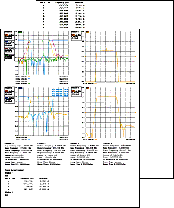
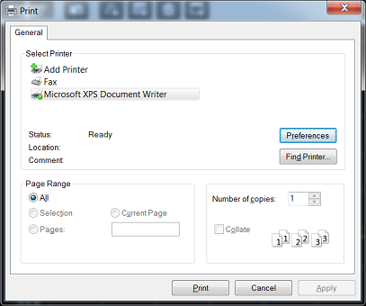
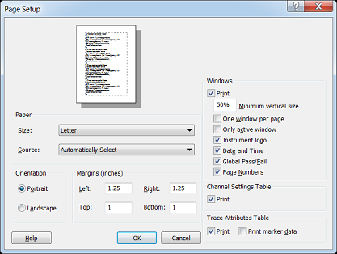

# Print a Displayed Measurement

* * *

The analyzer allows you to print a displayed measurement to a printer or to a
file. The printer can be either networked or local.

  * [Connecting a Printer](Print.md#Connecting to a printer)

  * [Printing](Print.md#Printing)

[Other Outputting Data topics](Outputting_Data.md)

Connecting a Printer

You can connect a printer to one of the VNA USB ports or to the LAN connector.

### To Add a Printer

Note: If you try to print from the VNA application and the Add Printer Wizard
appears, click Cancel and add the printer using the following procedure.

  1. From the VNA application, press System > Main > Minimize Application.

  2. On the Windows taskbar, click Devices and Printers.

  3. Double-click Add Printer.

  4. Follow the instructions in the Add Printer Wizard.

For more information, refer to Microsoft Windows Help or your printer
documentation.

Printing

  * [Print a Hardcopy](Print.md#printout)

  * [Page Setup](Print.md#printoptions)

  * [Print to File](Print.md#Printtofile)

The measurement information on the screen can be printed to any local or
networked printer that is connected to the VNA. The graphic below shows an
example of how a screen-capture image appears when printed. The Page Setup
settings allows you to customize the printed form of the measurement
information.

#### How to Print a Hardcopy  
  
---  
Using Hardkey/SoftTab/Softkey  
  
  1. Press System > Print.
  2. Click Print....

  
No programming commands are available for this feature.  
  

Note: For information on the choices in the Print dialog box, see Windows
Help.

Page Setup

The Page Setup dialog allows flexibility in the appearance that measurement
data is printed. After setting up the page, click File, then Print... to
obtain a hard-copy.

#### How to select Page Setup  
  
---  
Using Hardkey/SoftTab/Softkey  
  
  1. Press System > Print > Page Setup....

OR

  1.      1. Press System > System Setup > Preferences.....
     2. Click the Page Setup... button on Preferences dialog box.

  
  
Page Setup dialog box help  
---  
 Paper, Orientation, and Margins These
settings do NOT survive a VNA shutdown. See Windows Help for information on
these settings.

### Windows

The following VNA-specific settings DO survive a VNA shutdown: Minimum
vertical size Adjust to change the amount of a page that the measurement
window fills. The adjustment range is from 40 to 100%. One window per page
Check to print one window per page. Clear to print all selected windows
without a forced page break. Only active window Check to print only the active
window. Clear to print all windows. Instrument logo Check to print the
Keysight logo to the header. Data and Time Check to add the current date and
time to the header. Global Pass/Fail Check to add the Global Pass/Fail status
to the header. Page Numbers Check to add page numbers (1 of n) to the header.

### Channel Settings Table

Print Check to print the channel settings table. Segment data can no longer be
printed.

### Trace Attributes Table

Print Check to print the Trace Attributes Table. The Trace Attributes are
measurement type, correction factors ON or OFF, smoothing, options, and marker
details. The Trace Attributes are listed by Trace ID# for each window. Each
Trace ID# can have multiple entries depending on the number of markers
associated with the trace. The marker details are marker number, position and
response. If there are multiple markers on a trace, the trace attributes are
only shown for the first marker. However, the trace attributes for the first
marker apply to all other markers on that trace. The options column can have
one or more options. D for Delay, M for Marker, G for Gating. Multiple options
selected would appear as follows: DMG. Print marker data Check to print all
marker data. The amount of data depends on how many markers are created.  
  
Print to a File

The analyzer can save a screen-capture image in any of the following formats:

  * .png (preferred format)

  * .bmp (bitmap)

  * .jpg

The analyzer automatically saves the file to the current path. If not
previously defined, the analyzer automatically selects the default path D:\\.

A .bmp file, like a .prn file, can be imported into software applications such
as Microsoft Excel, Word, or Paint to display a screen-capture image.

[See Save and Recall files for more information](SaveRecall.md#SaveAsDiag).

#### How to Print to a File  
  
---  
Using Hardkey/SoftTab/Softkey  
  
  1. Press System > Print > Print to File....

  
  
  
* * *

