# Save and Recall a File

* * *

You can save and recall files to and from an internal or external storage
device in a variety of file formats.

  * [How to Save Instrument State](SaveRecall.md#file_save)

  * [How to Save Measurement Data](SaveRecall.md#SaveDataAs)

  * [How to Recall a File](SaveRecall.md#file_recall)

  * [About Instrument State and Calibration Data](SaveRecall.md#State) ( .csa, .cst, .sta, .cal)

  * [About Measurement Data Files](SaveRecall.md#ASCII) (.prn, .snp, .cti, .csv, .mdf)

  * [Managing Files without a Mouse](SaveRecall.md#Manage_files)

[Other Data Outputting topics](Outputting_Data.md)

#### How to Save Instrument State and Calibration Files  
  
---  
Using Hardkey/SoftTab/Softkey  
  
  1. Press Save Recall > Save State or Save Other.

  
  
  
Save State Softtab help  
---  
Learn all about VNA Instrument State files. Save State \- Immediately saves
the VNA state, possibly calibration data and link to the selected filename by
depends on the Save Type. The selected filename is automatically generate in
the storage when you performed a save. Auto Save \- Saves state, calibration
data and link to the storage. Saves state and calibration data to the internal
storage in the D: folder. A filename is generated automatically using the
syntax "atxxx"; where xxx is a number that is increment by one when a new file
is Auto Saved. The filename is depends on the Save Type to save it in ".sta",
".csa" or ".cst". Save State As... \- Starts the Save As dialog box. (Not
available on M948xA and E5080A.) Save Register \- Immediately saves the
specified register (Register 1 to 8) to the selected filename by depends on
the Save Type. The selected filename is automatically generate in the storage
when you performed a save on selected register. _Save Type_ State \- Save VNA
state in .sta filename. State + Cal Data \- Save VNA state and calibration
data in .csa filename. State + Cal Link \- Save VNA state and calibration link
in .cst filename.  
  
Save Other Softtab help  
---  
Save Calset... & Save Screen... \- Starts the [Save
As](saverecall.htm#SaveAsDiag) dialog box. Save Data... \- Starts the [Save
Data As](saverecall.htm#SaveAsDiag) dialog box. Save User Preset... \- Start
the [User Preset](../s1_settings/preset_the_analyzer.md#PresetUserDefined)
dialog box.  
  
Save As dialog box help  
---  
Save Allows you to navigate to the directory where you want to save the file.
File name Displays the filename that you either typed in or clicked on in the
directory contents box. Note: Filenames (not including the path name) MUST be
limited to 64 characters. Save as type The following file types save
Instrument states and Calibration data. You can save, and later recall,
instrument settings and calibration data for all channels currently in use on
the analyzer. These file types are only recognized by Keysight VNA analyzers.
[Learn more about these file types](SaveRecall.md#Binary).

  * *.csa \- save Instrument state and actual Cal Set data (cal/state archive) Default selection.
  * *.cst \- save Instrument state and a link to the Cal Set data.
  * *.sta \- save Instrument state ONLY (no calibration data)
  * *.cal \- save actual Calibration data ONLY (no Instrument state)

Note: To save the screen as .bmp, .jpg, or .png graphics file types, click
File / Print to File. [Learn more.](Print.md#Printtofile) Save Saves the file
to the specified file name and directory.  
  
## Save VNA Measurement Data

#### How to Save Measurement Data  
  
---  
Using Hardkey/SoftTab/Softkey  
  
  1. Press Save Recall > Save Other > Save Data....

  
Save Data As Saves the current trace(s) to the specified type of file.  
  
Save Data As dialog box help  
---  
  
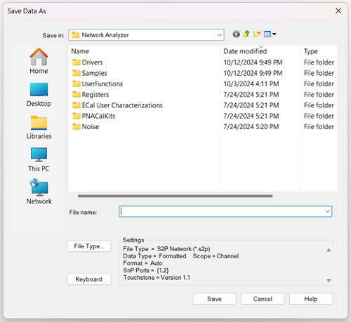

Note: Before saving measurement data, always [trigger a single]() measurement,
and then allow the channel to go into Hold. This ensures that the entire
measurement trace is saved.

Note: [Memory traces]() can only be saved in select file types (CTI, CSV, MDF)
when the “Scope” data setting is set to “Displayed Traces”.

Save in Allows you to navigate to the directory where you want to save the
file.

File name Displays the filename that you either typed in or clicked on in the
directory contents box.

To select a file type and change data settings, press File Type to launch the
File Type dialog:

File Type Choose from: (click each to learn more about each file type): *.prn,
*.SNP, *.SNPX. *.cti (citifile), *.csv, *.mdf.

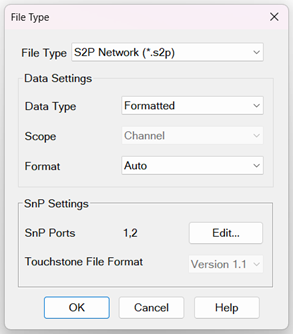

  * [FCA](../FreqOffset/FCA_Use.md), [GCA](../Applications/Gain_Compression_Application.md), [Swept IMD](../Applications/Swept_IMD.md), and [Swept IMDx](../Applications/Swept_IMDx.md) data can be saved to a special csv format. Learn how (FCA, GCA - Swept IMD)

  * S2P Noise Parameters (*.s2p) Trace and Noise Parameters (*.snp) - Save the noise figure parameters and S-parameters. [Learn more](Print.md).

  * To save the screen as .bmp, .jpg, or .png graphics file types, click File / Print / Print to File. [Learn more.](Print.md#printout)

  * Save Uncertainty (Opt S93015A/B) data (*.u*p, *.dsd, *.sdatcv). [Learn more](../S3_Cals/Dynamic_Uncertainty.md#Saving_Uncertainty_Data)

###

### Data Settings

This selection refers to the data processing stage of the data flow diagram:

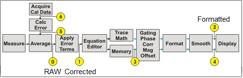

**Data Type****** |  **Description******  
---|---  
Corrected |  PRN, CSV, CTI, MDF Files: Saves data from Tap 1 after error correction and fixturing, if applicable. Does not include post-processing1 steps. SnP Network Files:

  * If user has chosen to save "Format=Auto" then the format of the first parameter saved to the file will be used as the format for all parameters.
  * Data is saved from the active channel in the following order:

  1. Save corrected parameters if they exist, from Tap 1.
  2. Otherwise save uncorrected parameters if they exist, from Tap 0.
  3. Otherwise, the parameter does not exist; save -200dB.

  
Formatted |  PRN, CSV, CTI, MDF Files: Saves data from Tap 2 (aka FDATA). Includes correction, fixturing, and post-processing1 steps, if applicable. SnP Network Files:  
Saves the S-parameters from the active channel in this order:

  1. Search displayed traces for SnP file parameters. Start at Tr1 and move sequentially through the list. If parameter not displayed go to (2). Save the first encountered missing S-parameter; skip duplicates and non-S-Parameters (this includes any trace with Trace Math or Equation on)3. Save data from Tap 2; Smoothing is not included when saving "Real/Imag".
  2. For SnP File parameters not assigned as traces:

  * Save corrected parameters if they exist, from Tap 1.
  * Otherwise save uncorrected parameters if they exist from Tap 0.
  * Otherwise, the parameter does not exist; save -200dB 

This data type selection applies gating on a per-trace basis, unlike the
Revision 2023 data type. For example, if gating is enabled for S11 but not for
S21, the saved data will only include gating for S11. If you have the same S
paramter in difference trace, assign to the smaller number trace for the
required trace. For example, thre are two traces for Tr 1: gated and Tr2: non-
gated. In this case, gated data is saved. Change non-gated to Tr1 to save th
non-gated data.  
Revision 2023 (for SnP only) |  This reproduces legacy operation from code shipping in 2023 for customers requiring backwards compatibility. Saves data from Tap 2

  * This will ignore traces which have "Equation Editor", or "Trace Math" applied. 
  * Smoothing is not included if saving Real/Imag data. 

Parameter Save Order for the channel:

  1. The active trace is saved first if it is an S-parameter trace.
  2. Other parameters may use the processing of the active trace or of other displayed traces. If you want to directly control the processing being used, then display the parameter as a trace.

Retains legacy gating issue.2  
  
  1. Post-processing: Includes equation editor, trace math, gating, phase correction, magnitude offset, and smoothing.

  2. Legacy gating issue: When saving SnP files with correction enabled and with gated S-Parameters, but not all S-Parameters are displayed on the channel, the gating applied to the saved S-Parameters may be unpredictable.

  3. SnP Equation Cached Parameters: When no correction is applied, S-Parameter(s) present in any equations on the channel will have their uncorrected data cached in memory. These cached S-Parameters exist and are used to save SnP files, even if they are not displayed on a trace. The parameters in the equation overwrite the underlying parameter (the original measurement parameter before the equation was applied), meaning the underlying parameter’s uncorrected data is no longer in memory. However, if there are no parameters in the equation, the underlying parameter will not be overwritten. If a correction is applied, all the S-Parameter data will exist in memory, regardless of whether it is displayed or not.

Example: User saves S2P with ports 1,2 selected with no correction applied

**Traces Displayed****** |  **Result******  
---|---  
Tr1: Eq=S12*S22  Tr1 Underlying Param: S21 |  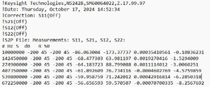

  * Saves S12, S22 data since they are cached.
  * Saves -200 dB for S11, S21 since they are not displayed or present in any equation.

  
Tr1: Eq=S12*S22 Tr1 Underlying Param: S21 Tr2: Eq=S11*5 Tr2 Underlying Param: S1 |  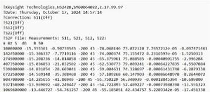

  * Saves S11, S12, S22 data since they are cached.
  * Saves -200 dB for S21 since it’s not displayed or present in any equation.

  
Tr1: Eq=1+1 Tr1 Underlying Param: S21 |  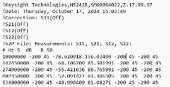

  * Saves S21 data since it’s cached.
  * Saves -200 dB for S11, S12, S22 since they are not displayed or present in any equation.

  
  
**Scope****** |  **Description******  
---|---  
Auto | 

  * When correction is OFF, saves the specified trace.
  * When correction is ON, saves all corrected parameters associated with the calibrated ports in the Cal Set.
  * For GCA and Swept IMD channels, saves the active trace only.

  
Single Trace |  Saves the active trace.  
Displayed Traces |  Saves all displayed traces for all channels.  
Channel |  Saves all displayed traces for current active channel.  
  
####

**Format** |  **Description******  
---|---  
Auto |  Data is saved in LogMag/Angle (dB/deg) or LinMag/Angle (unit/deg) if one of these LogMag or LinMag is the current displayed format, respectively. If format is other than these, then data is saved in Real/Imag. If the save involves multiple traces, then the format of the first saved trace will be used as the format for all other traces regardless of their displayed format.  
LogMag/Angle (dB/deg) LinMag/Angle (unit/deg) |  The phase portion for all LogMag and LinMag data is saved in degrees (dB/deg).  
Real/Imaginary |  Real/Imaginary data is never smoothed.  
Displayed Format |  Data is saved in the format of the displayed trace. Saved data can be a single-valued or dual-valued response depending on the displayed format.  
  
Note: The user may independently select the format of the data saved, so the
data may not match the format of the displayed trace.

### Recall a file

#### How to Recall (open) a file  
  
---  
Using Hardkey/SoftTab/Softkey |  Using a mouse  
  
  1. Press Save Recall > Recall.

|

  1. Click on File
  2. Select Recall Data...

  
  
Save Recall > Recall Softtab Help  
---  
Recall State \- Recall the specified filename. Recall State \- Select from a
list of files shown on softkeys. The list can be sorted by 'most recently
used' or alphabetically depending on a preference. The preference setting
appears at the bottom of the second page of softkeys listing files to be
recalled or on the [Preference dialog](../System/Preferences.md#Preferences).
Recall State... \- Starts the Recall dialog box. Recall Register - Recall the
register (Register 1 to 8) which is saved in the D:\ drive (Only the saved
register will enable to recall). Recall Calset... \- Starts the Recall dialog
box. Recall Data... \- Starts the Recall dialog box. Recall Order \- A list of
files for recall can arrange according to NAME or RECENT files.  
  
Recall dialog box help  
---  
Look in Allows you to select the directory that contains the file that you
want to recall. Filename Displays the filename that you either typed in or
clicked on in the directory contents box. Files of type Allows you view and
select files that are listed in categories of a file type. The following types
of files can be recalled into the analyzer: All [State
files](SaveRecall.htm#State), Citi files, SNP files.

### Recalling instrument state files

When an Instrument State file is recalled, the current state of the instrument
is overwritten with the recalled state. A *.cal file does not contain an
instrument state, but only calibration data. [Learn more about Instrument
States.](SaveRecall.htm#State) See also [Power ON and OFF during Save /
Recall, User Preset, and
Preset](../S1_Settings/Power_Level.htm#PowerStatePreset).

### Recalling Data files

Citi files and SNP files can be recalled and viewed in the analyzer.

  1. Click File then Recall. 
  2. Select Citifile Data or Snp.
  3. Select the file to recall
  4. Click Recall.

Note: Citi files that were saved in [CW Time
sweep](../s1_settings/sweep.htm#SweepTypeDiag) can NOT be recalled into the
VNA. Note: Filenames (not including the path name) that are longer than 64
characters will NOT be recalled. Recalled data is ALWAYS displayed using
[LogMag format](../S1_Settings/Data_Format.md#Log_Mag), regardless of how the
file was stored. The channel is placed in Trigger Hold. If triggering is
resumed, the data will be overwritten. SNP files are recalled as traces into a
single window and channel, beginning at the [highest available channel number
allowed on the analyzer](../S0_Start/Traces_Channels_and_Windows.htm#channel).
For multi-port SNP files (greater than 4 ports), if the number of S parameters
in the file is beyond the [maximum number of traces in a
window](../S0_Start/Traces_Channels_and_Windows.htm#Trace), then new windows
will be created. Citi files are recalled into the same window and channel
configuration as when they were saved. However, the new recalled channel
numbers begin with the [highest channel number allowed on the
analyzer](../S0_Start/Traces_Channels_and_Windows.htm#channel) and decrement
for each additional channel. For example, when a citi file is saved, two
traces are in window 1, channel 1 and two additional traces are in window 2,
channel 2. When recalled into a factory preset condition (1 trace in window 1,
channel 1), the first two recalled traces appear in window 2, highest channel
number, and the second two traces appear in window 3, (highest channel number
-1). See also [Traces, Channels, and
Windows](../S0_Start/Traces_Channels_and_Windows.htm). Recall Recalls the file
displayed in the file name box.  
  
Instrument State / Calibration Files

You can save, and later recall, instrument settings and calibration data for
all channels currently in use on the analyzer.

An Instrument State contains almost every analyzer setting. The following
settings are NOT saved and recalled with Instrument State:

  * [GPIB address](../Programming/Learning_about_GPIB/GP-IB_Fundamentals.md#address)

  * [RF power ON/OFF](../S1_Settings/Power_Level.md#PowerStatePreset) (depends on current setting)

  * [Test set I/O settings](../Programming/TestSetIO_Connector.md)

The following file types are used to save and recall instrument states and Cal
Set information:

File Types |  Information that is stored for each channel  
---|---  
.csa |  .cst |  |  .sta |  |  Instrument State Information  
---|---|---|---|---|---  
|  |  Channels/Traces |  Averaging  
|  |  Windows |  Markers  
|  |  Triggering |  Math/memory  
|  |  Format |  Limits  
|  |  Scale |  More...  
|  |  Stimulus Information:  
|  |  Frequency range |  Alternate sweep  
|  |  Number of points |  Port powers  
|  |  IF bandwidth |  Source attenuators  
|  |  Sweep type |  Receiver attenuators  
|  |  Sweep mode |  Test Set port map  
.cal |  |  |  Cal Set Information  
|  |  GUID (Globally Unique Identifier)  
provides link to Cal Set  
|  |  |  Name, Description, Modify date  
|  |  |  Stimulus Information:  
|  |  |  Frequency range |  Alternate sweep  
|  |  |  Number of points |  Port powers  
|  |  |  IF bandwidth |  Source attenuators  
|  |  |  Sweep type |  Receiver attenuators  
|  |  |  Sweep mode |  Test Set port map  
|  |  |  Error Terms: Directivity, Crosstalk, Source match, Load match, Reflection tracking, Transmission tracking  
  
### File Type Descriptions and Recall

The following describes each file type, and what occurs when the file type is
recalled.

Instrument states can have the following suffixes: .sta, .cst, and .csa.

Common to all of the instrument state files is the state of the instrument
including the quantity and content of channels, traces, windows, markers,
limit lines, etc.

What is different about the instrument state files is the way they handle the
calset - a calset is the set of data that results from having executed a
calibration on a channel.

##### Compatibility of Files

  * There is no compatibility among the VNA family products. For example, ENA cannot recall the state file which is saved by PNA and PXI/USB VNAs.

  * The analyzers cannot recall file saved by that with the smaller number of port. For example, 2 port VNAs cannot recall the files saved by 4 port VNAs.

  * When the installed option is different, recalling the file may fail.

  * Files that are saved with later firmware revisions may not be recalled by prior firmware revisions.

*.sta files

  * Contain ONLY instrument state information - NOT Cal data.

  * When recalled, they always replace the current instrument state immediately.

This instrument state file is saved without any calset data. You might choose
to use this type of save file if you are concerned about disk space or
specifically do not want to store calibration data that tends to have a shelf
life. That is, calibrations become less accurate as cables move and
temperature changes. Perhaps you want to force a new calibration when the
instrument state is used.

*.cst files

  * Contain BOTH instrument state and a LINK to the Cal Sets. [Learn more about Cal Sets.](../S3_Cals/Cal_Sets.md)

  * The quickest and most flexible method of saving and recalling a calibrated instrument state.

  * Channels need not have cal data to save as .cst file.

  * When recalled, the state information is loaded first. Then the analyzer attempts to apply a Cal Set as you would do manually. If the stimulus settings are different between the instrument state and the linked Cal Set, the usual choice is presented ([see Cal Sets](../S3_Cals/Cal_Sets.md#Differences)). If the linked Cal Set has been deleted, a message is displayed, but the state information remains in place.

  * Because only a link to the Cal Set is saved, the Cal Set can be shared with other measurements.

  * If you perform a calibration and save the result to a calset called “MyCalSet”, then save a .cst file (for example, MyState.cst), then that file will have a reference to the name of the calset (“MyCalSet”). 

    * If you redo the calibration and store the data again in MyCalset, then the next time you recall MyState.cst, your instrument state will use the new calibration data.

    * If you subsequently delete MyCalset, and then recall the MyState.cst, the resulting instrument state will not be calibrated as the calset no longer exists.

Note: Before saving a .cst file, be sure that a User Cal Set (NOT a Cal
Register) is being used for the calibration. Cal Registers are overwritten
with new data whenever a calibration is performed, and may not be accurate cal
data when the .cst file is recalled. [Learn more about Cal
Sets.](../S3_Cals/Cal_Sets.htm)

*.cal files

  * Contain ONLY Cal Set information.

  * When recalled, the Cal Set is NOT automatically applied. Apply the calibration data to a channel as you would [apply any Cal Set](../S3_Cals/Cal_Sets.md#ApplyingCalSet).

*.csa files

  * Contain ALL instrument state and the actual Cal Set; not a link to the Cal Set.

  * The safest method of saving and recalling a calibrated instrument state. However, the file size is larger than a *cst file, and the save and recall times are longer.

  * Channels need not be calibrated to save as .cst file.

  * The Cal Set that is saved could be a [Cal Register or a User Cal Set](../S3_Cals/Cal_Sets.md#Registers).

A .csa file is an instrument state and a collection of calset data. Every
channel that has an active calibration (that is, has a calset selected and
applied to the channel) stores its calibration data into the .csa file. For
example, let's say you have a calset called “mycalset” and you are using that
calset on channel 1. You save a .csa file called MyState. If you then perform
another calibration and save that calibration to “mycalset”, the data in
“mycalset” will not be the same as the calibration data in the MyState file.
Consequently, when you recall MyState the old calset called “mycalset” will
overwrite the new calset “mycalset”. When this is about to occur, you are
given a warning. If this is a problem for you, you might prefer to use a .cst
file.

Note: *.pcs files are the internal file format used for storing cal sets.
These files should never be accessed or copied by the user.

Measurement Data Files

Measurement data is saved as ASCII file types for use in a spreadsheet or CAE
programs.

Note: Before saving measurement data, always [trigger a
single](../S1_Settings/Trigger.htm#state_single) measurement, and then allow
the channel to go into Hold. This ensures that the entire measurement trace is
saved.

Note: [Memory traces](../S4_Collect/Math_Operations.md#MemoryTraces) can only
be saved in select file types (CTI, CSV, MDF) when the “Scope” data setting is
set to “Displayed Traces”.

The following file types can be saved by the analyzer:

  * [*.prn files](SaveRecall.md#prn)

  * [*.SNP (Touchstone)](SaveRecall.md#sNp)

  * [*.cti (Citifile)](SaveRecall.md#cti)

  * [*.csv](SaveRecall.md#csv)

  * [*.mdf (MDIF)](SaveRecall.md#MDIF)

*.prn Files

Prn files have the following attributes:

  * Comma-separated data which can be read into rows and columns by spreadsheet software, such as Microsoft Excel. To avoid the "delimiting" dialog boxes, change the filename extension from .prn to .csv. Then open directly into Microsoft Excel.

  * Contain formatted and corrected stimulus and response data for the current active trace ONLY.

  * Are Output only - they cannot be read by the analyzer.

  * Does not save memory traces.

  * Applications and [Cal Set Viewer](../S3_Cals/Errors.md#Monitoring) data can be saved to *.prn files

#### How to Save PRN Trace Data (*.prn)  
  
---  
Using Hardkey/SoftTab/Softkey  
  
  1. Press Save Recall > Save Other > Save Data....
  2. Under File Type, select PRN Trace (*.prn).

  
  
  
Example:

"S11 Log Mag" |   
---|---  
"Frequency (Hz)", |  "dB"  
3.000000e+005 , |  -3.528682e+001 ,  
4.529850e+007 , |  -2.817913e+001 ,  
9.029700e+007 , |  -3.216808e+001 ,  
1.352955e+008 , |  -3.101017e+001 ,  
  
#### How to Save .SNP Format (*.s1p, *.s2p, *.s3p. *.s4p)  
  
---  
Using Hardkey/SoftTab/Softkey  
  
  1. Press Save Recall > Save Other > Save Data....
  2. Under File Type, select SnP Network (*.s1p, *.s2p, *.s3p or *.s4p).

  
  
  
.SNP Format (*.s1p, *.s2p, *.s3p. *.s4p, and so forth)

  * *.SNP file format, also known as Touchstone format, is specified by IBIS. [See the Touchstone specification](https://ibis.org/touchstone_ver2.0/touchstone_ver2_0.pdf). The VNA supports Version 1.0 of the Touchstone format.

  * *.SNP file format is used by CAE programs such as Keysight's Microwave Design System (MDS) and Advanced Design System (ADS).

  * *.SNP data is saved using the File, [Save Data As](SaveRecall.md#SaveDataAs) dialog.

Before saving measurement data, always [trigger a
single](../S1_Settings/Trigger.htm#state_single) measurement, and then allow
the channel to go into Hold. This ensures that the entire measurement trace is
saved.

### *.SNP files and other analyzer settings

  * .SNP data can be [recalled](SaveRecall.md#RecallDiag) and viewed on the analyzer, or read by the embed/de-embed functions.

  * To save SNP data with an [external test set](../System/External_Testset_Control.md) enabled, at the File, "[Save Data As](SaveRecall.md#SaveAsDiag)" dialog, select SnP Network File(*.s*p), then complete the "Select Ports for SnP file" dialog.

  * When Fixturing is enabled, all of the enabled data transforms (De-embedding, Port Z Conversion, and so forth) are applied to saved SNP files.

  * When the Data Type = “Formatted” (Learn more about Data Types):

    * [Smoothing](../S2_Opt/Trce_Noise.md#Smoothing) is NOT saved when the format is Real, Imaginary (RI). Select a different format to save the smoothed data.

    * [Gating](../Time/TimeDomain.md#Gating) is applied on a per-trace basis.

  * Segmented FCA data is saved to *.S2PX files. Scroll down or [click here](SaveRecall.md#S2PX) to learn more.

  * Learn about [FCA parameters that are saved to an S2P file](../FreqOffset/FCA_Use.md#SaveDiag).

  * Balanced parameters can be saved to *.SNP files. See the ["Select Ports for SnP file" dialog](SaveRecall.md#ChoosePorts).

  * Z conversion SnP files still show S as format such as # Hz S dB R 50.

### What is Saved

*.SNP data is generally used to gather all S-parameters for a fully corrected measurement.

The analyzer saves the data that is available on the channel of the active
measurement.

File Type |  # of Ports |  # of S-parameters saved  
---|---|---  
*.s1p |  1 |  1 S-parameter  
*.s2p |  2 |  4 S-parameters  
*.s3p |  3 |  9 S-parameters  
*.s4p |  4 |  16 S-parameters  
... |  ... |  ...  
*.SNP |  N |  N^2 S-parameters  
  
  * If correction for a Full N-port cal is applied, then valid data is returned for all corrected s-parameters. Response cals will save uncorrected data.

  * If correction is NOT applied, the analyzer returns as much applicable raw data as possible using S-parameter measurements on the selected channel. Data that is not available is zero-filled. For example, if correction is NOT applied and the active measurement is S11, and an S21 measurement also exists on the channel, then data is returned for the S11 and S21 measurements. Data for S12 and S22 is not available and therefore returned as zeros in Real/Imaginary format. In Log Mag/Phase format, this appears as -200 dB and 45 degrees. See “Data Type” in Save Data As dialog help.

### SNP Data Output

.SNP files contain header information, stimulus data, a response data pair for
EACH S-parameter measurement. The only difference between .s1p, s2p, and so
forth, is the number of S-parameters that are saved.

The following is a sample of Header information:

!Keysight Technologies,E8362B,US42340026,Q.03.54

!Keysight E8362B: Q.03.54

!Date: Friday, April 25, 2003 13:46:41

!Correction: S11(Full 2 Port SOLT,1,2) S21(Full 2 Port SOLT,1,2) S12(Full 2
Port SOLT,1,2) S22(Full 2 Port SOLT,1,2)

!S2P File: Measurements:S11,S21,S12,S22:

# Hz S RI R 50

Note: Although the following shows Real / Imag pairs, the format could also be
LogMag / Phase or LinMag / Phase

### *.s1p Files

Each record contains 1 stimulus value and 1 S-parameter (total of 3 values)

Stim Real (Sxx) Imag(Sxx)

Example:

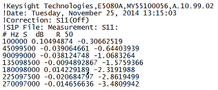

### *.s2p Files

Each record contains 1 stimulus value and 4 S-parameters (total of 9 values)

Stim Real (S11) Imag(S11) Real(S21) Imag(S21) Real(S12) Imag(S12) Real(S22)
Imag(S22)

Example:

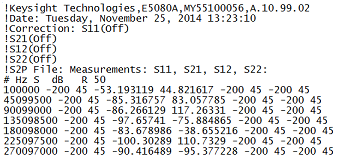

### *.s3p Files

Each record contains 1 stimulus value and 9 S-parameters (total of 19 values)

Stim Real (S11) Imag(S11) Real(S12) Imag(S12) Real(S13) Imag(S13)

Real (S21) Imag(S21) Real(S22) Imag(S22) Real(S23) Imag(S23)

Real (S31) Imag(S31) Real(S32) Imag(S32) Real(S33) Imag(S33)

Example:

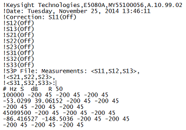

### *.s4p Files (and so forth...)

Each record contains 1 stimulus value and 16 S-parameters (total of 33 values)

Stim Real (S11) Imag(S11) Real(S12) Imag(S12) Real(S13) Imag(S13) Real(S14)
Imag(S14)

Real (S21) Imag(S21) Real(S22) Imag(S22) Real(S23) Imag(S23) Real(S24)
Imag(S24)

Real (S31) Imag(S31) Real(S32) Imag(S32) Real(S33) Imag(S33) Real(S34)
Imag(S34)

Real (S41) Imag(S41) Real(S42) Imag(S42) Real(S43) Imag(S43) Real(S44)
Imag(S44)

Example:

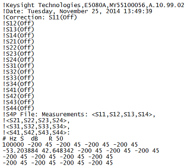

### .S2PX Data Output

*.S2PX files are used for Segmented Mixer Data. [Learn more.](../FreqOffset/FCA_Use.md#SegmentSweep)

The following ADDITIONAL columns precede parameter data:

SegIndex,InputFreq,OutputFreq,LO1Freq,InputPower,LO1Power, <parameter data>

Select ports for SNP File dialog box help  
---  
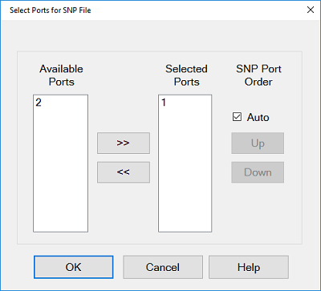 The following buttons appear ONLY
when a [Balanced measurement](../S1_Settings/Balanced_Measurements.md) is
displayed. Normal Click to save normal (single-ended) port data. Mixed Mode
Click to save balanced (logical) port data. Choices are based on the [topology
selection](../S1_Settings/Measurement_Parameters.htm#topology) for current
active parameter:

  * SE-Bal: Choose from S1, D2, C2 (Single-ended port 1, Differential port 2, Common port 2)
  * SE, SE, Bal: Choose from S1, S2, D3, C3 (Single-ended port 1, Single-ended port 2, Differential port 3, Common port 3)
  * Bal-Bal: Choose from D1, C1, D2, C2 (Differential port 1, Common port 1, Differential port 2, Common port 2)
  * Custom Topology: Balanced parameters in ALL SE, ALL BAL, and Custom Topologies can be saved as an SnP file. Be wary of port assignment in Topology dialog and SNP port order in Save Data As > File Type dialog. 

For example, with SE-Bal topology, choose 2 ports, S1 for first, and D2 for
second out of the three available ports: S1, D2, C2. When saving an S2P
Network file, the following 4 parameters are saved: Sss11, Ssd12, Sds21,
Sdd22.  Arrow buttons Click to Add or Remove ports from or to the following
columns: Available Ports All test set ports are listed. There may NOT be valid
data available for all of these ports. [Learn more.](SaveRecall.md#An *.s3p)
Selected Ports The current SnP file type descriptor in the File Type dialog
will update to match the number of ports selected after OK is pressed. With
number of ports = 2, .s2p data is saved; with number of ports = 3, .s3p data
is saved, and so forth. Learn more about SNP files SNP Port Order SnP ports
can be reordered in the saved file by unselecting the “Auto” check box and
highlighting ports in the “Selected Ports” list box and using the “Up” and
“Down” buttons to reorder. Multi-selecting ports is supported: click and drag
ports or use Ctrl + click or Shift + click to select multiple ports.  
  
.cti CitiFiles

Citifile format is compatible with the Keysight 8510 Network Analyzer and
Keysight's Microwave Design System (MDS).

You can do the following using citifiles :

  * save the active trace, or all traces.

#### How to Save Citifile Trace (*.cti)  
  
---  
Using Hardkey/SoftTab/Softkey  
  
  1. Press Save Recall > Save Other > Save Data....
  2. Under File Type, select Citifile Trace (*cti).

  
  
  
*.cti files contain:

  * Header information

  * Stimulus data

  * Data pairs for EACH S-parameter measurement

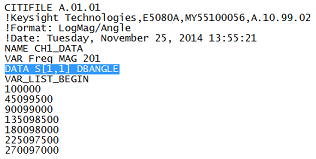  
---  
The above image is a Citifile opened in Notepad. There are two traces in
separate channels - one is an FCA trace. Each trace has 3 data points. The
save settings = Displayed Traces Content, and Auto Format. Format is
identified by DBANGLE (log mag), MAGANGLE (Lin Mag), or RI (real, imaginary -
NOT shown)  
  
## *.csv Files

Note: 2D Gain Compression data is saved as *.csv files using a different
format than shown here. [Learn
more.](../Applications/Gain_Compression_Application.htm#Saving)

CSV files are read by spreadsheet programs such as Microsoft Excel.

#### How to Save CSV Trace (*.csv)  
  
---  
Using Hardkey/SoftTab/Softkey  
  
  1. Press Save Recall > Save Other > Save Data....
  2. Under File Type, select CSV Trace (.csv)

  
  
  
*.csv files contain: header information and the following Comma-Separated Values.

  * Stimulus data

  * Data pairs for EACH S-parameter

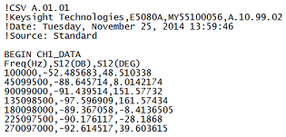

## *.mdf Files

MDIF files are compatible with Keysight ADS (Advanced Design System). [Learn
more at the Keysight
website.](http://www.home.Keysight.com/Keysight/product.jspx?nid=-34346.0.00&cc=US&lc=eng)

#### How to Save MDIF Trace (*.mdif)  
  
---  
Using Hardkey/SoftTab/Softkey  
  
  1. Press Save Recall > Save Other > Save Data....
  2. Under File Type, select MDIF Trace (*.mdif).

  
  
  
*.mdf files contain: header information and space-separated data:

  1.      * Stimulus data

     * Real and Imaginary data pair for EACH S-parameter measurement

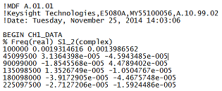

Manage Files without a Mouse

#### How to Manage Files without a Mouse  
  
---  
Using Hardkey/SoftTab/Softkey  
  
  1. Press Save Recall > Save Other.
  2. Click Manage Files... and then D:\ drive folder dialog box appears.

OR

  1. Press System > Main.
  2. Click Manage Files... and then D:\ drive folder dialog box appears.

  
  
Manage Files dialog box help  
---  
The Manage Files dialog box is designed to be used from the front panel. It
performs the same function as Windows Explorer, but can be used without the
use of a mouse or keyboard. 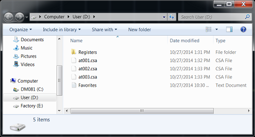  
  
* * *

