# Equations Used to Generate Uncertainty Curves

* * *

This topic contains the measurement uncertainty equations used to generate the
uncertainty curves in [Specifications](ManualChoice.md) documents.

It also contains general information about determining system measurement
uncertainties.

Note: RSS Computations are included along with worst case computations.

Learn about the following subjects in this topic:

  * Measurement Uncertainty Equations

  * Forward Reflection Uncertainty

  * Forward Transmission Uncertainty

  * Reverse Transmission Uncertainty

  * Reverse Reflection Uncertainty

  * Sources of Systematic Errors

  * Sources of Random Errors

  * Determining Expected System Performance

  * Determining Cable Stability Terms (CR1, CR2, CTM1, CTM2, CTP1, CTP2)

### See Also

  * [Measurement Errors](../S3_Cals/Errors.md)

  * [What is Measurement Calibration?](../S3_Cals/Measurement_Calibration.md#what)

  * [Why is Calibration Necessary?](../S3_Cals/Measurement_Calibration.md#why)

* * *

## Measurement Uncertainty Equations

Any measurement result is the vector sum of the actual test device response
plus all error terms. The precise effect of each error term depends on its
magnitude and phase relationship to the actual test device response. When the
phase of an error response is not known, phase is assumed to be worst case
(-l80x° to +180°).

Note: The uncertainty equations are derived for two-port measurement
uncertainties. However, uncertainties for a one-port device can be derived by
setting S21=0 then computing the reflection uncertainties.

View the abbreviations for residual systematic errors used in the equations.

View the abbreviations for random errors used in the error models and
equations.

### Forward Reflection Uncertainty

Equation 1: Forward Reflection Magnitude Uncertainty (Worst Case Computation)

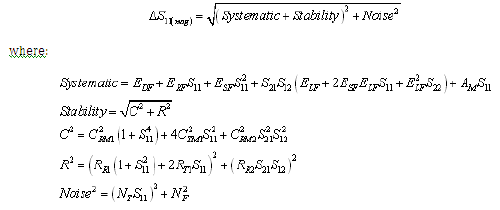

Equation 2: Forward Reflection Phase Uncertainty (Worst Case Computation)

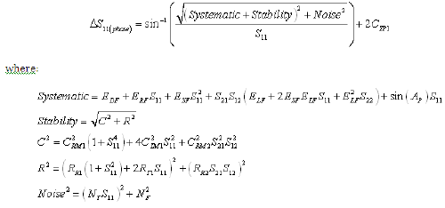

Equation 3: Forward Reflection Magnitude Uncertainty (RSS Computation)

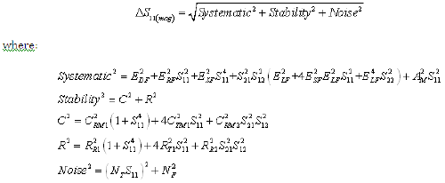

Equation 4: Forward Reflection Phase Uncertainty (RSS Computation)

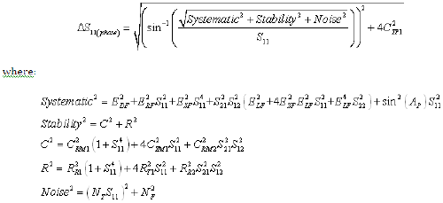

### Forward Transmission Uncertainty

Equation 5: Forward Transmission Magnitude Uncertainty (Worst Case
Computation)

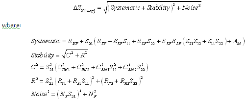

Equation 6: Forward Transmission Phase Uncertainty (Worst Case Computation)

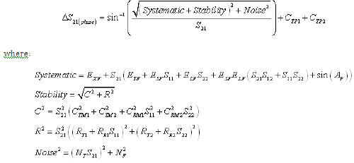

Equation 7: Forward Transmission Magnitude Uncertainty (RSS Computation)

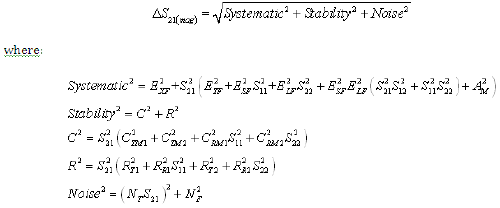

Equation 8: Forward Transmission Phase Uncertainty (RSS Computation)

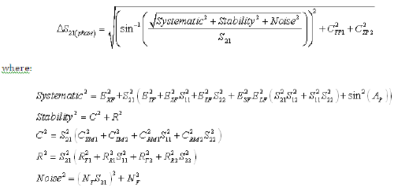

### Reverse Transmission Uncertainty

Equation 9: Reverse Transmission Magnitude Uncertainty (Worst Case
Computation)

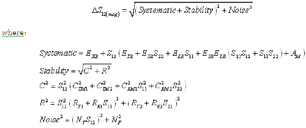

Equation 10: Reverse Transmission Phase Uncertainty (Worst Case Computation)

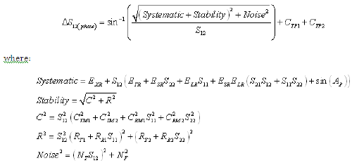

Equation 11: Reverse Transmission Magnitude Uncertainty (RSS Computation)

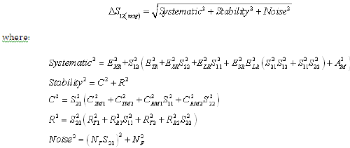

Equation 12: Reverse Transmission Phase Uncertainty (RSS Computation)

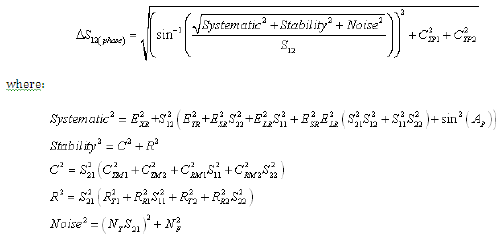

### Reverse Reflection Uncertainty

Equation 13: Reverse Reflection Magnitude Uncertainty (Worst Case Computation)

Equation 14: Reverse Reflection Phase Uncertainty (Worst Case Computation)

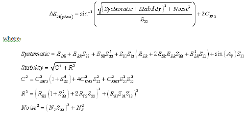

Equation 15: Reverse Reflection Magnitude Uncertainty (RSS Computation)

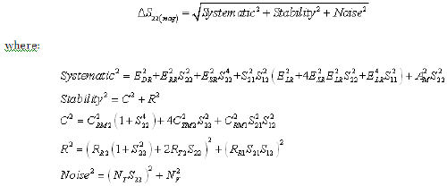

Equation 16: Reverse Reflection Phase Uncertainty (RSS Computation)

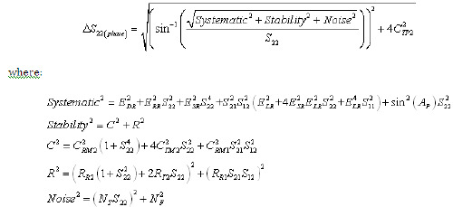

## Sources of Systematic Errors

The residual (after measurement calibration) systematic errors result from
imperfections in the calibration standards.  
For reflection measurements, the associated residual errors are:

  * residual directivity
  * residual source match

|

  * residual load match
  * residual reflection tracking

  
---|---  
  
For transmission measurements, the additional residual errors are:

  * residual crosstalk
  * residual source match

|

  * residual load match
  * residual transmission tracking

  
---|---  
  
The listing below shows the abbreviations used for residual systematic errors
that are in the uncertainty equations.

  * EDF = forward residual directivity
  * ESF = forward residual source match
  * ERF = forward residual reflection tracking
  * EXF = forward crosstalk
  * ELF = forward load match
  * ETF = forward transmission tracking
  * EDR = reverse residual directivity

|

  * ESR = reverse residual source match
  * ERR = reverse residual reflection tracking
  * EXR = reverse crosstalk
  * ELR = reverse load match
  * ETR = reverse transmission tracking
  * AM = magnitude dynamic accuracy
  * AP = phase dynamic accuracy

  
---|---  
  
All measurements are affected by dynamic accuracy. Dynamic accuracy includes:
errors during internal self-calibration routines, gain compression in the
microwave frequency converter (sampler) at high signal levels, errors
generated in the synchronous detectors, localized non-linearities in the IF
filter system, and from LO leakage into the IF signal paths.

## Sources of Random Errors

The random error sources are

  * noise

  * connector repeatability

  * interconnecting cable stability

There are two types of noise in any measurement system:

  1. low level noise (noise floor)

  2. high level noise (trace noise)

Low level noise is the broadband noise floor of the receiver which can be
reduced through averaging or by changing the IF bandwidth.

High level noise or trace noise is due to the noise floor of the receiver, and
the phase noise of the LO source inside the test set. It is worsened by
reducing the IF bandwidth. Using a high stability 10 MHz time base can reduce
high level noise.

Connector repeatability is the random variation encountered when connecting a
pair of RF connectors. Variations in both reflection and transmission can be
observed.

Cable stability is dependent on the cable used and the amount of cable
movement between calibration and measurement.

The listing below shows the abbreviations used for random errors in the error
models and uncertainty equations.

  * NF = noise floor
  * NT = trace noise
  * CR1 = port 1 cable reflection stability
  * CTM1 = port 1 cable magnitude transmission stability
  * CTP1 = port 1 cable phase transmission stability
  * CR2 = port 2 cable reflection stability

|

  * CTM2 = port 2 cable magnitude transmission stability
  * CTP2 = port 2 cable phase transmission stability
  * RR1 = port 1 connector reflection repeatability
  * RT1 = port 1 connector transmission repeatability
  * RR2 = port 2 connector reflection repeatability
  * RT2 = port 2 connector transmission repeatability

  
---|---  
  
## Determining Expected System Performance

Improper connection techniques and contact surfaces can degrade measurement
accuracy.

Proper connection techniques include using a torque wrench with proper torque
limits, ensuring that the connector pin depths meet specifications, ensuring
that the center conductor of sliding loads is properly set, and observing
proper handling procedures for beadless airlines.

Contact surface errors are caused by improper cleaning procedures, scratches,
worn plating, and rough seating. View more information on [connector
care](../Tutorials/Connector_Care.htm)

If proper connection techniques and connector care is observed, the following
table provides an indication of connector repeatability.

Connector Repeatability (RR1, RR2, RT1, and RT2)  
---  
Connector Type |  |  Connector Type  
Frequency Range |  Repeatability |  |  Frequency Range |  Repeatability  
2.4-mm |  |  3.5-mm  
0 to 2 GHz |  0.0002 |  |  0 to 2 GHz |  0.0001  
2 to 20 GHz |  0.0004 |  |  2 to 8 GHz |  0.0003  
20 to 36 GHz |  0.0006 |  |  8 to 20 GHz |  0.0006  
36 to 40 GHz |  0.0008 |  |  20 to 26.5 GHz |  0.0010  
7-mm |  |  Type-N  
0 to 2 GHz |  0.0001 |  |  0 to 2 GHz |  0.0006  
2 to 8 GHz |  0.0003 |  |  2 to 8 GHz |  0.0006  
8 to 18 GHz |  0.0006 |  |  8 to 18 GHz |  0.0010  
Type-F |  |  Waveguide  
0 to 3 GHz |  0.0006 |  |  0 to 40 GHz |  0.0002  
  
## Determining Cable Stability Terms  
(CR1, CR2, CTM1, CTM2, CTP1, CTP2)

Cable stability is dependent on the cable used and the amount of cable
movement between calibration and measurement. Values for cable reflection
stability are determined by connecting a fixed load to the free end of the
cable and measuring the change in reflection coefficient after flexing the
cable through the normal range of cable movement for a particular setup. Cable
transmission stability is determined by connecting a short to the free end of
the cable and measuring the change in reflection coefficient due to changes in
cable position.

Graphics 1-3 demonstrate concepts useful in determining cable stability. In
each case, a cable (part number 8120-4779) was connected to port 1, with a
fixed load connected to the free end. A reference trace is obtained by
measuring S11 with the free end held close to port 2 and storing the results
in memory. Two additional S11 measurements are made; one with the cable flexed
out to its straight position and the other with the cable positioned back to
the same location as reference trace. As shown in Graphic 1, the flexed
position demonstrates the effect of moving the cable after calibration. The
repeatability trace demonstrates the stability of the cable when moved to its
original position.

Graphic 1

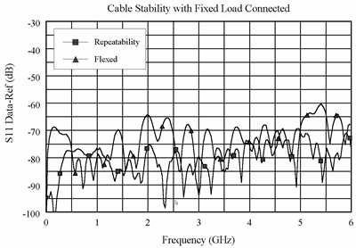

Graphic 1 demonstrates the concepts useful in determining cable reflection
stability. A fixed load is connected to the free end. The DATA-MEM feature
provides an indication of the cable reflection stability. A 60-dB peak on the
chart yields a reflection stability estimated as 10(−60/20) or 0.001.

Graphic 2

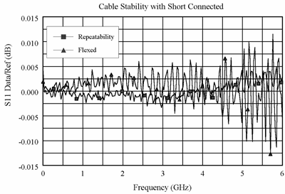

Graphic 2 and Graphic 3 demonstrate the concepts useful in determining cable
transmission stability. A short is connected to the free end. The DATA/MEM
feature provides an indication of the two-way cable transmission stability.
The one-way transmission magnitude stability is determined by dividing the
two-way magnitude measurement by two before it is converted to linear. A
0.013-dB peak on the chart yields transmission magnitude stability estimated
as 10(0.013/40) −1 or 0.00075. The one-way transmission phase stability is
determined by dividing the two-way phase measurement by two.

Graphic 3

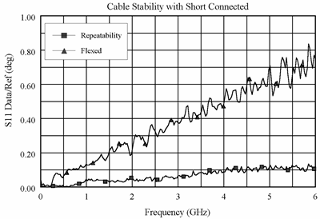

Cable movement often has a much larger effect on phase measurements than
magnitude measurements.

### See Also

[Measurement Errors](../S3_Cals/Errors.md)

[What is Measurement
Calibration?](../S3_Cals/Measurement_Calibration.htm#what)

[Why is Calibration Necessary?](../S3_Cals/Measurement_Calibration.md#why)

* * *

