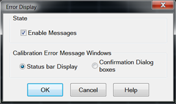
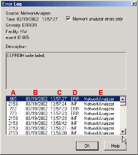

# About Error Messages

* * *

Analyzer errors and Operating System errors are displayed and logged in an
error file. You can choose how to display errors, or choose to not display
errors at all.

  * [Error Display](About_Error_Messages.md#Options)

  * [View Error Log](About_Error_Messages.md#log)

  * [List of VNA Errors](PNA_Errors.md)

  * [SCPI Errors](SCPI_Errors.md)

[Other System topics](../System/System_Topics.md)

Error Display

By default, error messages appear on the screen for a brief period. You can
choose to have them stay on the screen until you click an OK button, or have
them not appear at all. When they stay on the screen, a Help button is
available to provide further assistance.

#### How to select the display of Error Messages  
  
---  
Using Hardkey/SoftTab/Softkey  
  
  1. Press System > Help > Error Display....

  
  
  
Error Display dialog box help  
---  
 On Preset, these settings revert to
their defaults (enabled, timed popups). Enable Messages Check to display all
error messages as they occur. Clear to suppress the display of error messages.
You can still view them in the [error log](About_Error_Messages.md#log).
Calibration Error Message Windows  Status bar Display Displays error messages
on the screen for a duration of time proportional to the length of the
message. You can then view the message in the [error
log](About_Error_Messages.htm#log) and get further assistance. Confirmation
Dialog boxes Displays error messages in a standard dialog box. You then choose
OK or Cancel to close the dialog box, or press Help to get further information
on the error message.  
  
View Error Log

The analyzer Error Log is a list of all events that have occurred. (Events are
used in programming the analyzer using COM.) Analyzer errors are a subset of
events. Only events with severity codes of ERROR are displayed on the screen
as they occur. From the error log, you can access further help with an error
by selecting the error and clicking Help.

#### How to view the Error Log  
  
---  
Using Hardkey/SoftTab/Softkey  
  
  1. Press System > Help > View Error Log....

  
No programming commands  
  
Error Log dialog box help  
---  
 Network analyzer errors only Select to
view only analyzer errors. Clear to view all errors that occur on all
applications of the computer. Description Error message that appears on the
analyzer screen. A \- Event ID Error message number B \- Date the Error
occurred C \- Time the Error occurred D \- Severity Code - All events have one
of the following severity codes:

  * SUCcess - the operation completed successfully
  * INFormational \- events that occur without impact on the measurement integrity
  * WARning - events that occur with potential impact on measurement integrity
  * ERRor - events that occur with serious impact on measurement integrity

E \- Application in which the error occurred. OK Closes the Dialog box Help
Provides further information on the selected Error message To clear the Error
Log:

  1. From the System > Main menu click Minimize Application.
  2. On the desktop, select Start, Control Panel
  3. On the Control Panel, click Administrative Tools
  4. On the Administrative Tools window, click Event Viewer
  5. On the Event Viewer window, right-click Application
  6. Select Clear all Events
  7. If you want to save a file with the contents of the Event Log, click Yes. Otherwise, click No

To restore the VNA application, click on the VNA Analyzer taskbar button at
the bottom of the screen.  
  
* * *

