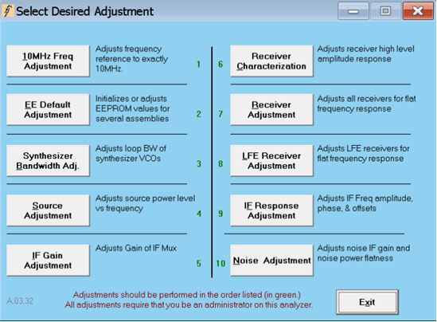
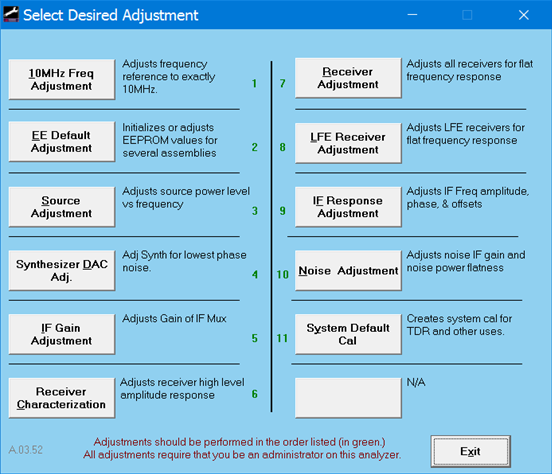
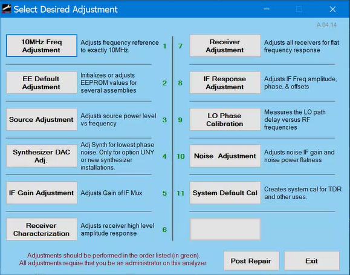
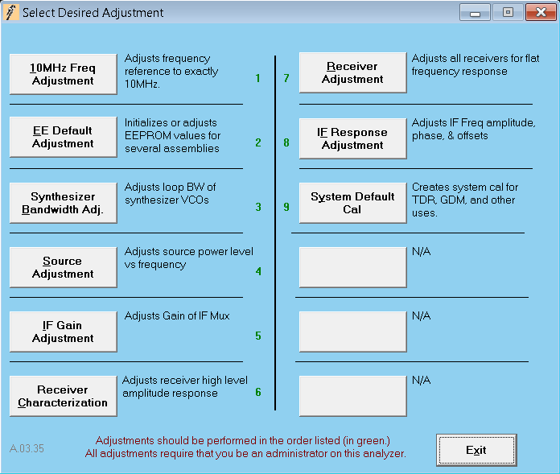
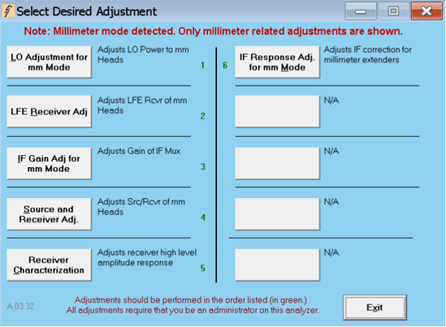

# Diagnostic Tools, Utilities, and Adjustments

* * *

The following Tools, Utilities, and Adjustments are available to help you keep
your VNA at peak performance.

### Diagnostic Tools

  * [Operators Check](Operators_Check.md)

  * [System Verification](System_Verification.md)

### Utilities

  * [Receiver Display](ReceiverDisplay.md)

  * [Restore ECal Memory](../S3_Cals/ECal_User_Characterization.md#Restore)

  * [Receiver Temperature](Receiver_Temperature.md)

### Adjustments

_Not all of the adjustments listed below are valid for every VNA model._ Only
the adjustments needed for each particular VNA will be listed.

_To access the service adjustments on the VNA, click Utility, then System,
then Service, then Adjustment Routines..._

### Standard and TDR Adjustments

Standard Adjustments

TDR Adjustments

  * 10 MHz Reference Frequency Adjustment

  * [EE Default Adjustment](Default_EE_Data.md)

  * [Synthesizer Bandwidth Adjustment](Synthesizer_Bandwidth_Adjustment.md)

  * Source Adjustment

  * [Synthesizer DAC Adj.](Synthesizer_DAC_Adj..md)

  * [IF Gain Adjustment](IF_Gain_Adj.md)

  * [Receiver Characterization](Receiver_Characterization.md)

  * Receiver Adjustment

  * [LFE Receiver Adjustment](LFE_Receiver_Adjustment_-_Standard.md)

  * [IF Response Adjustment](IF_Response_Adjustment.md)

  * [IF Response Adjustment](IF_Response_Adjustment_6021_and_above.md) (applies ONLY to instruments with serial prefix 6021 and above with A.14.00.xx firmware and above.)

  * [LO Phase Calibration](LO_Phase_Calibration.md)

  * [Noise (Figure) Adjustment](Noise_Figure_Adjustment.md)

  * [System Default Calibration](Default_System_Calibration.md)

### mmWave System Adjustments

When a Millimeter mode is detected, the following adjustments are displayed.

  * [LO Adjustment for mm Mode](LO_Adjustment_for_mm_Mode.md)

  * [LFE Receiver Adj.](LFE_Receiver_Adjustment.md)

  * [IF Gain Adj for mm Mode](IF_Gain_Adj_for_mm_Mode.md)

  * [Source and Receiver Adj.](Source_and_Receiver_Adj.md)

  * [Receiver Characterization](Receiver_Characterization_mm_Mode.md)

  * [IF Response Adj. for mm Mode](IF_Response_Adj_for_mm_Mode.md)

* * *

