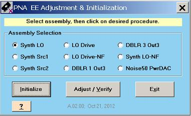

# EE Default Adjustment

* * *

This program must be run whenever an assembly is replaced. This program sets
correction DAC values for each assembly for each band so that the assembly
outputs the proper power level at all frequencies.

### Equipment needed

Power Meter and Sensor, GPIB cable (or LAN, or USB cable depending upon
connection method to Power Meter), Adapters as needed.

### Procedure

_N_ ote: You must be logged onto the VNA as an Administrator to perform an
adjustment. [Learn more.](../S0_Start/NewUsers.md#AddAccounts)

_Press System > Service > Adjustment Routines...._

_At the Adjustments selection, click_ EE Default Adjustment

This program is a combination of up to 9 different adjustments. The number of
applicable adjustments varies with model number and options. The above image
shows all available adjustments for a 50GHz PNA-X with Option 029. Assemblies
with “NF” or “Noise” are only applicable to VNAs with Option 029 or H29 (Noise
Figure). Only valid assemblies for each particular VNA will be available.

  1. Select the appropriate assembly, then click Initialize. This presets all values to some known (default) condition. This only takes a few seconds. In general, Initializing is usually the only process that needs to be performed for all Synthesizers.

  2. For other assemblies, click Adjustment / Verify. This will improve upon the default initialization and will result in better performance. Performing an adjustment or verification will require one or more power sensors to measure the actual output power. Connect the power sensor at the appropriate measurement point. Follow the prompts in the program. For assemblies where the connection point is not obvious, click Setup to see a picture of the actual connection point.

  3. Selecting Verify will plot the difference between its current output power level and the specified level.

Note: The maximum measured frequency for these adjustments is only 26.5GHz,
even for VNA models with a maximum frequency of of 50GHz and higher.

### Data Storage

  * The correction data for the Synth LO, Synth Src1, and Synth Src2 adjustments are stored in the EEPROM on the selected assembly.

  * The correction data for the remaining adjustments are stored in flash memory on the Test Set Motherboard.

* * *

