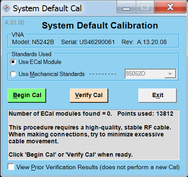

# System Default Calibration

The Default System Calibration creates a system cal for TDR, GDM, and other
uses. This adjustment is for service only; not for measurement calibration.

### Required Equipment

DC ECal or Mechanical Calibration Kit

See [VNA Accessories](Analyzer_Accessories.md)

Notes

  * You must be logged onto the VNA as an Administrator to perform an adjustment. [Learn more.](../S0_Start/NewUsers.md#AddAccounts)

  
---  
  
### Procedure

  1. _Click Utility, then System, then Service, then Adjustment Routines..._

  2. _At the Adjustments selection, click System Default Calibration. The System Default Calibration dialog is displayed as shown below._  
  

  3. _Select the calibration method ( ECal or Mechanical Standards)._

  4. _Click on the Begin Cal button to begin the calibration_.

  5. Follow the instructions displayed in the program.

### _D_ ata Storage

  * The correction data is stored in the hard drive.

