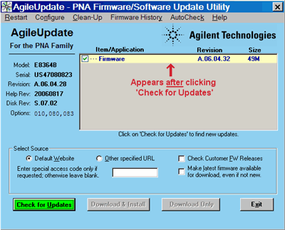
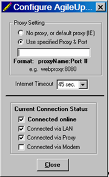

# Firmware Update (Core Software Update)

* * *

VNA firmware updates are available to you at no cost in a self-extracting
Install Shield file. The update includes the VNA application, Online help, and
Service Utilities.

To manually check the version of firmware on the VNA, click System > Help >
About NA....

Tip: Use [Move App to Back](../s2_opt/move_app_to_back.md) to cause the VNA
application to move behind this application on the screen.

The following options are available for you to update your VNA application:

  * Auto-Check and Firmware Update If your VNA is connected to the Internet, these utilities will automatically check for, download, and install, the new firmware and associated files when the VNA application is started. You will be prompted before this occurs.

  * [Website Access](FW_upgrade.md#website) If your VNA is NOT connected to the Internet, but you have a PC that is, you can download the VNA firmware and associated files to a storage medium.

Note: After a firmware update...

  * Custom Cal Kits must be imported. [Learn more](../S3_Cals/ModifyCalKits.md#FirmwareUpgrades)
  * If a different desktop icon named "Network Analyzer" exists, the shortcut to the VNA application will assume the same icon. Right-click on the desktop, then click Refresh.

  
---  
  
[Other Support Topics](Support_Overview.md)

Auto-Check

With Internet access to your VNA, Auto-Check automatically and regularly
checks the Internet for new VNA firmware revisions. If a new revision is
found, a notification message prompts you to run the [Firmware
Update](FW_upgrade.htm#AgileUpdate) utility, which then performs the actual
download.

Without Internet access to your VNA, Auto-Check provides a reminder prompt at
the selected intervals.

Auto-Check is run only when the VNA application is started. Once the VNA
application is running, it will not check for updates again until it is
restarted.

When Auto-Check runs, it checks the following conditions:

  * Is there an active connection to the Internet?

  * Is the Auto-Check utility enabled?

  * Is it time to check for new firmware?

  * Does new firmware exist?

If all of these conditions are true, Auto-Check shows the following dialog
box.

If all of these conditions are NOT true, or to change these settings at any
time, press System, then Service, then Update Firmware. From within the
utility, click AutoCheck. These preferences are stored in the VNA registry.
Future firmware updates will not change these settings.

VNA Auto-Check dialog box help  
---  
Enable When the VNA application is started, Auto-Check will search the VNA
website for firmware updates at the selected time interval. Disable When the
VNA application is started, Auto-Check will NOT search the VNA website for
firmware updates. Time Interval Select the time interval Auto-Check is to
search for firmware updates. Accept Starts update process. Ignore No further
action is taken until the selected time interval has elapsed. Remind Me Later:
This window is displayed again after 1-20 days depending upon the time
interval selected.  
  
Firmware Update Utility

Note: You must have administrative privileges on the analyzer to run this
utility. See [Set Up Analyzer Users](../S0_Start/NewUsers.md).

### How to start Firmware Update

Connect the VNA to the Internet. A LAN connection is recommended because a
firmware download can take many hours using a modem.  
---  
Using Hardkey/SoftTab/Softkey | Using a mouse  
  
  1. Press System > Service > Update Firmware.

|

  1. Click Utility
  2. Select System
  3. Select Service
  4. Select Update Firmware

  
  
  1. Click Check for Updates.
  2. If updates exist, click Download & Install.

  
No programming commands are available for this feature  
  

AgileUpdate dialog box help  
---  
Note: Your privacy is important to Keysight. The update utility does NOT send
ANY information from the VNA to the server. It only downloads from the server
to the VNA. Restart Click to restart from the beginning. Configure Click to
launch the [Configure dialog box](FW_upgrade.md#Detailed_procedure). Clean-up
Click to delete all but the two most recent install shield packages from the
VNA hard drive. Firmware History Available after clicking Check for Updates.
Auto-Check Launches the [Auto-Check](FW_upgrade.md#Auto-Check) dialog box.
Item / Application Lists the items available for download at the firmware
website.

  * Click items with  i to read more information about the download.
  * Items in RED should be downloaded and installed individually.
  * Multi-language help includes all help files except English.

Note: The firmware includes the help file. Therefore, only the firmware
checkbox will be selected if a new version for both the firmware and the help
file are available. Select Source  Default Website The Keysight site that
contains update FW. Other Specified URL Click if you were instructed to get
firmware from a different website. Check Customer FW Releases Check this box
to also check Customer Releases in addition to Production Releases. This
setting provides you with the very latest VNA firmware. Customer Releases are
fully supported but have not yet been tested in all production models.
Customer Releases take precedence over Production Releases. This setting is
remembered and applied the next time update utility is run. Special Access
Code... Type in the code if you were given one from Keysight Technical
Support. Otherwise, leave blank. Make Latest Firmware Available... Select this
checkbox if you want to download the latest firmware, even if it is not new.
Check for Updates Click to look for firmware updates at the Keysight website.
If there are newer versions, the files will be listed. Download and Install
When updates are found, this selection becomes available. Some files may be
pre-checked. Be sure the corresponding boxes are checked for the files you
want to download. Then click to download and install the update. Download Only
Click to download the files to the analyzer hard disk and install the files at
a later time. At that time, click Install from File.  
  

Configuration dialog box help  
---  
Note: If the update utility will not connect, try to access ANY Internet
website. Contact your local IT department if necessary. Proxy Setting No Proxy
or Default Proxy Click if you use a LAN connection. The update utility will
automatically use the proxy specified in Internet Explorer. Use specified
Proxy / Port Click to enter the proxy name and port. The format is:
proxyName:portNumber. (The proxy port number is typically 8088). Internet
timeout If you are using an automatic dial-up Internet connection you may need
to increase the timeout. Current Connection Status Shows the current status of
the VNA connection to the Internet. Note: These settings are NOT saved; they
must be re-entered each time the update utility is run.  
  
Updating firmware

  1. Download the latest firmware from <http://www.keysight.com/find/na>

  2. Terminate the VNA application by pressing System > Main > Exit.

  3. Transfer the file from your PC to your VNA using LAN or USB Pen drive.

  4. Double-click the file on the VNA and follow the instruction.

* * *

