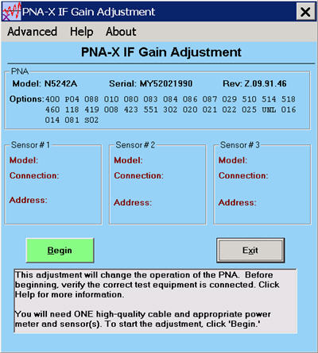

# IF Gain Adjustment

* * *

This adjustment sets the IF attenuator/gain stages to present a relatively
consistent level to the ADC versus frequency for a given amount of signal.
This maximizes the dynamic range of the instrument by preventing any IF
compression at higher levels. The adjustment range is about 18dB with one
adjustment value per band per input: R1, R2, R3, R4, A, B, C, and D (if
applicable.)

The program first finds the peak of each band’s frequency response with a
fixed input level. It then re-measures those peaks with a power meter. From
this information, it determines the optimum gain or attenuation needed to keep
all bands as similar as possible for any given frequency.

### When to perform

IF Gain Adjustment should be performed when any of the following occur:

  * An assembly in the reference receiver path (R1,R2) is replaced.

  * The Test Set Motherboard is replaced

  * The IF Mux assembly or SPAM assembly is replaced

### Required Equipment

  * Power Meter and Sensor(s) - These must cover the full frequency range of the VNA.

  * GPIB cable, LAN, or USB cable depending upon the type of Power Meter/Sensor being used.

  * Adapters as needed

### Procedure

_N_ ote: You must be logged onto the VNA as an Administrator to perform an
adjustment. [Learn more.](../S0_Start/NewUsers.md#AddAccounts)

_Click_ _Utility , then System, then Service, then Adjustment Routines..._

_At the[Adjustments selection](Adjust_Overview.md), click IF Gain
Adjustment._

Note: Connect the Power Meter/Sensor to the VNA USB, GPIB, or LAN input
depending on the type of Power Meter/Sensor being used. The program will
prompt you where and when to attach the RF input for the Power Sensor(s).

Ensure the Reference Channel paths are properly configured and the connections
are properly torqued.

  1. Click Begin

  2. Follow the instructions displayed in the program.

The adjustment takes about 5 minutes to complete for a 26.5 GHz VNA. Higher
frequency units may take longer.

The Default menu selection (under the advanced menu) is for factory personnel
only. This will preset all values to default levels for trouble shooting
purposes only. If this is selected, a full IF gain adjustment will need to be
performed.

### Data Storage

  * The correction data is stored in the flash memory on the Test Set Mother Board.

* * *

