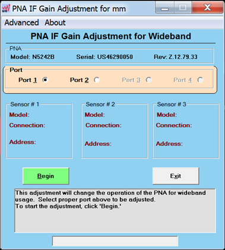

# IF Gain Adj for mm Mode

This program adjusts the gain of the IF mux in the N5290A/91A system.

This adjustment is for service only; not for measurement calibration.

### Required Equipment

[See list of supported power meters and
sensors.](../S3_Cals/PwrCalibration.htm#TestEquipmentRequired)

See [VNA Accessories](Analyzer_Accessories.md)

Notes

  * You must be logged onto the VNA as an Administrator to perform an adjustment. [Learn more.](../S0_Start/NewUsers.md#AddAccounts)

  
---  
  
### Procedure

  1. _Click Utility, then System, then Service, then Adjustment Routines..._

  2. _At the Adjustments selection, click IF Gain Adj for mm Mode. The PNA IF Gain Adjustment for Wideband dialog is displayed as shown below._  
  

  3. _Select the first port to adjust. Each port with a frequency extender connected must be adjusted._

  4. _Click on the Begin button and f_ollow the instructions displayed in the program.

  5. _Set up the power sensors then click OK. Up to three different power sensor configurations can be saved and recalled._

  6. Follow the instructions displayed in the program.

### _D_ ata Storage

  * The correction data is stored in the flash memory.

