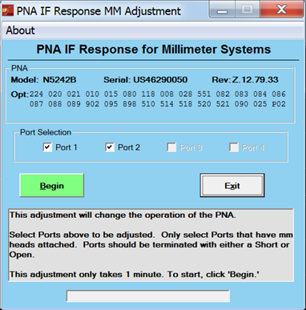

# IF Response Adj for mm Mode

This program adjusts IF correction for the frequency extenders from the
N5292A, N5261A, or N5262A test set.

This adjustment is for service only; not for measurement calibration.

### Required Equipment

See [VNA Accessories](Analyzer_Accessories.md)

Notes

  * You must be logged onto the VNA as an Administrator to perform an adjustment. [Learn more.](../S0_Start/NewUsers.md#AddAccounts)

  
---  
  
### Procedure

  1. _Click Utility, then System, then Service, then Adjustment Routines..._

  2. _At the Adjustments selection, click IF Response Adj. for mm Mode. The PNA IF Response for Millimeter Systems dialog is displayed as shown below._  
  

  3. _Select the ports to adjust that have frequency extenders (mm heads) attached._

  4. _Connect either a short or open to the ports._

  5. _Click on the Begin button._

  6. Follow the instructions displayed in the program.

### _D_ ata Storage

  * The correction data is stored in the flash memory.

