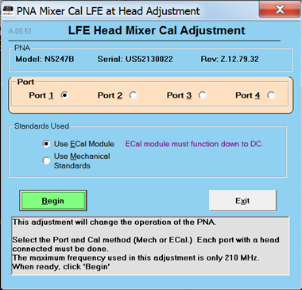

# LFE Receiver Adjustment of mm Heads

This program adjusts the Option 205 (2-port) or Option 425 (4-port) Low
Frequency Extension (LFE) receivers in the N5293AX03/N5295AX03 Frequency
Extenders for a flat response across the full frequency range. The range of
this adjustment is 500 Hz to 210 MHz. Learn more about
[LFE](../IFAccess/Low_Frequency_Extension/Overview.md).

This adjustment is for service only; not for measurement calibration.

### Required Equipment

[See list of supported power meters and
sensors.](../S3_Cals/PwrCalibration.htm#TestEquipmentRequired)

See [VNA Accessories](Analyzer_Accessories.md)

Notes

  * The recommended power sensor is the U8485A with Option 200 (DC - 33 GHz).
  * The ECal module must function down to DC.
  * You must be logged onto the VNA as an Administrator to perform an adjustment. [Learn more.](../S0_Start/NewUsers.md#AddAccounts)

  
---  
  
### Procedure

  1. _Click Utility, then System, then Service, then Adjustment Routines..._

  2. _At the Adjustments selection, click LFE Receiver Adj. The LFE Head Mixer Cal Adjustment dialog is displayed as shown below._  
  

  3. _Select the first port to adjust. Each port with a frequency extender connected must be adjusted._

  4. _Select the calibration method ( ECal or Mechanical Standards)._

  5. _Click on the Begin button and f_ollow the instructions displayed in the program.

  6. Follow the instructions displayed in the program.

### _D_ ata Storage

  * The correction data is stored in the flash memory.

