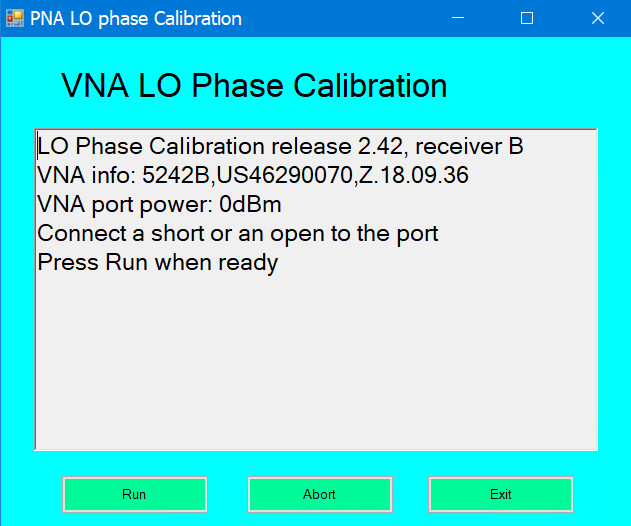

# LO Phase Calibration

* * *

This adjustment allows better wideband test signals phase measurement when
running SA channel in coherent and vector mode, or when running MOD or MODX
channels. It computes the VNA internal LO path delay versus RF frequencies,
providing the knowledge of the LO phase at downconverter mixers when the LO
synthesizer phase is reset. It is not a mandatory adjustment, and it is
currently not performed at factory.

### When to perform

If you want to use the Normal Image Rejection mode of a SA channel in coherent
mode and output data to VSA demodulation software, the presence of this
adjustment will be tested. If not present, a warning message when turning on
SA phase computation will suggest performing it. It is recommended to perform
it every year.

### Requirements

  * Latest firmware

  * SA or Mod channel option

  * A short connector to connect to Port 2

### Procedure

  1. _Click Utility, then System, then Service, then Adjustment Routines...._

  2. _At the Adjustments selection, click LO Phase Calibration._

__

  3. Click Run.

  4. When finished click Exit.

### Data Storage

  * The correction data is stored in the flash memory on the Test Set Mother Board.

