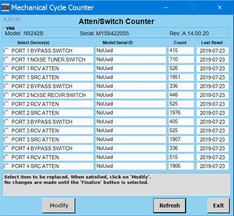

# Mechanical Counter

This feature keeps track of mechanical attenuator and switch changes. The
firmware increments counters each time commands to change the attenuator or
switch settings are sent. The dialog reads back the counters and allows a
technician to reset the counters if the hardware components are replaced. This
feature exists on all PNAs running firmware A.13.60 and above. There are no
user SCPI commands to read these counter values remotely.

  * To read/reset counters, press System > Service > Diagnostics > Mechanical Counter.... The Mechanical Cycle Counter dialog is displayed:  
  

  * Select the device to reset by clicking on its radio button located on the left side of the device name then click on the Modify button. The Model and Serial Entry dialog is displayed:  
  

  * Follow the instructions in the dialog. 

  * Enter as much data as can be found for the new assembly and enter the count in the Enter Desired Count numeric field.

