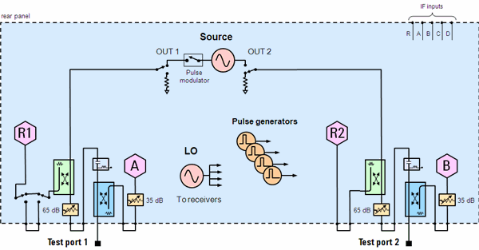
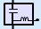
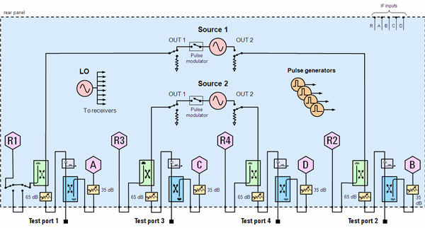

# N522xB Block Diagrams

* * *

### 2-Port Models with Option 219 and the following:

  * Opt 020 - Rear-panel IF Inputs

  * Opt 021 - Pulse Modulator on Source 1

  * Opt S93025A/B - Four internal pulse generators

[See all options](Configurations.md#N522x)

### Legend

 |  Bias Tee  
---|---  
 |  Source and Receiver Attenuators  
 |  Front-panel Jumper  
 |  Receiver  
  
* * *

### 4-Port Models with Option 419 and the following:

  * Opt 020 - Rear-panel IF Inputs

  * Opt 021 - Pulse Modulator on Source 1

  * Opt 022 - Pulse Modulator on Source 2

  * Opt 025 - Four internal pulse generators

[See all options](Configurations.md#N522x)

* * *

* * *

