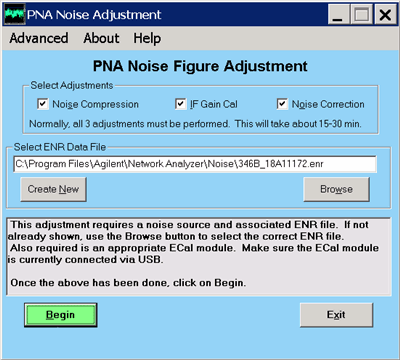
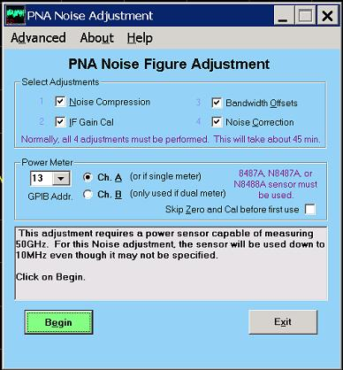

# Noise Figure Adjustment

* * *

This adjustment is ONLY for the following 13.5 or 26.5 GHz models with Noise
Figure:

  * N5241B Opt 029

  * N5242B Opt 029

See [Adjustment procedure for 43.5 GHz, 50 GHz, and 67 GHz
models.](Noise_Figure_Adjustment.htm#50GHz)

* * *

This procedure does the following:

  * Sets warning level for overpower conditions at the noise receiver. (Noise compression test)

  * Sets IF Gain flatness for the noise receiver. (IF Gain Cal)

  * Overwrites the factory noise receiver calibration. (Noise correction test).

Perform this procedure after replacing any component in the noise figure
circuitry, or if the VNA fails the noise IF gain portion of the [OP
check](Operators_Check.htm).

To launch the adjustment program:

  1. Click Utility, then System, then Service, then Adjustment Routines....

  2. Click Noise Adjustment Available only with Opt 029 or Opt H29 installed.

### Equipment Required

  * Compatible ECal module (N4691A recommended)

  * Compatible Noise source (346C recommended)

  * High quality RF Cable

Note: On a 50 GHz Option H29 VNA, noise figure adjustments and measurements
are limited to 26.5 GHz.

Advanced For Service personnel only.

Select Adjustments Leave all three checked, unless otherwise instructed.

### Procedure

This adjustment is made without the Noise Tuner connected. [Connect the
original jumper cable](../Applications/Noise_Figure.htm#Connection) to the VNA
front panel.

This adjustment requires a compatible ECal module. Make sure the ECal USB
cable is connected to the VNA before beginning. Also required is a 26.5 GHz
noise source such as the 346C.

Ignore any beeps or warnings as the adjustment program is running.

The adjustment program prompts you through the following steps:

  1. Select the ENR file for the Noise Source you will be using. This adjustment will automatically remember, and use, the last file selected. These files should normally reside in the C:\Program Files(x86)\Keysight\Network Analyzer\Noise directory, but they can also exist elsewhere. If the proper file does not already exist, click Create New to enter data for the noise source you will be using.

  2. Click Begin

  3. Connect a high-quality cable between port 1 and port 2.

  4. When prompted, connect the Noise Source to port 2, either directly or with a short, low-loss adapter.

  5. You will be prompted to reconnect the high-quality cable between ports 1 and 2.

  6. When prompted, disconnect the cable at port 2 and insert the ECal module between port 2 and the free end of the cable. Connect the ECal module directly to port 2 without using any adapters if possible. 

The entire procedure takes about 15-30 minutes.

* * *

# Noise Figure Adjustment

This adjustment is ONLY for the following 43.5, 50, and 67 GHz models with
Noise Figure:

N5244A Opt 029

N5245 Opt 029

N5247A Opt 029

* * *

This procedure does the following:

  * Sets warning level for overpower conditions at the noise receiver. (Noise compression test)

  * Sets IF Gain flatness for the noise receiver. (IF Gain Cal)

  * Sets the proper offset to compensate for Noise Bandwidth offset variations

  * Overwrites the factory noise receiver calibration. (Noise correction test).

Perform this procedure after replacing any component in the noise figure
circuitry, or if the VNA fails the noise IF gain portion of the OP check.

To launch the adjustment program:

  * Click Utility, then System, then Service, then Adjustment Routines....

  * Click Noise Adjustment Available only with Opt 029 installed.

### Equipment Required

  * Compatible ECal module (N4693A or N4694A recommended)

  * Power Meter with compatible Sensor (8487A, N8487A, or N8488A required)

  * High quality RF Cable

Note: On a 67 GHz VNA, noise figure adjustments and measurements are limited
to 50 GHz.

Advanced For Service personnel only.

Select Adjustments Leave all four checked, unless otherwise instructed.

This adjustment requires a compatible 50 or 67 GHz ECal module. Make sure the
ECal USB cable is connected to the VNA before beginning. Ignore any beeps or
warnings as the adjustment program is running.

The adjustment program prompts you through the following steps:

  1. Select the GPIB address of the power meter you will be using. If using a dual power meter, select the input channel that the sensor is connected to.

  2. Click Begin

  3. Follow all prompts.

  4. When prompted for the ECal module, disconnect the cable at port 2 and insert the ECal module between port 2 and the free end of the cable. Connect the ECal module directly to port 2 without using any adapters if possible. 

The entire procedure takes about 30-45 minutes.

### Noise Figure Adjustment Data Storage for all VNA models

  * The correction data is stored in the flash memory on the Test Set Mother Board.

* * *

