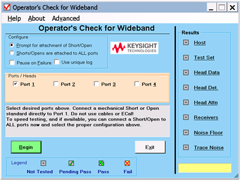
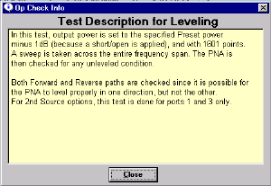

# Operator's Check

* * *

  * [Overview](Operators_Check.md#What is the Operator's Check)

  * [How to Run the Operator's Check](Operators_Check.md#The Operator's Check display)

  * [Operators Check Dialog Box Help](Operators_Check.md#OperatorsDiag)

Tip: Use Move App to Back to cause the VNA application to move behind this
application on the screen.

Overview

The Operator's Check should be performed when you first receive your VNA, and
any time you wish to have confidence that the VNA is working properly.

Notes

  * The Operator's Check does not verify performance to specifications. To verify VNA performance to specifications, run [System Verification.](System_Verification.md)
  * Allow the VNA to warm up for 90 minutes before considering a failed test to be valid.
  *   * The Operator's Check can NOT be run with a Multiport test set enabled. However, you can run a performance check as described in the Test Set User's Guide. [See the N44xx User's Guide](http://www.na.tm.Keysight.com/multiport/n44xx_users.pdf).

  
---  
  
The Pass/Fail criteria used in the Operator's Check identifies obvious
failures in the following portions of the VNA hardware:

  * Repeatability of the RF switch in the test set

  * Attenuation ranges of the test port attenuators (if installed).

  * Calibration of the receivers

  * Frequency response of the receivers

  * Phase lock and leveling

  * Noise floor and trace noise

#### How to Run the Operator's Check  
  
---  
Using Hardkey/SoftTab/Softkey  
  
  1. Press System > Service > Operator's Check.

  
  
  1. Follow the instructions to proceed with the test.

  
  
### Standard Dialog

The following dialog is displayed for standard VNAs.

### Wideband Millimeter Wave Dialog

The following dialog is displayed for wideband millimeter wave systems.

This dialog box will look slightly different, depending on VNA model number
and installed options. Some of the tests are not run if the appropriate option
is not installed.

To learn about how each test is performed, click one of the tests on the right
of the dialog For example, the following information dialog is launched when
Leveling is clicked:

Operators Check dialog box help  
---  
Note: It is normal for a momentary unleveled condition to appear during
portions of the Operators Check. Configure Prompt for attachment of Short /
Open  If you do not have enough shorts or opens for all test ports, you will
be prompted to move the standard to the next test port. Connect either a short
or open to port 1, then click Begin. Shorts / Opens are attached to all ports
Connect either a short or open for each test port, then click Begin. All ports
are tested without interruption. You can mix shorts and opens on the test
ports. VNA Shows information about the VNA that is being tested. Legend Shows
the status icons used in the Operator's Check and their meaning. Pending Pass
means that a portion of the testing has been completed successfully. Results
Shows the current status of each test. Click on the test name to learn how
that test is performed. This may help in troubleshooting failed tests. If any
tests Fail, refer to Chapter 3 of the VNA service guide. Begin Starts the
Operator's Check. View Results Shows all results in text format. Failed items
are preceded by ===>>>. This text file can be printed or saved with a unique
file name to compare results with previous or subsequent testing. Exit Ends
the program and closes the window.  
  
* * *

