# License Installation (Option Enable)

* * *

The software option can be installed by yourself. See
<https://www.keysight.com/find/LicensingSupport> about detailed Keysight
license information.

  * [Getting the license file from the Keysight Software Manager (License Server)](Option_Enable.md#KSM)

  * [Installing the license file](Option_Enable.md#Installinglicensefile)

  * [HOST ID](Option_Enable.md#HostID)

## Getting the license file from the Keysight Software Manager (License
Server)

  1. Visit http://www.keysight.com/find/softwaremanager

  2. Log in or register your name if first time log-in.

  3. Click “Add New Certificate”  
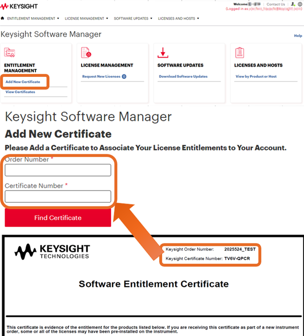

  4. Locate the Software License Entitlement Certificate.

  5. Enter your “Order Number” and “Certificate Number” on Software Entitlement Certificate.

  6. Follow the instructions to register the ordered software licenses.

  7. Select your required license (ex. S9xxxxxx)

  8. Add your [HOST ID](Option_Enable.md#HostID).  
  
Node-locked / Transportable / Trial Licenses  
  
PXI VNA / S9405xB Simulator  
  
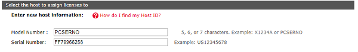  
or  
  
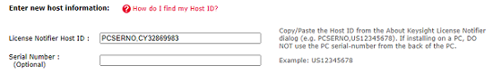  
  
Bench Top VNA  
  
The license file can be copied to the root directory of the USB device and
then connected to the VNA. The Keysight License Manager is always running, and
it scans the root directory of any new drive looking for license files. When
the file is found, the licenses are automatically installed, and a
notification is displayed on the screen. If the licenses are not installed
automatically, then the following instructions should be followed.  
  
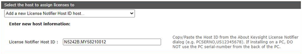  
or  
  
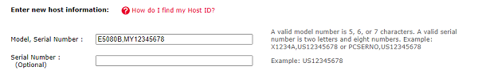  
Blank for optional  
  
  
USB VNA  
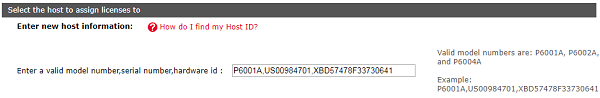  
Floating License for all VNAs and Simulator  
  
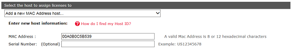  
USB Portable License for all VNAs and Simulator  
  
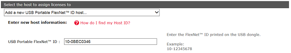  
Click “Assign License” at the bottom.

  9. Follow the instructions.

  10. The message with license file (.lic) is sent to your email address.

## Installing the license file

### Node-locked / Transportable / Trial Licenses

Note: Keysight License Manager 5 and 6 are replaced with PatheWave License
Manager from A.19.xx..

  1. Execute the Keysight PathWave License Manager from Start Menu in Windows

  2. Click \+ Add a License File.

  3. Import the license file (.lic).  
  
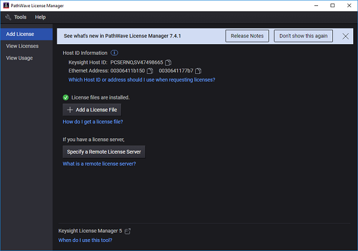

Detailed instructions can also be found in the PathWave License Manager help.

### Floating License

The floating license allows you to borrow/return the license from the license
server. Your [local controller](Option_Enable.md#YourControllerAsLocalServer)
can be a license server if required.

  1. Make sure if the license has already been installed in the license server.

  2. Execute the Pathwave License Manager as Administrator from Start Menu in Windows on the analyzer or controller for analyzer.

  3. Click Specify a Remote License server, then enter the host name or IP address with port number of the license server.

  4. Click Borrow licenses.

  5. Select the required license and specify the return date.

  6. Select View License Tab, then confirm if the selected license is installed.

Detailed instructions can also be found in the Keysight Licensing
Administrator's Guide

[Keysight Licensing Administrator's Guide | Keysight](https://www.keysight.com/us/en/assets/9018-04713/programming-guides/9018-04713.pdf)

#### Setup a license server

  1. Download a PathWave License Manager from <https://www.keysight.com/find/LicensingSupport> and install it on a PC which you will assign as a license server. If you want to use your controller as a server, the installation is not necessary. See next.

  2. Execute the PathWave License Manager as Administrator from Start Menu in Windows.

  3. Click  \+ Add a License File..

  4. Select PNA, ENA or PXIVNA for the product family. Select PXIVNA for USB VNA.

  5. Select View License Tab, then confirm if the selected license is installed,

#### Use your controller as a license server

The network connection is not required when your controller is used as a
license server.

  1. Execute the Keysight PathWave License Manager as Administrator from Start Menu in Windows on the analyzer or controller for analyzer.

  2. Click  \+ Add a License File..

  3. Select PNA, ENA or PXIVNA for the product family. Select PXIVNA for USB VNA.

  4. Select View License Tab, then confirm if the selected license is installed.

##### Known Issue on KLM6

When the VNA does not detect the floating license, execute the following
procedure.

  1. Execute C:\WIndows\system32\services.msc and find EEsof EDA License Server.  
  
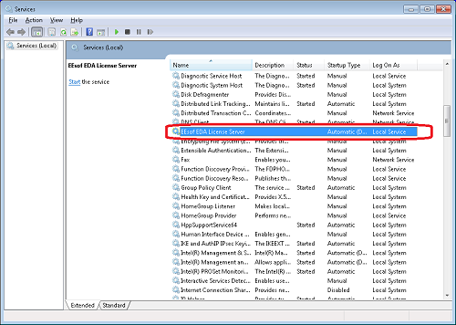

  2. If the status is either blank (Stopped) or status type is Automatic (Delayed Start), then right click and select Properties.

  3. Change the status type from Automatic (Delayed Start) to Automatic, then click Start of the Service Status.   
  
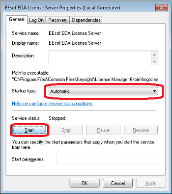

  4. Confirm if the Status is changed to Started and Automatic.  
  
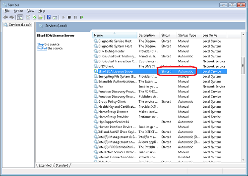

### USB Potable License

The application/option is enabled only when the analyzer or controller has
both license and the corresponding USB dongle. A license file can be installed
on many analyzers or controllers. The application is activated while the
dongle is plugged in.

  1. Execute the Keysight PathWave License Manager as Administrator from Start Menu in Windows on the analyzer or controller for analyzer.

  2. Click  \+ Add a License File..

  3. Select PNA, ENA or PXIVNA for the product family. Select PXIVNA for USB VNA.

  4. Select View License Tab, then confirm if the selected license is installed.

  5. When you use the application on the analyzer, connect the dongle in the USB port to enable the capability for license.

Note: If your analyzer or controller does not detect the dongle, download and
install the FLEXID10USBDongle Driver package for your platform from
<https://www.keysight.com/find/LicensingUsbDriver>.

Detailed instructions can also be found in the Keysight Licensing
Administrator's Guide.

[Keysight Licensing Administrator's Guide | Keysight](https://www.keysight.com/us/en/assets/9018-04713/programming-guides/9018-04713.pdf)

## About HOST ID

The HOST ID will be asked when you get the license file.

### HOST ID for PXI VNA, Bench Top VNA and Simulator

HOST ID is shown in the PathWave License Manager. PathWave License Manager can
be executed from Start Menu in Windows.

Host ID for Node-Locked, Transportable and trial licenses

The HOST ID syntax for Bench Top VNA is {Model No.},{Serial Number}, ex:
E5080B,MY12345678

The HOST ID syntax for PXI VNA and S94050B/51B Simulator is PCSERNO, {two
letters and eight numbers (this is nothing related with PC serial number)}

Host ID for Floating

HOST ID is Ethernet (Mac) address. If two numbers are displayed, either one
should be fine.

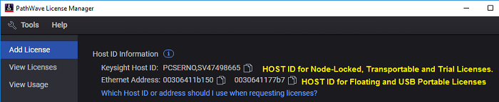

#### Host ID for USB Portable

HOST ID is printed on a USB dongle.

The USB dongle can be ordered as an option of USB portable licence or Keysight
P/N E8900-80036 Hardware Key-USB Port FLEX10.

### HOST ID for Streamline USB VNA

HOST ID is shown in About NA by clicking System > Help > About NA...

Only Node-Locked License is available for Streamline USB VNA

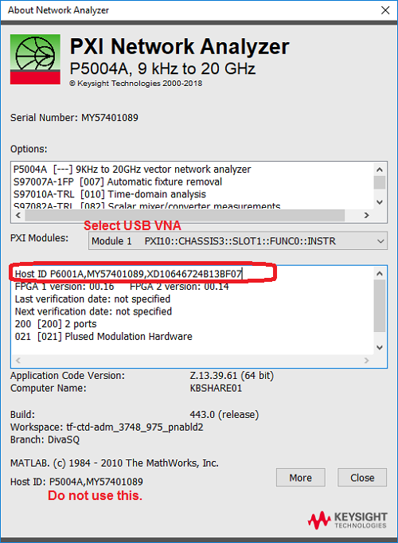

