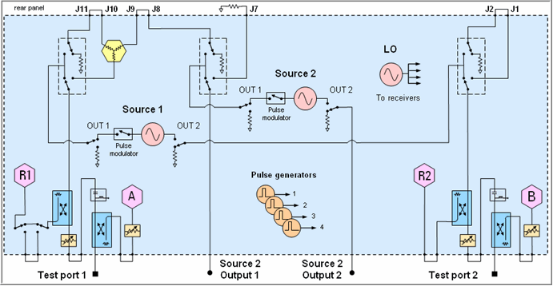
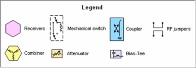
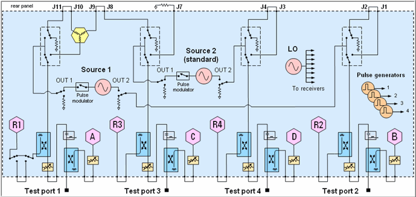

# PNA-X Block Diagrams

* * *

### 2-Port Models with Option 224 and the following:

  * Opt 021 - Pulse Modulator on Source 1

  * Opt 022 - Pulse Modulator on Source 2

  * Opt S93025A/B - Four internal pulse generators

[See all options](Configurations.md#PNAX)

Block Diagrams for other configurations are available in the last pages of
each [specifications](../Specs/ManualChoice.md) document.

### 

* * *

### 4-Port Models with Option 423 and the following:

  * Opt 021 - Pulse Modulator on Source 1

  * Opt 022 - Pulse Modulator on Source 2

  * Opt S93025A/B - Four internal pulse generators

[See all options](Configurations.md#PNAX)

* * *

* * *

