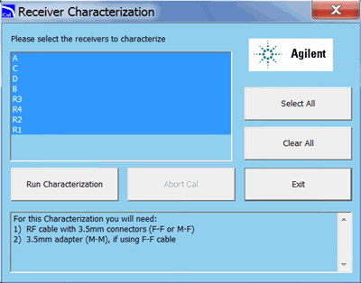

# Receiver Characterization Check

* * *

### Equipment needed:

The cables and adapters listed in the dialog box.

### Procedure

_N_ ote: You must be logged onto the VNA as an Administrator to perform an
adjustment. [Learn more.](../S0_Start/NewUsers.md#AddAccounts)

_Click Utility, then System, then Service, then Adjustment Routines...._

_At the[Adjustments selection](Adjust_Overview.md), click_ Receiver
Characterization.

Follow prompts in the program.

  1. Select the receivers to be characterized, or click Select All.

### Data Storage

  * The correction data is stored in the flash memory on the Test Set Mother Board.

* * *

