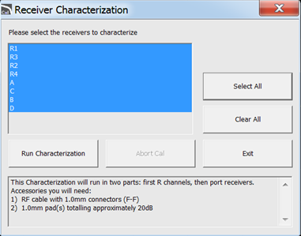

# Receiver Characterization mm Mode

This program adjusts the high level amplitude response of the N5290A/91A
system.

### Required Equipment

[See list of supported power meters and
sensors.](../S3_Cals/PwrCalibration.htm#TestEquipmentRequired)

See [VNA Accessories](Analyzer_Accessories.md)

Notes

  * You must be logged onto the VNA as an Administrator to perform an adjustment. [Learn more.](../S0_Start/NewUsers.md#AddAccounts)

  
---  
  
### Procedure

  1. _Click Utility, then System, then Service, then Adjustment Routines..._

  2. _At the Adjustments selection, click Receiver Characterization. The Receiver Characterization dialog is displayed as shown below._  
  

  3. Select the receivers to be characterized, or click Select All.

  4. Follow the instructions displayed in the program.

### Data Storage

  * The correction data is stored in the flash memory.

