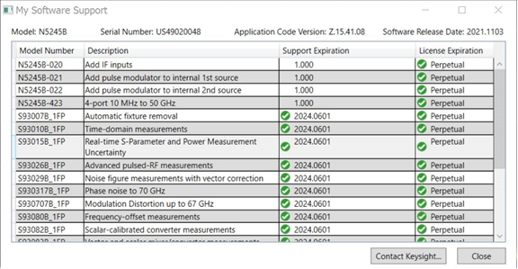
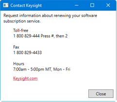
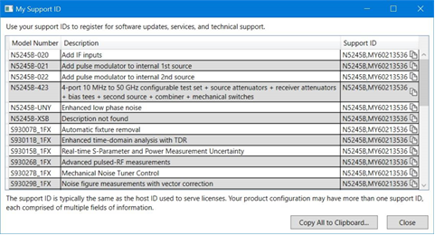
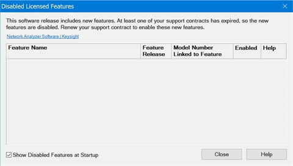
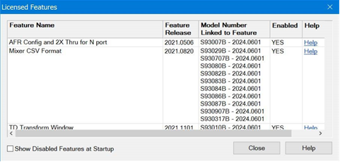

# Software Support

Each software license includes free software updates and support for the
specific instrument application for the duration of your support subscription.
A perpetual license term includes software updates and support for the first
year, after which support can be renewed annually for a fee. A subscription-
based license term includes software updates and support through the term of
the license.

In this topic:

  * List of Gated Licensed Features (with links to descriptions)
  * License Types
  * License Terms
  * Software Support Dialogs 
    * My Software Support (support expiration and license terms)
    * My Support ID
    * Licensed Features

## List of Gated Licensed Features

The following table is a list of all features that are "gated" (or tied) to
specific software licenses. Software licenses must be active to use "gated"
features. Click on a gated feature link below to access a description. The
Licensed Features dialog displays the licensed features in your instrument.

Model |  Description |  Licensed Feature (Release Date)  
---|---|---  
S9x007B |  [Automatic Fixture Removal](../S3_Cals/Auto_Fixture_Removal.md) |  [AFR Config and 2X Thru for N Port](../S3_Cals/Auto_Fixture_Removal.md#Specify) (2021.0506) Cal Update (refer to [Cal Update](../S3_Cals/Drift_Calibration.md) and [AFR](../S3_Cals/Auto_Fixture_Removal.md) topics) (2022.0101)  
S9x010B |  [Time Domain](../Time/TimeDomain.md) |  [TD Transform Window](../Time/TimeDomain.md#WindDiag) (2021.1101)  
S9x011B |  [Enhanced time domain analysis with TDR](../Applications/Enhanced_Time_Domain_Analysis/Enhanced_Time_Domain_Analysis.md) |  [L8990M Switch Matrix](../Applications/Enhanced_Time_Domain_Analysis/Switch_Matrix/Overview.md) (2022.0211) [TD Transform Window](../Time/TimeDomain.md#WindDiag) (2021.1101)  
S9x015B |  [Real-time S-Parameter and Power Measurement Uncertainty](../S3_Cals/Dynamic_Uncertainty.md) |  None  
S9x024B |  Basic Pulsed-RF Measurements, Lite |  Plot Pulse Dialog (2023.1128)  
S9x025B |  Basic Pulsed-RF Measurements |  Plot Pulse Dialog (2023.1128)  
S9x027B |  [Mechanical noise tuner control](../Applications/Noise_Figure.md#Noise_Figure_Option_027) |  [Focus Microwaves Tuner Support](../Applications/Noise_Figure.md#Noise_Figure_Option_027) (2023.0601)  
S9x029B |  [Noise Figure Measurements with Vector Correction](../Applications/Noise_Figure.md) |  [Mixer CSV Format](../Applications/MixerConverter_Setup.md#CSV_Files) (2021.0820) [Support for U1832X and U1833X Noise Sources](../Applications/Noise_Figure.md#NoiseSource) (2021.0903) [Macro Control for NF measurement path switching](../Programming/GP-IB_Command_Finder/Sense/Noise.md#SweMacrFilRNP) (2022.0910) [Multi-sensor Power Calibration for SMC/GCX](../FreqOffset/SMC_Measurements.md#Use_Multiple_Sensors) (2022.0910)  
S9x070B |  [Modulation Distortion](../Applications/Modulation_Distortion/Overview.md) |  [Mixer CSV Format](../Applications/MixerConverter_Setup.md#CSV_Files) (2021.0820) [Create Digital Modulation](../Applications/Modulation_Distortion/Create_Modulation_Files.md) (2022.0601) [Multi-sensor Power Calibration for SMC/GCX](../FreqOffset/SMC_Measurements.md#Use_Multiple_Sensors) (2022.0910) [Multi-sensor Power Calibration for SMC/GCX](../FreqOffset/SMC_Measurements.md#Use_Multiple_Sensors) (2022.0910) [Digital Pre-Distortion (DPD) and Single Port EVM Analysis](../Applications/Modulation_Distortion/DPD_Overview.md) (2022.0601)  
S9x082B |  [Scalar Mixer Converter (SMC) measurements](../FreqOffset/SMC_Measurements.md) |  [Mixer CSV Format](../Applications/MixerConverter_Setup.md#CSV_Files) (2021.0820) [Multi-sensor Power Calibration for SMC/GCX](../FreqOffset/SMC_Measurements.md#Use_Multiple_Sensors) (2022.0910)  
S9x083B |  [Vector & Scalar Mixer/Converter Measurements](../FreqOffset/VMC_Measurements.md) |  [Mixer CSV Format](../Applications/MixerConverter_Setup.md#CSV_Files) (2021.0820) [Multi-sensor Power Calibration for SMC/GCX](../FreqOffset/SMC_Measurements.md#Use_Multiple_Sensors) (2022.0910)  
S9x084B |  [Embedded LO Capability](../Applications/Embedded_LO.md) |  [Mixer CSV Format](../Applications/MixerConverter_Setup.md#CSV_Files) (2021.0820) [Multi-sensor Power Calibration for SMC/GCX](../FreqOffset/SMC_Measurements.md#Use_Multiple_Sensors) (2022.0910)  
S9x086B |  [Gain-Compression Measurements](../Applications/Gain_Compression_Application.md) |  [Gain Compression Phase](../Applications/Gain_Compression_Application.md#Phase) [Mixer CSV Format](../Applications/MixerConverter_Setup.md#CSV_Files) (2021.0820) [Multi-sensor Power Calibration for SMC/GCX](../FreqOffset/SMC_Measurements.md#Use_Multiple_Sensors) (2022.0910) [Parallel Gain Compression Measurement for Amplifier](../Applications/Gain_Compression_Application.md#GCA_Parallel)s (2024.0101)  
S9x087B |  [Swept IMD for Amplifiers](../Applications/Swept_IMD.md) |  [IMD: Multiple Receiver Configurations](../Applications/Swept_IMD.md#Receiver_Configuration) (2022.0601) [Mixer CSV Format](../Applications/MixerConverter_Setup.md#CSV_Files) (2021.0820) [Multi-sensor Power Calibration for SMC/GCX](../FreqOffset/SMC_Measurements.md#Use_Multiple_Sensors) (2022.0910)  
S9x088B |  [Source Phase Control](../S1_Settings/Phase_Control.md) |  None  
S9x089B |  [Differential and I/Q device measurements](../Applications/Differential_IQ.md) |  [Mixer CSV Format](../Applications/MixerConverter_Setup.md#CSV_Files) (2021.0820) [Multi-sensor Power Calibration for SMC/GCX](../FreqOffset/SMC_Measurements.md#Use_Multiple_Sensors) (2022.0910)  
S9x090B |  [Spectrum Analysis](../Applications/Spectrum_Analyzer.md) |  [Mixer CSV Format](../Applications/MixerConverter_Setup.md#CSV_Files) (2021.0820) [Create Digital Modulation](../Applications/Modulation_Distortion/Create_Modulation_Files.md) (2022.0601) [Multi-sensor Power Calibration for SMC/GCX](../FreqOffset/SMC_Measurements.md#Use_Multiple_Sensors) (2022.0910)  
S9x460B |  [True-Mode Stimulus](../Applications/iTMSA.md) |  None  
S9x551B |  Multiple Instruments/modules measurements |  None Note: The M983xA requires the valid subscription.  
S9x552B |  Multiport calibration assistant / Multiport ECal for PXI Switches |  None  
S9x553B |  Multiport calibrated measurements with switch instruments |  None  
  
## License Types

Node-locked (Fixed)

This type of license is locked to a specific host instrument or PC, and only
allows use of the product on this host.

Use node-locked licenses when your product only needs to be used with a single
instrument or PC. It provides the most cost-effective alternative for single-
use situations.

Transportable

This type of license is provisionally locked to a specific host instrument or
PC, and only allows use of the product on this host, but it can be unlocked
from one host and then locked to another host. You can do this using [PathWave
License
Manager](https://www.keysight.com/main/redirector.jspx?action=ref&ckey=3135511&cname=EDITORIAL),
[Keysight License Manager
5](https://www.keysight.com/main/redirector.jspx?action=ref&ckey=2225131&cname=EDITORIAL),
or [Keysight Software
Manager](https://www.keysight.com/main/redirector.jspx?action=ref&ckey=2976539&cname=EDITORIAL).

Use transportable licenses when your product periodically needs to be used on
a different instrument or PC. The transport process enables product use to be
shifted between physically adjacent instruments or PCs, and also between
geographically distributed instruments or PCs.

USB Portable

This type of license is locked to a USB key (sold separately), and can be
physically moved from one host instrument or PC to another with that USB key.
When connected to a host, the USB key enables the use of the product on that
host. This enables multiple users who are physically adjacent to share
licenses without being connected to a network.

Use USB portable licenses when your product needs to be shared frequently
among different instruments or PCs and multiple users, and the instruments or
PCs may not always be connected to a common network.

USB portable licenses require installing an additional software driver. See
[Keysight Licensing USB
Driver](https://www.keysight.com/main/redirector.jspx?action=ref&ckey=2977280&cname=EDITORIAL).

Floating (Network)

This type of license is locked to a license server, a host PC that manage
pools of licenses. The licenses can be used by multiple users on multiple
instruments or PCs; the license server ensures that each purchased license
count is used by only one user at a time. This enables geographically-
distributed users to share licenses across a common network.

Use floating licenses when your product needs to be shared frequently among
different instruments or PCs and among multiple users, and you have a common
network that can interconnect all the instruments and PCs with the license
server.

## License Terms

Perpetual (Permanent)

This term of license usage allows you to use the product indefinitely.

Perpetual licenses include software updates and support for the first year.
Support may be renewed annually for a fee after that.

Use perpetual licenses when you will need to use the product for an extended
period of time (e.g. many years) and you may not need updates and support
after the first year.

Subscription (Expiring)

This term of license usage allows you to use the product for a specific
limited time.

Subscription licenses include software updates and support through the term of
the license.

## Software Support Dialogs

There are three dialogs that provide support information:

  * My Software Support
  * My Support ID
  * Licensed Features

#### Access Software Support  
  
---  
Using Hardkey/SoftTab/Softkey |  Using a mouse  
  
  1. Press System > Help > Tech Support.
  2. Select My Software Support... or My Support ID....

|

  1. Click Help.
  2. Select Tech Support.
  3. Select My Software Support... or My Support ID....

  
  
### My Software Support

This dialog displays software-specific support information.

Model Number \- Displays the model number of the feature.

Description \- Displays a description of the feature.

Support Expiration \- Displays the support expiration date.

License Expiration \- Displays the license type.

Contact Keysight... button - Opens the dialog showing contact information:

### My Support ID

This dialog displays your support IDs used to register for software updates,
services, and technical support. The support ID is typically the same as the
host ID used to serve licenses. Your product configuration may have more than
one support ID, each comprised of multiple fields of information.

Model Number \- Displays the model number of the feature.

Description \- Displays a description of the feature.

Support ID \- Displays your support ID, which is typically the same as the
host ID.

Copy icon - Copy the corresponding ID information to the clipboard.

Copy All to Clipboard... button - Copies all the contents of this dialog to
the clipboard.

### Licensed Features

This dialog displays a list of new features in the VNA firmware and
corresponding license.

On start-up, the following dialog appears if the Show Disabled Features at
Startup is checked and at least one feature has an expired support contract.

In the normal case, all licenses are shown.

Feature Name \- Displays the name of the measurement feature.

Feature Release \- Displays the license model firmware release date.

Model Number Linked to Feature \- Displays the licenses that can enable the
feature. Each license is on its own line with the expiration data. This
information can also be found in the Keysight License Manager. Support
contract information is NOT in the Keysight License Manager.

Enabled \- Indicates whether the feature is enabled or not. When the Feature
Release date is newer than the date in Model Number Linked to Feature, the
feature is disabled. Purchase the subscription for the software to enable the
feature.

Help \- Link to information about the feature.

Show Disabled Features at Startup \- When enabled, will display the Disabled
Licensed Features dialog at startup. If unchecked and default preferences are
restored, the Show Disabled Features at Startup will be checked.

