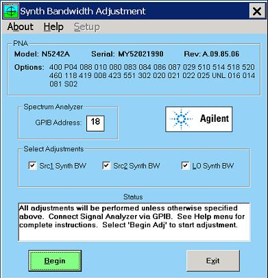

# Synthesizer Bandwidth Adjustment

* * *

The Synth Bandwidth adjusts the loop bandwidth of the synthesizer by measuring
the sideband amplitude difference of the IF signal from the main signal. The
program aims for a difference of 7dB.

### Equipment needed:

Compatible Spectrum Analyzer, GPIB cable, RF cable. An Keysight spectrum
analyzer (SA) that covers 3.7 GHz is required. The SA must be controlled via
GPIB.

### Procedure

_N_ ote: You must be logged onto the VNA as an Administrator to perform an
adjustment. [Learn more.](../S0_Start/NewUsers.md#AddAccounts)

_Click Utility, then System, then Service, then Adjustment Routines...._

_At the[Adjustments selection](Adjust_Overview.md), click_ Synthesizer
Bandwidth Adjustment.

Follow prompts in the program.

  1. Connect the SA to the VNA.

     1. The adjustment program will display the proper connection point. In most cases the connection point is either on the front or rear panel of the VNA, so no internal connection is needed. 

     2. For PNA-L models (N5231A-N5239A) the connection point is internal to the chassis, so the VNA must be opened. 

  2. There are either one, two, or three synthesizers depending upon model and option. Only the synthesizers valid for the particular instrument will be enabled and selectable. All should be adjusted since the actual adjustment takes less than 1 minute.

### Data Storage

  * The correction data is stored in the EEPROM on the selected Synthesizer assembly.

* * *

