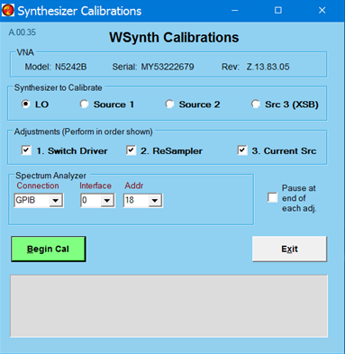

# Synthesizer DAC Adj.

* * *

The synthesizer DACs are adjusted for best phase noise. This adjustment is
only required on option UNY instruments.

Note: Performing this adjustment on instruments that do not have option UNY
can be done but will not improve phase noise. That is, it will have no effect.

### Equipment needed:

Compatible Spectrum Analyzer, GPIB cable (or LAN cable), RF cable. An Keysight
spectrum analyzer (SA) that covers 6 GHz is required. The Spectrum Analyzer
must be controlled via GPIB or LAN.

### Procedure

_N_ ote: You must be logged onto the VNA as an Administrator to perform an
adjustment. [Learn more.](../S0_Start/NewUsers.md#AddAccounts)

_Click Utility, then System, then Service, then Adjustment Routines...._

_At the[Adjustments selection](Adjust_Overview.md), click_ Synthesizer DAC
Adj.

Follow prompts in the program.

  1. The program will prompt for the proper connections. 
  2. Ensure that the Spectrum Analyzer is connected to the VNA via GPIB or LAN.
  3. Click on the Begin Cal button.

### Data Storage

  * The correction data is temporarily stored on the hard drive but it is then immediately uploaded to the synthesizer flash memory.

* * *

