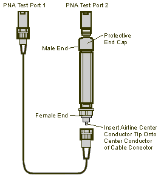
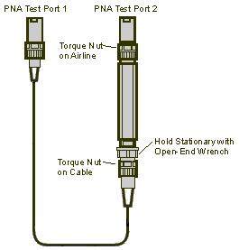
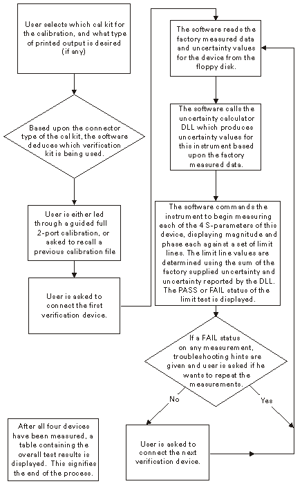
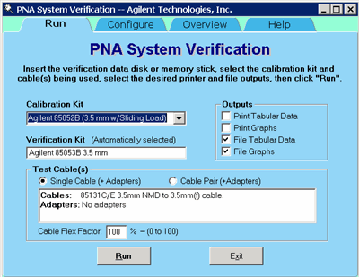
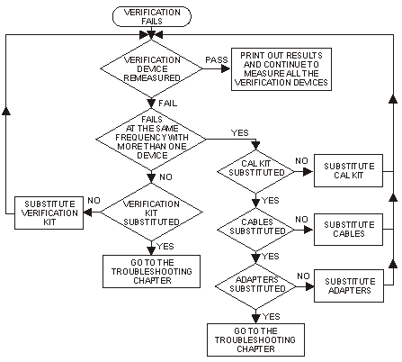
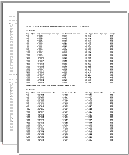
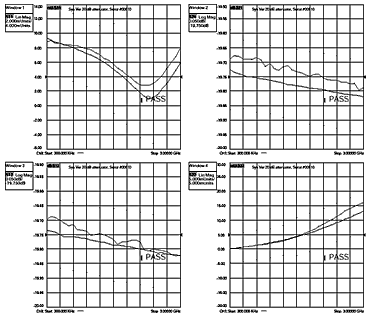

# System Verification

* * *

The performance of the network analyzer is specified in two ways: system
specifications, and instrument specifications. It is the end user’s
responsibility to determine which set of specifications is applicable to their
use of the analyzer.

A network analyzer measurement “system” includes the analyzer, calibration
kit, test cables, and any necessary adapters. The system verification software
in the analyzer is used to verify the system’s conformance to the “system”
specifications. A “pass” result demonstrates that the analyzer, test cables,
and adapters, perform correctly as a system. It DOES NOT demonstrate that any
one component performs according to its individual specifications. A change to
any part of this measurement system requires a re-verification of the system.

Instrument specifications specify the network analyzer’s uncorrected
measurement port characteristics and its output and input behavior. The
analyzer performance tests are used to verify the analyzer’s conformance to
“instrument” specifications.

The system verification utility verifies the analyzer system specifications by
automatically measuring the magnitude and phase for all four S-parameters for
each verification device, and comparing the values against the following:

  * Factory measured data from files on the verification disk

  * Limit lines based on the measurement uncertainty

System Verification requires the use of a calibration kit and verification kit
which has been certified within the past 12 months by Keysight. System
Verification can NOT be used to perform this kit certification.

[Operator's Check](Operators_Check.md) should also be performed to verify the
basic operation of the analyzer.

  * Equipment Used in the System Verification

  * [Precautions for Handling Airlines](System_Verification.md#precau)

  * [Flow Diagram of Procedure](System_Verification.md#flowdiag)

  * [Procedure for System Verification](System_Verification.md#verproc)

  * [If the System Fails the Verification Test](System_Verification.md#fails)

  * [Interpreting the Verification Results](System_Verification.md#interpret)

Notes

  * Although the performance for all S-parameters is measured, the S-parameter phase uncertainties are less important for verifying system performance. Therefore, the limit lines will not appear on the printouts.
  * System Verification can NOT be run with a Multiport test set enabled. However, you can run a performance check as described in the Test Set User's Guide. [See the N44xx User's Guide](http://www.na.tm.Keysight.com/multiport/n44xx_users.pdf).
  * The M9485A supports only ports 1 to 4. When the M9485A has any M9377As, system verification is not supported.

  
---  
  
Equipment Used in the System Verification

### VNA Models with 3.5 mm test ports

**Equipment Type** |  **3.5 mm** |  **Type-N**  
---|---|---  
Calibration kit**  
or**  
ECAL Module |  85052B/C/D, 85033D/E  
  
N4691A/B/D  |  85054D,85032B/E/F  
  
N4690A/B/C/D  
Verification kit |  85053B |  85055A  
RF Cable(s) |  Single: 85131C/E  
Pair: 85131D/F |  Single: 85132C/E  
Pair: 85132D/F  
Adapters |  None |  _Single:_ 85130C and one 7mm-to-Type-N from 85054B cal kit _  
Pair:_ Two 7mm-to-Type-N from 85054B cal kit  
  
### VNA Models with 2.4 mm test ports

**Equipment Type** |  **2.4 mm** |  **3.5 mm** |  **Type-N**  
---|---|---|---  
Calibration kit**  
or**  
ECAL Module |  85056A/D  
  
N4693A/D  |  85052C/D  
  
N4691A/B/D  |  85054B/D  
  
N4690A/B/C/D  
Verification kit |  85057B |  85053B |  85055A  
RF Cable(s) |  Single: 85133C/E  
Pair: 85133D/F |  Single: 85134C/E  
Pair: 85134D/F |  Single: 85135C/E  
Pair: 85135D/F  
Adapters |  None |  _Single:_ 85130F _  
Pair:_ None |  _Single:_ 85130E and two 7mm-to-Type-N from 85054B cal kit _  
Pair:_ Two 7mm-to-Type-N from 85054B cal kit  
  
### **VNA Models with** 1.85 mm test ports

**Equipment Type** |  **1.85 mm** |  **2.4 mm  
3.5 mm  
Type-N**  
---|---|---  
Calibration kit**  
or**  
ECAL Module |  85058B  
  
N4694A/D  |  See 2.4 mm test port table above  
Verification kit |  85058V |  See 2.4 mm test port table above  
RF Cable(s) |  Single: N4697E  
Pair: N4697F |  See 2.4 mm test port table above  
Adapters |  None |  See 2.4 mm test port table above  
  
### Cable Substitution

The test port cables specified for the analyzer have been characterized for
connector repeatability, magnitude and phase stability with flexing, return
loss, insertion loss, and aging rate. Since test port cable performance is a
significant contributor to the system performance, cables of lower performance
will increase the uncertainty of your measurement. It is highly recommended
that the test port cables be regularly tested.

If the system verification is performed with a non-Keysight cable, ensure that
the cable meets or exceeds the operation of the specified cable. Refer to the
cable User's Guide for specifications.

### Cable Flex Factor

Flex Factor determines how much of the cable phase uncertainty to include in
determining the limit lines.

  * Set to 0% (zero) if the cables are held down in a fixture and are not allowed to move during the calibration and verification.

  * Set to 100% if the cables are allowed to move a lot.

### Calibration Kit Substitution

Non-Keysight calibration kits are not recommended nor supported.

Precautions for Handling Airlines

When you are using the airlines in the verification kit, observe the following
practices to ensure good measurement techniques.

  * Be very careful not to drop the airline's center or outer conductor. Damage will result if these devices are dropped.

  * Use proper Electro-Static Discharge (ESD) procedures.

  * Clean your hands or wear gloves as skin oils will cause a change in electrical performance.

Flow Diagram of Procedure

The operational flow of the software is depicted by the flowchart shown below.

Procedure for System Verification

  1. If you want printed test outputs, connect a printer to the analyzer. Let the analyzer warm up for at least 30 minutes.

  2. Insert the verification kit USB memory into the analyzer USB port.

  3. Press System > Service > Verification > System Verification . The System Verification window similar to this will be displayed.

System Verification Dialog

  4. In the Calibration Kit box, select the calibration kit or ECal module that is being used. The corresponding verification kit to use appears in the Verification Kit box.

  5. Under Printer Output click on any of the following options.

     * Print Tabular Data: Prints the verification data in tabular form which includes measured data and uncertainty limits. Refer to a tabular data example, later in this topic.

     * Print Graphs: Prints the verification data in graphical form. The graphic form includes the measured data trace, factory supplied data trace and uncertainty limits. Refer to a plot data example, later in this topic.

     * File Tabular Data: Writes the verification data in tabular form to a text file in the D:\ directory.

     * File Graphs: Saves a screen image in .PNG format in the D:\ directory.

Note: If you want printed output, it is assumed you have already installed the
Windows driver for your particular printer, and have tested that you can print
to the printer from the network analyzer. This software is designed to print
to whichever printer is currently set as the Default printer (see Printers in
the Windows Control Panel).

  6. To modify the number of ports to be verified, to change the number of devices to measure, or to use a previously stored verification calibration, click on the Configure tab and make the desired selections.

     * For the system verification to be truly adequate, the software must measure all devices in the kit with a recent calibration applied. Removing and reattaching any test port cables or adapters invalidates all previous calibrations.
  7. Click Run.

  8. Follow the instructions on the analyzer for performing the system verification, inserting the verification devices as prompted.

Note for 3 Port analyzer:  
The System Verification Procedure is repeated three times. The first time,
Ports 1 and 2 are measured as a pair; then Ports 1 and 3 are measured; and
lastly, Ports 2 and 3 are measured.

Note for 4 Port analyzer:  
The System Verification Procedure is repeated two times. The first time, Ports
1 and 2 are measured as a pair, then Ports 3 and 4 are measured.

Step-by-Step Process Description

  1. Depending upon the selected choice in the Calibration submenu of the Configure menu, the user is either prompted to recall a previous calibrated instrument state, or is guided through a full 2-port calibration using the selected calibration kit. For ECal, the ECal module is connected just once; a standby message is posted while the software is performing the calibration.

  2. The user is prompted to connect the first verification device.

  3. The software reads the factory measured data for that device and uncertainty values for that data (CITIfiles) from the floppy disk supplied with the verification kit.

  4. The software sends the factory measured data, calibration kit and instrument state information to the uncertainty calculator DLL, which generates uncertainty values specific to the analyzer.

  5. The analyzer first sets up for magnitude measurements of all four S-parameters, each parameter in a separate window (lin mag for S11 and S22, log mag for S21 and S12). Each of the factory measured S-parameters are fed to the appropriate window as a memory trace. Limit line offsets are calculated as the sum of the factory measured data uncertainties and analyzer uncertainties reported by the DLL. Upper and lower limits are displayed (factory measured data + uncertainty sum, factory measured data - uncertainty sum). The analyzer takes a sweep, limit test is turned on and PASS/FAIL status is reported in each of the four windows.

  6. The user clicks a button when ready to view phase measurements. The four windows get updated for phase format, phase memory traces, phase limits and PASS/FAIL result.

  7. If the limit test of any of the four S-parameters (magnitude or phase) indicates a FAIL status, the software suggests troubleshooting tips and asks if the user would like to repeat measurement of that device or proceed to the next device. If proceeding to the next device, the factory measured data and uncertainties for the next device are read from floppy, the uncertainty DLL gets called with this next set of factory measured data, and the four measurement windows get updated for magnitude measurement of the next device.

  8. The software follows this same process until all selected devices have been measured, at which point a summary window is displayed containing the set of PASS/FAIL results for all four parameters of each device.

If the System Fails the Verification Test

IMPORTANT: Inspect all connections. Do not remove the cable from the analyzer
test port. This will invalidate the calibration that you have done earlier.

  1. Repeat this verification test. Make good connections with correct torque specifications for each verification device.

  2. Disconnect, clean and reconnect the device that failed the verification test. Then measure the device again.

  3. If the analyzer still fails the test, check the measurement calibration by viewing the error terms as described in "Front Panel Access to Error Terms" on page 4-7 of the Service Guide.

  4. Refer to the graphic below, for additional troubleshooting steps.

Verification Fails Flowchart

Interpreting the Verification Results

The graphic below shows an example of typical verification results with
Tabular Data selected in the Printer Output area of the System Verification
window. A graphic later in this topic shows an example of typical verification
results with Measurement Plots selected in the Printer Output area of the
System Verification windows. These printouts include a comparison of the data
from your measurement results with the traceable data and corresponding
uncertainty specifications. Use these printouts to determine whether your
measured data falls within the total uncertainty limits at all frequencies.

The tabular data consists of:

  * Frequency of the data points (in MHz).

  * Lower limit line as defined by the total system uncertainty specification.

  * Results of the measurement.

  * Upper limit line as defined by the total system uncertainty specification.

  * Test status (PASS or FAIL) of that measurement point.

Printout of Tabular Verification Results

The printed graphical results show:

  * Upper limit points as defined by the total system uncertainty specifications.

  * Lower limit points as defined by the total system uncertainty specifications.

  * Data measured at the factory.

  * Results of measurements.

  * Measurement parameter names and formats (Lin Mag or Log Mag).

  * Serial number of device (00810).

  * Device being measured (Sys Ver 20 dB attenuator).

Printout of Graphical Verification Results

* * *

