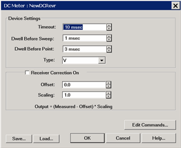
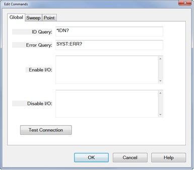
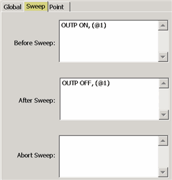
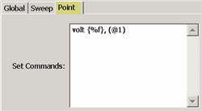

# Configure DC Sources and DC Meters

* * *

Once configured, one or more DC Sources and DC Meters can be controlled by the
VNA. DC Power Analyzers are also supported, but they must be configured as a
separate Source and Meter.

The Keysight [N6700 series](http://www.keysight.com/find/n6700) and [B2900
series](http://www.keysight.com/find/b2900) DC Analyzers are supported with
configuration files that can be loaded on the DC Meter and DC Source property
page. Once loaded, the SCPI commands that control the DC device can be
modified and saved. [Learn how](Configure_a_DC_Device.md#DCMeterProps).

### See Also

[External DC Meter Data
Conversion](../S4_Collect/External_DC_Meter_Data_Conversion.htm)

#### How to Configure a DC Meter or DC Source

  1. Important: Create a DC Source / Meter device by name (one-time). [Learn how (separate topic)](Configure_an_External_Device.md).
  2. On the Configure an External Device dialog, click Device Properties. (This topic).

  
---  
Using Hardkey/SoftTab/Softkey |  Using a mouse  
  
  1. Press Setup > External Hardware > External Device...
  2. Click Device Properties to [Configure the External Source](Configure_an_External_Source.md#ext_source_config).

|

  1. Click Instrument
  2. Select Setup
  3. Select External Hardware
  4. Select External Device...

  
Once configured, set the DC source voltage and display DC meter measurements:

  * DC Sources: DC Source control is available in Standard, [Gain Compression](../Applications/Gain_Compression_Application.md)/[GCX](../Applications/Gain_Compression_for_Converters.md) , and [FCA](../FreqOffset/FCA_Use.md) channels. 
  *     * Set the Start and Stop voltage on the [DC Control dialog](../S1_Settings/DC_Control.md). To access this dialog: Press Sweep > Source Control > DC Source.
  * DC Meters : DC meter measurements are available in Standard, [Gain Compression](../Applications/Gain_Compression_Application.md) /[GCX](../Applications/Gain_Compression_for_Converters.md), [Swept IMD](../Applications/Swept_IMD.md) / [IMDX](../Applications/Swept_IMDx.md), and [FCA](../FreqOffset/FCA_Use.md) channels.
  *     * In [Gain Compression](../Applications/Gain_Compression_Application.md) /[GCX](../Applications/Gain_Compression_for_Converters.md), [Swept IMD](../Applications/Swept_IMD.md) / [IMDX](../Applications/Swept_IMDx.md), and [FCA](../FreqOffset/FCA_Use.md) channels, display DC parameters as you would an RF parameter, by clicking Trace > New Trace.
    * In a Standard channel, configure an unratioed measurement. See [AUX](../S1_Settings/Measurement_Parameters.md#Auxiliary) tab.

  
  
  
DC Source / Meter Configuration dialog box help  
---  
The DC Source and DC Meter properties are almost identical in how they
operate. Both are documented here.

### Device Settings

Timeout \- Sets a time limit for the DC source or meter to make contact with
the VNA. If this time limit is exceeded, the VNA stops the measurement and
displays the following error message. EXECUTION ERROR;OPC QUERY TIMEOUT ERROR
If this occurs, check the connections between your VNA and external device.
Dwell Before Sweep Wait time before making a sweep. Dwell Before Point

  * DC source Wait time after setting the voltage/current at each data point.
  * DC meter Wait time before measuring voltage/current at each data point.

Type: This setting changes the units that are displayed in the [DC Source dialog](../S1_Settings/DC_Control.md), the X-axis display annotation, and the [underlying data format](../S4_Collect/External_DC_Meter_Data_Conversion.md). Use these settings with Receiver or Source Correction (Scaling and Offset) to display and scale measurements with these units. Choose from: |  V (volts - default) |  dBm |  F (degrees)  
---|---|---  
A (amperes) |  W (watts) |  C (degrees)  
|  |  K (kelvin)  
  
Note: To change the X-axis to display the DC Meter units, click Response, then
Display, then Labels, then Select X-Axis, then select the DC Meter.

### Receiver / Source Correction

  * For a DC source, use the correction settings to scale and offset the output voltage.

  * For a DC Meter (receiver), use the correction settings, along with Type, to display and scale measurements with appropriate units. For example:

Measure the voltage across a 5 ohm resistor, then display the results in
A(mperes).

Using ohms law, I = V / 5 ohms or I = V *.2

For receiver correction, enter Scaling = .2; Offset = 0.

ON Check to apply the following correction factors to each measurement.

Offset: Enter the value to offset the DC Meter reading or set the DC Source
voltage.

Scaling: Enter the value to scale the DC Meter reading or set the DC Source
voltage.

Displayed Output = (Measured / Set value - Offset) * Scaling value.

Edit Commands \- Click to start the Edit Commands dialog.

Important Note: The Edit Commands dialogs (see below) MUST be completed. They
are used to set the SCPI commands with which the VNA communicates with the DC
device. These commands are saved, along with other configuration settings, to
configuration (*.xml) files. These files can then be loaded later when
communicating with the same DC Device. Configuration files for the Keysight
N67xx and B29xx Power Analyzers and the other devices are pre-loaded on the
VNA. Click Load, then navigate to: d:\drivers.  
---  
  
Save \- Press to save the current DC Source or DC Meter configuration to an
*.xml file. The list of files is NOT filtered by "DCMeter" or "DCSource", so
use a descriptive filename.

Load \- Press to load an existing configuration.  
  
DC Meter Edit Commands dialog box help  
---  
  
### Global Tab

 The Global tab includes
the system settings for the DC Meter. ID Query \- Enter the SCPI command to
return the ID string of the DC Meter. Typically *IDN? Error Query \- Enter the
SCPI command that is used to return DC Meter errors. Typically SYST:ERR?
Enable I/O \- Enter the SCPI commands that is used to enable the DC Meter to
read voltages. Disable I/O \- Enter the SCPI commands that is used to disable
the DC Meter from reading voltages.

### Test Connection

Click to start the Test Connection dialog. You must first have entered the I/O
Configuration settings and select Enable IO on the [External Device
dialog](Configure_an_External_Device.htm#ExtDevConfig).
 Enter a SCPI command,
then click Send or Send&Read when a return value is expected.

### Sweep Tab

 Use the Sweep Tab to send SCPI
commands to the DC Meter at the beginning or end of each sweep. Abort Sweep \-
Enter the SCPI command that is used to Abort or reset the DC Meter. This would
be necessary when the VNA sweep is aborted or terminated. The VNA will then
send the command to the DC Meter.

### Point Tab

 Read (commands) \- Enter the
SCPI command that is used to make a DC measurement at each data point. Set
(commands) \- Use <%variable> to make a DC Meter setting.  
  
DC Source Edit Commands dialog box help  
---  
  
### Global Tab

 The Global tab includes the
system settings for the DC Source. ID Query \- Enter the SCPI command to
return the ID string of the DC Source. Typically *IDN? This entry can be left
blank. Error Query \- Enter the SCPI command that is used to return DC Source
errors. Typically SYST:ERR? Enable I/O \- Enter the SCPI commands that is used
to enable the DC Source to output voltages. Disable I/O \- Enter the SCPI
commands that is used to disable the DC Source from outputting voltages.

### Maximum / Minimum DC Output

Read Max / Min Using \- Select, then enter the commands used to return the
output limits of the DC source. Define Max / Min As \- If the DC Source has no
commands to return these values, or you would rather define the limit for your
DC Source, select then enter the Max and Min voltage limits.

### Test Connection

Click to start the Test Connection dialog. You must first have entered the I/O
Configuration settings and select Enable IO on the [External Device
dialog](Configure_an_External_Device.htm#ExtDevConfig).
 Enter a SCPI command,
then click Send or Send&Read when a return value is expected.

### Sweep Tab

 Use the Sweep Tab to send SCPI
commands to the DC Source at the beginning or end of each sweep. Typically,
you might send the output ON at the beginning of each sweep, and output OFF at
the end of each sweep as shown above. Abort Sweep \- Enter the SCPI command
that is used to Abort or reset the DC Source. This would be necessary when the
VNA sweep is aborted or terminated. The VNA will then send the command to the
DC Source.

### Point Tab

 Note: The DC Source output
voltages are configured on the [DC Source
dialog](../S1_Settings/DC_Control.htm). This dialog is used to configure the
commands that are used to communicate with the DC Source. Set commands \-
Enter the SCPI command, enclosed in {curly brackets} to output (set) a
voltage/current from the DC Source for each data point.

  * {%f} \- The value is a double value. (Most common).
  * {%d} \- The value is a integer. This would be used when the voltage controls a remote switch. For example, you can program the value to: “0,1,0,1,0,1 .”. where “0” = OFF and “1” = ON.

  
  
* * *

* * *

