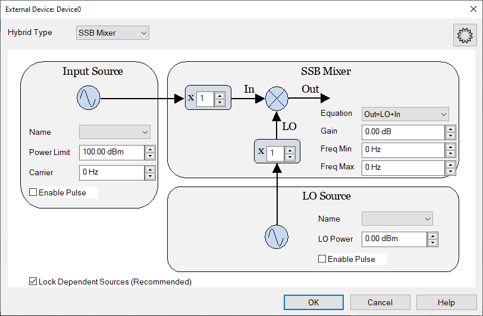
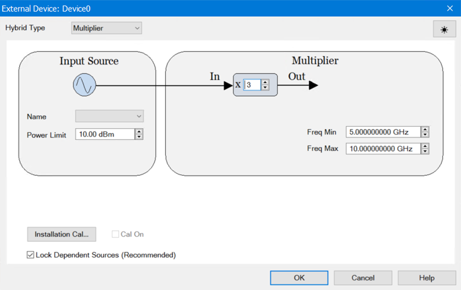
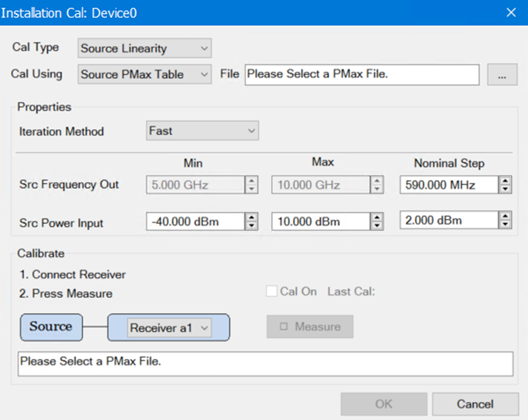

# Configure a Hybrid Source

The Hybrid Source is a new driver selection from the External Device
Configuration dialog. It combines a source with a mixer to create a high-
frequency source and supports the following:

  * Single-Side-Band mixers

  * Multipliers

Note: License S94800B "Millimeter Wave Modulation" is required for any use of
the Hybrid Source to output a signal with frequency greater than 90 GHz.

Note: License S94801B "Wideband Modulation" is required for the use of hybrid
source to output a wideband signal that exceeds the following:  
Between 4.8 GHz and 31.8 GHz, any modulation signal wider than 2.2 GHz  
Between 31.8 GHz and 37 GHz, any modulation signal wider than 550 MHz  
Between 37 GHz and 90 GHz, any modulation signal wider than 2.2 GHz

* * *

Once configured, an external source appears in VNA dialogs as though it were
an internal source.

In this topic:

  * How to Configure an External Source

  * External Device dialog (Hybrid Type set to SSB Mixer)

  * External Device dialog (Hybrid Type set to Multiplier)

* * *

#### How to Configure an External Source

  1. Important: Create an External Source device by name (one-time). [Learn how.](Configure_an_External_Device.md) (Separate topic)
  2. Select Hybrid Source from the Driver menu.
  3. Then click Device Properties to [Configure a Hybrid Source](Configure_a_Hybrid_Source.md). (This topic)

[VNA Applications](../Applications/Applications.md) have additional methods
of launching this dialog.  
---  
Using Hardkey/SoftTab/Softkey |  Using a mouse  
  
  1. Press Setup > External Hardware > External Device...
  2. Click Device Properties to [Configure a Hybrid Source](Configure_a_Hybrid_Source.md).

|

  1. Click Instrument
  2. Select Setup
  3. Select External Hardware
  4. Select External Device...

  
 See [Remotely Specifying a Source
Port](../Programming/Remotely_Specifying_a_Source_Port.htm)  
  
External Device dialog box help (Hybrid Type set to SSB Mixer)  
---  

### Hybrid Type

Currently provides two selections: SSB Mixer (default) and Multiplier. The
External Device dialog changes appearance and available settings according to
the Hybrid Type you select. This section describes the External Device dialog
when SSB Mixer is selected.

### Input Source

Name The drop-down menu allows you to select external or internal sources.
Power Limit This is the maximum power setting allowed for the Input Source.
The system will adjust the output power of the Hybrid Source by changing the
power level of the Input Source and correcting for the Nominal Gain. This
limit ensures that the Input Source is not set to a power level that will
damage the SSB mixer. Carrier For an SSB Mixer, the center of the input
modulated signal is offset from DC by the carrier frequency. The Hybrid Source
will adjust the LO Source to set the frequency of the output. In some cases,
the Input Carrier frequency must be adjusted by a slight amount so that the
input mixed with the LO results in the desired output. Enable Pulse The hybrid
source can be pulsed either by pulsing the Input Source or by pulsing the LO
Source. The user can choose which source is pulsed when the hybrid source is
pulsed.

### SSB Mixer

Equation An equation is required for a Single-Sideband Mixer. Two available
selections: "Out=LO+In", "Out=LO-In".

  * "Out=LO+In" This is known as a Low-Side LO converter. This is the default setting.
  * "Out=LO-In" This is known as a High-Side LO converter. From the hardware point of view, a modulated spectrum at the output will be a "inverted" version of the modulated spectrum at the input. To fix this problem, the Hybrid Source will "invert" the input spectrum so that the output spectrum is correct.

Input Multiplier If there is a multiplier placed between the Input Source and
the SSB mixer, then specify the multiplication factor here. LO Multiplier If
there is a multiplier placed between the LO Source and the SSB mixer, then
specify the multiplication factor here. Gain This is the nominal gain of the
SSB mixer system. The nominal gain value is used to set the input source power
in order to get the desired output source power. The user may choose to add an
amplifier to the hybrid source to get more output power. Note that if the
input multiplier is set to some value other than 1, then the concept of
amplification not very clear. In this case, we will assume that the gain
represents the gain from the input power limit value to the resulting output
power. Freq Min/Freq Max Limits the output frequency of the mixer. By default,
these should be 0 Hz to 1 THz.

### LO Source

Name The drop-down menu allows you to select external or internal sources.
Power Sets the output power of the LO. Enable Pulse The hybrid source can be
pulsed either by pulsing the Input Source or by pulsing the LO Source. The
user can choose which source is pulsed when the hybrid source is pulsed.

### Lock Dependent Sources (Recommended)

When checked, this locks out sources that are used by this source from the
GUI. By default this is checked.  
  
External Device dialog box help (Hybrid Type set to Multiplier)  
---  

### Hybrid Type

Currently provides two selections: SSB Mixer (default) and Multiplier. The
External Device dialog changes appearance and available settings according to
the Hybrid Type you select. This section describes the External Device dialog
when Multiplier is selected.

### Input Source

Name The drop-down menu allows you to select external or internal sources.
Power Limit This is the maximum power setting allowed for the Input Source, to
avoid damaging the multiplier.

### Multiplier

Input Frequency Multiplier Specify the multiplication factor here. Freq Min
Minimum output frequency of the hybrid multiplier. Freq Max Maximum output
frequency of the hybrid multiplier.

### Lock Dependent Sources (Recommended)

When checked, this locks out sources that are used by this source from the
GUI. By default this is checked. Note: This checkbox is already available for
Hybrid SSB Mixers and now functions the same way for Hybrid Multipliers.

### Cal On

If an Installation Cal has already been run, this checkbox toggles the
calibration on/off.

### Installation Cal

Launches the Hybrid Multiplier Installation Cal dialog.  
  
Hybrid Multiplier Installation Cal dialog box help (Hybrid Type set to
Multiplier)  
---  
 This
feature performs a 2D source calibration (frequency and power) on hybrid
multipliers. It uses a new dynamic source calibration algorithm that
determines the frequencies and powers to sample on the fly. Cal Type:
Currently “Source Linearity” is the only option. Cal Using: Currently “Source
PMax Table” is the only option. File: Click “ ” to open a file selection
dialog and select the PMax table file. The PMax table contains the saturated
output powers for different frequencies. PMax file format is given below.
Iteration Method: Options are "Fast," "Accurate," and "None." These determine
the behavior of the dynamic source calibration algorithm.

  * Fast: Optimized for fast calibration acquisition.
  * Accurate: Optimized for calibration accuracy.
  * None: No dynamic measurement acquisition. Sampling is performed with uniform measurement spacing specified in "Nominal Step."

Src Frequency Out: "Min" and "Max" give the range of frequencies over which
the calibration is performed. They are not modifiable. "Nominal Step" gives
the maximum measurement spacing used during calibration acquisition. If
"Iteration Method" is "Fast" or "Accurate" samples may be taken with a smaller
spacing. Scr Power Input: Range of input powers over which the calibration
will be performed. “Nominal Step” gives the maximum measurement spacing used
during calibration acquisition. If “Iteration Method” is “Fast” or “Accurate”
samples may be taken with a smaller spacing. Receiver Dropdown: Select the
receiver used to measure the output of the hybrid source. Cal On: If a
calibration has already been run, this checkbox will toggle the calibration
on/off. Last Cal: Timestamp of the most recently run calibration. Measure:
Click to begin the calibration acquisition. This button is disabled until the
PMax file has been loaded. PMax file format: The PMax file is a standard PRN
file as exported from the PNA, but it includes one extra line at the beginning
specifying the hybrid multiplier input power used to generate the table. Here
is a sample: "InputPower:10dBm"  
"B,Device2 Log Mag"  
"Freq (Hz)","dBm",  
10000000, 9.760687e+00,  
142450000, -5.466206e+01,  
274900000, -6.108307e+01,  
407350000, -7.507793e+01,  
539800000, -6.009474e+01,  
672250000, -6.127968e+01,  
804700000, -5.465605e+01,  
937150000, -5.086320e+01,  
1069600000, -5.190491e+01,

