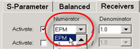
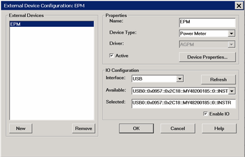
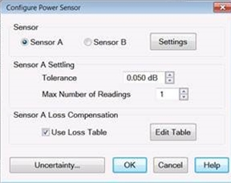
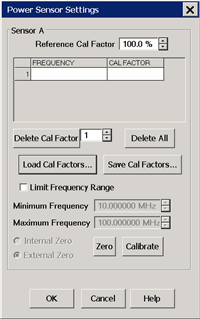
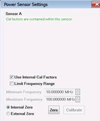

# Configure a Power Meter As Receiver (PMAR)

* * *

When a power meter is configured as a VNA receiver (in [standard measurement
channels](../S1_Settings/Measurement_Classes.htm) ONLY), you can...

  * Extend the number of measurement receivers.

  * Use the power meter as a scalar detector.

  * Monitor the power at any point in a measurement system.

  * Use multiple power meters in a [Guided Power Cal](../S3_Cals/Guided_Power_Calibration.md) to cover a wide frequency range.

Note: Multiple configurations for the same physical device can be Active.
However, only one configuration for the same external source can have the I/O
Enabled

  * Use the power meter to level the stimulus power at any point in a measurement system.

  * Use the power sensor as a PMAR device to confirm the accuracy of a Source Power Cal. [Learn how](Configure_a_Power_Meter_As_Receiver.md#ConfirmSPC).

Note: PMAR is not compatible with [Point
Sweep](../S1_Settings/Sweep.htm#Point_Sweep_Mode) mode.

Once configured, a power meter can be used like any other VNA receiver in the
following dialogs:

  * [New Trace / Meas dialog](../S1_Settings/Measurement_Parameters.md#NewTraceDiag) \- used in Ratioed and Unratioed measurements.

  * [Receiver Leveling](../S1_Settings/Receiver_Leveling.md)

  * [Frequency Offset Mode](../FreqOffset/Frequency_Offset_Mode.md) \- Extend frequencies beyond VNA

### See Also

  * [Supported Power Meters](../S3_Cals/PwrCalibration.md#TestEquipmentRequired)

  * [Important first-time USB connection note](../Front_Panel/XTour.md#FirstTimeNote).

#### How to Create and Configure a PMAR Device

  1. Create a PMAR device by name (one-time).
  2. Then click Device Properties to [configure the Power Meter/Sensor](Configure_a_Power_Meter_As_Receiver.md#ConfigPwrSensor).

[VNA Applications](../Applications/Applications.md) have additional methods
of launching this dialog.  
---  
Using Hardkey/SoftTab/Softkey | Using a mouse  
  
  1. Press Setup > External Hardware > External Device...
  2. Click Device Properties to [configure the Power Meter/Sensor](configure_a_power_meter_as_receiver.md#ConfigPwrSensor).

|

  1. Click Instrument
  2. Select Setup
  3. Select External Hardware
  4. Select External Device...

  
  
  
External Device Configuration dialog box help  
---  
 This dialog allows you to create and
configure a power meter to be used as a receiver by the VNA. Once you create
and configure a power meter from this dialog box, it becomes available from
VNA dialog boxes as well as the softkeys and entry toolbar, as if it were an
internal VNA receiver.

  * This dialog is ALSO used to configure an External Source. [Learn more.](Configure_a_Power_Meter_As_Receiver.md)
  * To configure a single power meter for a Source Power Cal, use the [Power Meter Settings](../S3_Cals/PwrCalibration.md#MeterSettings) dialog.

| Important Notes

  * By default, an external PMAR device is de-activated when the VNA is Preset or when an Instrument State is recalled. This behavior can be changed with a [Preference setting](Preferences.md) so that it remains active through a Preset or Instrument State recall.
  * PMAR configuration is NOT saved in an Instrument State file. Therefore, recalling a state file that refers to a device that has been removed, or recalling a state file on a different VNA will result in a “Device configuration not found” error.

  
---  
  
### External Devices

The devices that are currently configured appear in this list. The number of
devices that can be configured is limited by the specified Interface.

New Click to create a new PMAR configuration. The default name is Device<n>,
where <n> is the next number for 'Device'.

Remove Click to remove the selected device from the list.

### Properties

Name Enter a device name as it will appear when referring to this device in
all VNA dialog boxes. Edit the name at any time. Duplicate names are not
allowed.

Notes

  * Because External Devices can be used with FOM ranges, do NOT name an external device any of the following FOM range names: “primary”, “receivers”, or “source”, “source1”, source2”, "source3" and so forth. [Learn more about FOM ranges](../FreqOffset/Frequency_Offset_Mode.md#FreqOffsDiag).
  * Do NOT use a parameter name, such as "S11, or "R1".

  
---  
  
Device Type Select Power Meter.

Driver Use AGPM for all Keysight Power Meters. See [Supported Power
Meters](javascript:BSSCPopup\('../S3_Cals/PwrCalibration.htm#TestEquipmentRequired'\))

Active Check to make the device available for use in the FOM, New Trace, and
Receiver Leveling dialogs. An instrument state that is saved with an Active
device (checked) will include the device in the state file. Otherwise, if the
Active box is cleared, the device will NOT appear in the state file.

Note: Multiple PMAR configurations for the same physical device can be Active
and Enabled.

Device Properties Click to launch the [Configure Power
Sensor](Configure_a_Power_Meter_As_Receiver.htm#ConfigPwrSensor) dialog.

### IO Configuration

Interface Select the interface that is used to connect the device to the VNA.
These devices will then appear in the 'Available' field. Choose from:

  * GPIB \- Devices connected to the System Controller GPIB port.

  * USB \- Devices connected to the VNA USB ports. [See Important First-time USB connection note](../Front_Panel/XTour.md#FirstTimeNote).

  * Aliases \- Devices that are connected to ANY interface for which you created an alias. [See Configure Alias and LAN devices](Configure_an_External_Device.md#ConfigureAlias).

  * LAN \- Devices connected to a network using a LAN connection. The VNA must also be connected to the network. Note: Devices connected to LAN must first be configured in Keysight IO libraries before they will appear on the Available list. [See Configure Alias and LAN devices](Configure_an_External_Device.md#ConfigureAlias).

Available Shows a list of devices that are connected to the specified IO
Interface.

Refresh Click to rescan the specified interface for devices.

Selected Enter the IO configuration or select from the available list of IO
Interfaces found.

Enable I/O Clear this box to disable communication with the selected device.
You would do this to configure a device that is not yet connected to the VNA.

  * Communication with devices is attempted when Enable I/O is checked, Active is checked, and OK is pressed.

  * If communication with a device is lost, the affected channels are put into Hold.

  * When communication is attempted, devices with Enable I/O checked are queried for limits for frequency, power, and number of points. If there are limit problems, the VNA sends an error and the affected channels are put into Hold. These limits are enforced by the dialog box in which they are set. Resolve the reported limit problem and then restore the triggering.

  * Communication is also attempted when clicking the Settings button on the [Configure Power Sensor](Configure_a_Power_Meter_As_Receiver.md#ConfigPwrSensor) dialog. You can not change any of the sensor settings unless Enable I/O and Active are checked and communication is possible with the sensor.

### Configure Alias and LAN Devices

Use this procedure to configure a device using a LAN interface. Also use for
ANY device for which you want to set an alias (easily-recognized) name. The
alias name appears in the Available field when Aliases is selected as the
Interface.

  1. On the VNA, minimize the VNA application.

  2. In the system tray (lower-right corner) right-click the IO icon, then click Keysight Connection Expert

To Add a LAN Device:

  1. In Keysight Connection Expert, click Manual Configuration tab.

  2. Select LAN Instrument.

  3. Click, then enter the IP address of the external source.

  4. Click Test This VISA Address to verify communication.

  5. Click Accept.

To create an Alias for a connected device:

  1. In the list of connected instruments, click the instrument, then click Add or Change Aliases.

  2. Enter the Alias Name to be used in the [External Device Configuration](Configure_an_External_Device.md#ExtDevConfig) dialog.

  
  
Power Sensor Configuration dialog box help
  
---  
 To launch this dialog, with the PMAR device selected in the [External Device Configuration](Configure_a_Power_Meter_As_Receiver.md#ExtDevConfig) dialog, click Device Properties . This dialog is used to configure a power meter / sensor for use as a receiver. To configure a single power meter for a Source Power Cal, use the [Power Meter Settings](../S3_Cals/PwrCalibration.md#MeterSettings) dialog. | 

### About Power Sensor Calibration

PMAR traces are NOT calibrated using standard VNA calibrations, including
response corrections. PMAR traces are calibrated using methods that are
appropriate for the selected sensor. Follow the proper guidelines for zeroing
or calibrating the sensors that are in use. Check to ensure that the selected
sensor is appropriate for the frequency range and the power level at which
PMAR measurements occur. The VNA does not automatically prompt you to perform
a calibration. To calibrate a power sensor, click Settings on this dialog box,
then click Zero/Calibrate Sensor. [Learn
more](Configure_a_Power_Meter_As_Receiver.htm#PerformCal).  
---  
  
Note: By default, a PMAR is de-activated when the VNA is Preset or when a
Instrument State is recalled. This behavior can be changed with a [Preference
setting.](Preferences.htm)

### Sensor

For power sensors that are connected to a power meter, select a sensor to
configure.

Settings Click to launch the Power Sensor Settings dialog.

When pressed, communication with the sensor is tested. Sensor settings can NOT
occur unless Enable I/O is checked on the [External Device Configuration
dialog](Configure_an_External_Device.htm#ExtDevConfig), and the sensor is
properly connected and configured.

### Sensor Settling

Each power meter reading is "settled" when either:

  * two consecutive meter readings are within this Tolerance value or

  * when the Max Number of Readings has been met.

The readings that were taken are averaged together to become the "settled"
reading.

Tolerance When consecutive power meter readings are within this value of each
other, then the reading is considered settled.

Max Number of Readings Sets the maximum number of readings the power meter
will take to achieve settling.

### Sensor Loss Compensation

Use Loss Table Select this checkbox to apply loss data to Source Power
calibration correction (such as for an adapter on the power sensor).

Edit Table Invokes the Power Loss Compensation dialog box.

### Power Meter Uncertainties

**Uncertainty...** Select this button to set up power meter uncertainties for
power uncertainty calibrations. Then, when the [Use
uncertainties](../S3_Cals/Calibration_Wizard.htm#Use_Uncertainties) option is
selected during a guided calibration, uncertainty power values will include
the uncertainty of the power meter.

Clicking on the **Uncertainties...** button opens a dialog to either select a
specific power meter from a list or load a custom file of power meter
uncertainties.  
  
Power Sensor Settings dialog box help  
---  
 This dialog appears when you
click the Settings button on the Configure Power Sensor dialog. Note: Be sure
that the frequency range of your power sensor covers the frequency range of
your measurement. This does NOT occur automatically. Sensor A (B) Displays one
of the following messages depending on type of sensor.

  * Not connected The VNA is not detecting a power sensor.

  * Sensor Data Allows the following entries for power sensor data:
  *     * Reference Cal Factor Specifies the Cal Factor for the 50 MHz reference signal.
    * Cal Factor Table Specifies the frequency and corresponding Cal Factor for the sensor. 
    * Delete Cal Factor Deletes the indicated row in the table.
    * Delete All Deletes all data in the table.
    * To Add a Row to the table, click on a row in the table and press the down arrow on either the VNA front panel or keyboard. A row is added to the bottom of the table. The table is automatically sorted by frequency when OK is pressed.

  * Cal factors are contained within this sensor Internal Reference Cal Factor and Cal Factor data are loaded automatically and the following dialog appears.

  1.      * Use Internal Cal Factors This box only appears when internal cal factors have been detected for the sensor and by default will be checked. Clear this box to not use internal cal factors.

Load Cal Factors Click to load cal factors from a *.csv file that you create
from the cal factors that appear on the sensor. The first line of the file
MUST have the reference Cal Factor (typically 100), followed by Freq / Cal
Factor pairs as show in the following image:
 Save Cal Factors Click to save the cal
factor table to a *csv file. Limit Frequency Range

  * Check to limit the use of the power sensor to those within the Minimum and Maximum frequency values.
  * Clear to use the power sensor for all measurements. If the measurement frequency is not within the Minimum and Maximum frequency values, the closest min or max correction data is used for the measurement.

Minimum Frequency Specifies the minimum frequency range for the sensor.
Maximum Frequency Specifies the maximum frequency range for the sensor.

### Zero and Calibrate the Power Sensor

For highest accuracy, Zero AND Calibrate the power sensor before measuring
data. Follow prompts that may appear. Zero - If the following settings are
'greyed', Internal or External zeroing is selected automatically based on the
power meter/sensor model. Otherwise, select the appropriate type of zeroing to
perform, then press Zero.

  * Internal Zero \- A switch inside the power sensor removes the sensor from the incident power.
  * External Zero \- Requires that you physically remove the sensor from incident power.

| Note for the U2000 Series USB power sensors Calibration is NOT available.
Select External Zero ONLY when the power to be measured is below the specified
level. Otherwise, the U2000 series performs internal zeroing automatically
when needed. See your power sensor documentation for more details.

  * U200xA \- below -30 dBm
  * U200xH \- below -20 dBm
  * U200xB \- below 0 dBm

If your U2000 power sensor 'hangs' when external zeroing, upgrade the power
sensor firmware to Rev. A.01.02.00 or higher to fix this problem.  
---  
  
Calibrate \- Available when the selected sensor has calibration capability.
Calibration involves measuring an internal 1 mW source.

  * Keysight P-Series sensors have an internal reference so you can calibrate them without connecting to the meter’s reference port.

  * Keysight U2000 USB power sensors do not require calibrating.

  * For other sensors, refer to the documentation to determine if it has calibration capability.

Press Calibrate, then follow the prompts.  
  
Power Loss Compensation dialog box help  
---  
 To Add a Row to the table, click on
a row in the table and press the down arrow on either the VNA front panel or
keyboard. To Edit a value, double-click in the cell to be edited. Compensates
for losses that occur when using an adapter or coupler to connect the power
sensor to the measurement port. These components will be removed when the
calibration is complete. To account for components that will remain during the
measurement, use the [Power Offset
setting](../S3_Cals/PwrCalibration.htm#SourceDiag). The Frequency / Loss pairs
define the amount of loss for the entire frequency range. For example, using
the entries in the above dialog image:

  * 0.5 dB is used to compensate power sensor measurements up to 1 GHz.
  * Each data point between 1 GHz to 2 GHz is linearly interpolated between 0.5 dB and 1 dB.
  * 1 dB is used above 2 GHz.
  * A single frequency/loss segment is applied to the entire frequency range.

| Beginning with A.09.80, enter up to 9999 segments to achieve greater
accuracy. Previously the limit was 100. Note: Large segment counts with one or
more power sensors can result in long load and close times for the VNA
Application.  
---  
  
Frequency Enter a frequency in Hz.

Loss Enter a loss as a POSITIVE value in dB. To compensate for gain, use
NEGATIVE values.

Delete Table Segment Deletes row indicated in the field.

Delete All Deletes all data in the table.

The Power Loss Compensation table survives VNA Preset and Power OFF. To NOT
use Loss compensation, clear the Use Loss table checkbox on the [Configure
Power Sensor](Configure_a_Power_Meter_As_Receiver.htm#ConfigPwrSensor) dialog.  
  
### Use a PMAR Device to confirm a Source Power Cal

[Learn how to create and configure PMAR
device.](Configure_an_External_Device.htm)

After a Source Power Cal has been performed, use the same sensor as a
configured PMAR to analyze the accuracy of the Calibration.

  1. Create a PMAR device with the power sensor that will be used for the Source Power Cal.

  2. Perform a Source Power Cal. [Learn how](../S3_Cals/PwrCalibration.md#PerformSourcePowerCal).

  3. Create an unratioed measurement with the PMAR device. [Learn how](../S1_Settings/Measurement_Parameters.md#Unratioed_Power).

  4. With the power sensor still connected to the test port, monitor the corrected source power using [Min and Max markers](../S4_Collect/Markers.md#search_type) or the [Trace Statistics peak-to-peak](../S4_Collect/Math_Operations.md#statistics) feature.

* * *

