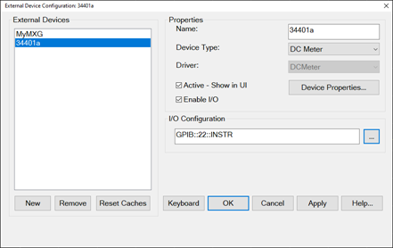
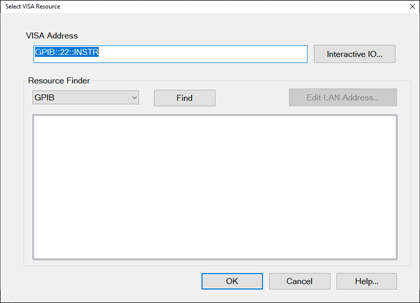
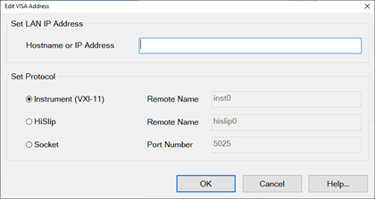
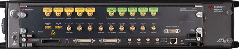
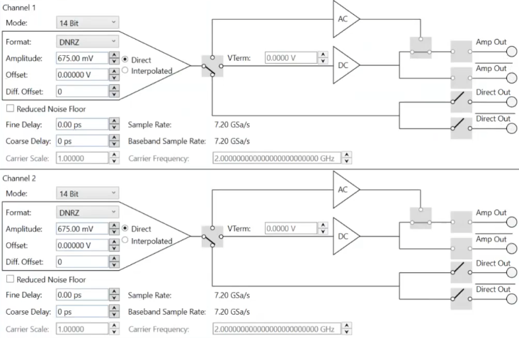

# Configure an External Device

* * *

Once configured (as shown in this topic), an external device will appear in,
and be controlled from, relevant VNA dialogs as though it were internal to the
VNA.

  * [External Device Configuration dialog](Configure_an_External_Device.md#ExtDevConfig)

The following links discuss how to set properties for these types of devices:

  * [External Source Properties](Configure_an_External_Source.md)

  * [Power Meter As Receiver (PMAR) Properties](Configure_a_Power_Meter_As_Receiver.md)

  * [External Pulse Generator Properties](Configure_an_External_Pulse_Generator.md)

  * [Configure an SMU (Source/Measure Unit)](Configure_an_External_SMU.md)

  * [Configure a DC Source/Meter](Configure_a_DC_Device.md)

  * Drivers for External Compound Sources

  * [Configure a Hybrid Source](Configure_a_Hybrid_Source.md)

* * *

#### How to access the External Device Configuration dialog

[VNA Applications](../Applications/Applications.md) have additional methods
of launching this dialog.  
---  
Using Hardkey/SoftTab/Softkey |  Using a mouse  
  
  1. Press Setup > External Hardware > External Device...

|

  1. Click Instrument
  2. Select Setup
  3. Select External Hardware
  4. Select External Device...

  
 See [Remotely Specifying a Source
Port](../Programming/Remotely_Specifying_a_Source_Port.htm)  
  
External Device Configuration dialog box help  
---  
 Jump to a section below for more
information:

  * External Devices
  * Properties
  * I/O Configuration

|  Important Notes

  * This dialog is used to configure the following types of external devices:
  *     * [External Source Properties](Configure_an_External_Source.md) requires FOM S9x080A, S9x082A or Option 009
    * [Power Meter As Receiver (PMAR) Properties](Configure_a_Power_Meter_As_Receiver.md)
    * [External Pulse Generator Properties](Configure_an_External_Pulse_Generator.md)
    * [DC Power Analyzer](Configure_a_DC_Device.md)
    * [SMU (Source/Measure Unit)](Configure_an_External_SMU.md)
    * External Switch Matrix (L8990M) which requires VNA with option S9x011A/B
    * [Hybrid Source](Configure_a_Hybrid_Source.md)
  * To configure an external source using this dialog, your VNA must have [FOM Option.](../Support/Configurations.md#080) Without this option, you must control an external source manually. See [Synchronize an External Source](../Tutorials/Synchronize_an_External_PSG_Source.md) for help with manual source control.
  * By default, an external device is de-activated when the VNA is Preset or when a Instrument State is recalled. This behavior can be changed with a [Preference setting](Preferences.md) so that it remains active through a Preset or Instrument State recall.
  * External Device properties are NOT saved in an Instrument State file. However, the reference to the External Device from relevant VNA dialogs IS saved. Therefore, recalling a state file that refers to a device that is NOT present will result in a “Device configuration not found” error.
  * Multiple configurations for the same physical device can be Active. However, only one configuration for the same external source can have the [I/O Enabled](Configure_an_External_Device.md#EnableIO).
  * The driver for the P9336A USB I/Q Arbitrary Waveform Generator must be installed in the PNA. The driver can be downloaded from the Keysight website.
  * The B2902A or N6705C driver names cannot be the same as the device name because the driver names are reserved. For example, a device name of "B2902SMU" when using the B2902A driver is acceptable.

  
---  
  
### External Devices

The devices that are currently configured appear in this list. The number of
devices that can be configured is limited by the specified Interface.

New Click to create a new device configuration. The default name is Device<n>,
where <n> is the next number for 'Device'.

Remove Click to remove the selected device from the list.

### Properties

Name Enter a device name as it will appear when referring to this device in
VNA dialog boxes. Edit the name at any time. Duplicate names are not allowed.

  * Because External Devices can be used with FOM ranges, do NOT name an external device any of the following FOM range names: “primary”, “receivers”, or “source”, “source1”, source2”, "source3" and so forth. [Learn more about FOM ranges](../FreqOffset/Frequency_Offset_Mode.md#FreqOffsDiag).

  * Do NOT use a parameter name such as "S11" or "R1".

  * DC Analyzer devices MUST use at least three characters in the name.

Device Type Select one of the following:

(Quotes are used when specifying in a remote program.)

  * "DC Meter" \- [Learn more](Configure_a_DC_Device.md)

  * "DC Source" \- [Learn more](Configure_a_DC_Device.md)

  * "Power Meter" (PMAR) \- [Learn more](Configure_a_Power_Meter_As_Receiver.md)

  * "Pulse Generator" \- Only the Keysight 81110A Pulse Generator is supported. [Learn more](Configure_an_External_Pulse_Generator.md)

  * "SMU" \- [Learn more](Configure_an_External_SMU.md)

  * "Source" (RF) - [Learn more](Configure_an_External_Source.md)

  * "Switch Matrix" \- Learn more

  * "None" \- returned remotely before setting Device Type.

Driver Select the appropriate model to be configured.

(Quotes are used when specifying in a remote program.)

For Source Device Type choose from:

  * "AG81150_1" (Legacy driver with no modulation capabilities)

  * "AG81150_2" (Legacy driver with no modulation capabilities)

  * "AG81150_2S" (Legacy driver with no modulation capabilities)

  * "AG836XX" (8360 and 8340)

  * "AGESG" (ESG)

  * "AGEXG" (EXG) [See configuration note](Configure_an_External_Source.md#EXG)

  * "AGGeneric" For sources that are NOT listed but can be controlled using SCPI. Click Device Properties, then Edit Commands to send commands to these sources. [Learn how.](Configure_an_External_Source.md#RCMControl)

  * "Agile Vector Adapter" (Driver for N5192 and N5194 Agile Vector Adapters with modulation capabilities. These sources need to be inserted in a back loop of the PNA. The PNA provides the LO.)

  * "AGMXG" (MXG) The MXG must have at least firmware A.01.44 for FOM power sweep to work correctly.

  * "AGPSG" (PSG)
  * "HP834XX" (Driver for HP 834XX)
  * "Hybrid Source" (Driver for a source and a mixer/multiplier to create a high-frequency source)

  * "KtUXG" (Legacy driver for N5193)
  * **" M5300x"** (PXIe RF AWG) [Learn more](Configure_an_External_Source.md#M5300x_source).
  * "M8190" (M8190A Arbitrary Waveform Generator with E8267D PSG Vector Signal Generator) Learn more.
  * "M8190 + IQ mixer" (M8190A Arbitrary Waveform Generator with I/Q Mixer) Learn more.
  * "M8195 96 99" (M8195A 65 GSa/s Arbitrary Waveform Generator / M8196A 92 GSa/s Arbitrary Waveform Generator / M8199A Arbitrary Waveform Generator)

  * "M9336" (M9336A PXIe I/Q Arbitrary Waveform Generator)
  * "MXG_Vector" MXG driver that supports modulation for vector MXGs.
  * "PSG_Vector" (PSG driver that allows modulation)
  * "VXG" (M9383B/84B VXG Microwave Signal Generator)
  * "VXG" (M9484C VXG Vector Signal Generator; pulse modulation not supported)
  * "VXT_Vector" (VXT driver with modulation capabilities)
  * "P9336a + PSG" (P9336A USB I/Q Arbitrary Waveform Generator with E8267D PSG Vector Signal Generator)

For SMU Device Type, choose from:

  * "B29XX" \- B2900 Series

  * "N67XX" \- N6700 Series

  * "M960X" \- N6700 Series

  * "PZ21XX" \- PZ2100A, PZ2121A, PZ2131A

  * "B15XX" \- B1500A

All other device types have only one driver.

Active - Show in UI Check to make the device available for use in the relevant
dialogs. An instrument state that is saved with an Active device (checked)
will include the device in the state file. Otherwise, if the Active box is
cleared, the device will NOT appear in the state file. [Learn more about
Instrument State files.](../S5_Output/SaveRecall.htm#State)  
Note: The preset makes this disable. Check this again if necessary after
preset.

Enable I/O Clear this box to disable communication with the selected device.
Do this to configure a device that is not yet connected to the VNA.

  * Communication with devices is attempted when Enable I/O is checked, Active is checked, and OK is pressed.

  * When communication is attempted, devices with Enable I/O checked are queried for selected limits, such as frequency, power, and number of points. If there are limit problems, the VNA sends an error and the affected channels are put into Hold. These limits are enforced by the dialog box in which they are set. Resolve the reported limit problem and then restore the triggering.

  * If communication with a device is lost the affected channels are put into Hold.

Device Properties Click to launch the Properties dialog for relevant Device
type:

  * [Configure External Sources](Configure_an_External_Source.md)

  * [Configure a Power Meter As Receiver](Configure_a_Power_Meter_As_Receiver.md)

  * [Configure an External Pulse Generator](Configure_an_External_Pulse_Generator.md)

  * [Configure a DC Meter / Source](Configure_a_DC_Device.md)

  * [Configure a SMU](Configure_an_External_SMU.md)

  * Configure an External Switch Matrix

  * [Configure a Hybrid Source](Configure_a_Hybrid_Source.md)

### IO Configuration

Type VISA address that is used to connect the device to the VNA.

The "..." button opens the Select VISA Resource dialog box (described below).

Select VISA Resource dialog box help  
---  
 Interactive I/O.. Open the
interactive I/O of Connection Expert. Select in Resource Finder from the
following selections, then click Find.

  * GPIB \- Devices connected to the System Controller GPIB port.
  * USB \- Devices connected to the VNA USB ports. [See Important First-time USB connection note](../Front_Panel/XTour.md#FirstTimeNote).
  * Aliases \- Devices that are connected to ANY interface for which you created an alias. [See Configure Alias and LAN devices](Configure_an_External_Device.md#ConfigureAlias).
  * LAN \- Devices connected to a network using a LAN connection. The VNA must also be connected to the network. Note: Devices connected to LAN must first be configured in Keysight IO libraries before they will appear on the Available list. [See Configure Alias and LAN devices](Configure_an_External_Device.md#ConfigureAlias).

Edit LAN Address... When the Resource Finder is set to LAN, this button
launches the Edit VISA Address dialog box (described below). Otherwise, this
button is disabled and grayed out.  
  
Edit VISA Address dialog box help  
---  
 When the Edit VISA Address dialog
is opened, the firmware automatically attempts to read the VISA Address value
from the Select VISA Resource dialog and set its protocol buttons and fields,
as follows:

  * Read the hostname from VISA Address string and populate the "Hostname or IP Address" text box with it.
  * Discover the protocol from the VISA Address string and select the correct protocol button.
  * Read the Remote Name or Port Number from VISA Address string and populate these fields.

The "Set Protocol" radio buttons allow you to select the protocol used to
communicate with the external device.

  * Each protocol radio button, when selected, enables a text box to the right of it (except the Instrument protocol, because "inst0" is the only valid value).
  * The value of the text box and the value of the "Hostname or IP Address" are combined to generate the VISA Address shown on the Select VISA Resource page.

Note: You can always go back and manually enter/modify values in the VISA
Address field of the Select VISA Resource dialog.  
  
### Configure Alias and LAN Devices

Use this procedure to configure a device using a LAN interface. Also use for
ANY device for which you want to set an alias (easily-recognized) name. The
alias name appears in the Available field when Aliases is selected as the
Interface.

  1. On the VNA, minimize the VNA application (System > Main > Minimize Application).

  2. In the system tray (lower-right corner) right-click the IO icon, then click Keysight Connection Expert.

To Add a LAN Device:

  1. In Keysight Connection Expert, click Manual Configuration tab.

  2. Select LAN Instrument.

  3. Click, then enter the IP address of the external source.

  4. Click Test This VISA Address to verify communication.

  5. Click Accept.

To create an Alias for a connected device:

  1. In the list of connected instruments, click the instrument, then click Add or Change Aliases.

  2. Enter the Alias Name to be used in the [External Device Configuration](Configure_an_External_Device.md#ExtDevConfig) dialog.

  
  
## Drivers for External Compound Sources

Drivers have been created to facilitate the configuration of external source
devices commonly used for specific types of measurements such as Spectrum
Analyzer (SA) or Modulation Distortion (MOD or MODX). The following is a list
of the current drivers for these sources:

  * M8190 (M8190A Arbitrary Waveform Generator with E8267D PSG Vector Signal Generator)
  * M8190 + IQ mixer (M8190A Arbitrary Waveform Generator with I/Q Mixer)

### M8190A Arbitrary Waveform Generator

The M8190A configuration can be with or without an embedded CPU. However, the
preferred M8190A is the configuration without an embedded CPU using a PCIe
cable connection to the PNA. A special cable is required: PCIe 4-lane to PCIe
8-lane. In this configuration, the driver must be installed in the PNA for the
driver to be seen by the CPU in the PNA. This makes the cable connection to
the M8190A an extension of the memory domain of the PNA CPU. This
configuration is several times faster than using the USB interface.

The M8190A must have at least one of the following options:

  * M8190A-14B - 8 GSa/s with 14 bit resolution
  * M8190A-12G - 12 GSa/s with 12 bit resolution

Note: Power up the M8190A first and wait until the LED on the front-panel is
lit (green) before powering up the PNA.

#### M8190A Preferred Model (without CPU)

#### M8190A Outputs

The Direct Out outputs are used by the M8190 driver and the Amp Out outputs
are used by the M8190 + IQ mixer driver.

### M8190 Compound Source Driver

The Driver name is M8190.

#### M8190 Device Properties

In the dialog above, M8190PSG is the name assigned to the M8190 driver. With
M8190PSG highlighted in the External Devices window, de-select the Active -
Show in UI check box, then click on the Device Properties... button to access
the following dialog:

Note: Before changing the configuration of this driver, the Active - Show in
UI must be de-selected. After changes are made and this dialog is closed,
check the Active - Show in UI check box when ready to activate the driver.
Otherwise, the setting changes will not be applied.

Timeout (sec) Sets the VISA timeout and will stop processing additional SCPI
commands on the first error and will put the measurement into hold.

Dwell per point (ms) Applies a dwell in Hardware List triggering ONLY. Set the
time (in milliseconds) the external source will wait before data acquisition.

PSG I/O Configuration \- Sets the VISA address of the PSG.

Amplitude I/Q \- Sets the amplitude of the I and Q differential outputs from
the M8190A. Calibration affects these settings. The M8190A Direct Out outputs
are connected to the PSG using four cables of the same length.

DC Offset I/Q \- Sets the offset to remove any LO feedthru.

8 GSa/s 14bits (14B option) \- Selects the Option M8190A-14B.

12 GSa/s 12bits (12G option) \- Selects the Option M8190A-12G.

Digital Upconverter (DUC) \- Selects the Option M8190A-DUC.

### M8190 + IQ Mixer Compound Source Driver

The Driver name is M8190 + IQ mixer.

#### M8190 + IQ mixer Device Properties

In the dialog above, M81_IQ is the name assigned to the M8190 + IQ mixer
driver. With M81_IQ highlighted in the External Devices window, de-select the
Active - Show in UI check box, then click on the Device Properties... button
to access the following dialog:

Note: Before changing the configuration of this driver, the Active - Show in
UI must be de-selected. After changes are made and this dialog is closed,
check the Active - Show in UI check box when ready to activate the driver.
Otherwise, the setting changes will not be applied.

Timeout (sec) Sets the VISA timeout and will stop processing additional SCPI
commands on the first error and will put the measurement into hold.

Dwell per point (ms) Applies a dwell in Hardware List triggering ONLY. Set the
time (in milliseconds) the external source will wait before data acquisition.

RF output \- Selects the IQ mixer output. Select Straight Out, no PNA port to
go out of the IQ mixer and not controlled by the PNA, or select one of the PNA
ports. The PNA port selections will set the proper path and step attenuation
in the PNA automatically. If Straight Out, no PNA port is selected, the IQ
mixer output can still be connected to the PNA, but path and step attenuation
must be set manually.

The following shows a configuration example where Port 1 (J11) is the source
of the LO drive signal and the RF Output of the IQ mixer is re-injected into
PNA Port 1 (J10) on the rear panel:

Source power offset \- Sets the power offset applied at the source driver
level. If a decent value of the RF path budget between the modulated source
and the DUT port is set (negative value means attenuation, positive value
means amplification: there is power booster added in the path), then (even
without modulation power level calibration) the source requested power and the
source obtained power at the DUT plane will be aligned.

IQ Mixer LO drive \- Selects the LO signal source for the IQ mixer from any
PNA port, an external source, or baseband (no LO drive signal). One of four
possible M8190A baseband outputs (output of DAC) can be selected: DC or AC
output of Channel 1, or DC or AC output of Channel 2.

Power \- Sets the power of the LO signal.

Source I/O Configuration for external source LO drive \- Sets the address of
an external source when used as the LO signal source.

Amplitude I/Q \- Sets the amplitude of the I and Q differential outputs from
the M8190A. Calibration affects these settings. The M8190A Amp Out outputs are
connected to the PSG using four cables of the same length.

DC Offset I/Q \- Sets the offset to remove any LO feedthru.

8 GSa/s 14bits (14B option) \- Selects the Option M8190A-14B.

12 GSa/s 12bits (12G option) \- Selects the Option M8190A-12G.

Digital Upconverter (DUC) \- Selects the Option M8190A-DUC.

* * *

