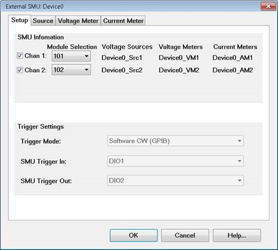
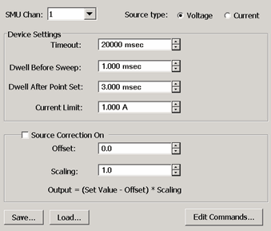
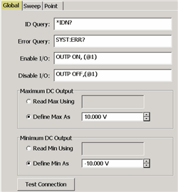
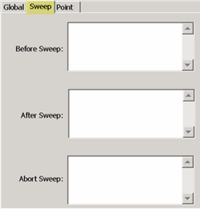
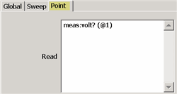

# Configure an External SMU

* * *

An external SMU Source Measure Unit is a combined DC Source and Meter. The VNA
supports the Keysight B1500A, B2900 series and N6700 series of SMUs. Only the
B2900 series offers Hardware Triggering ([learn
more](Configure_an_External_SMU.htm#Hardware)).

Learn more about the Keysight SMU offerings at: <http://Keysight.com/find/smu>

For all other External DC devices, select DC Source or Meter Device Type.
[Learn more about configuring those devices.](Configure_a_DC_Device.md)

#### How to Configure a SMU

  1. Important: Create an SMU by name (one-time). [Learn how (separate topic)](Configure_an_External_Device.md).
  2. On the Configure an External Device dialog, click Device Properties. (This topic).

  
---  
  
### Using Hardkey/SoftTab/Softkey

|  Using a mouse  
  
  1. Press Setup > External Hardware > External Device...

|

  1. Click Instrument
  2. Select Setup
  3. Select External Hardware
  4. Select External Device...

  
Once configured, set the SMU source voltage and display Voltage / Current
Meter measurements:

  * SMU Sources: DC Source control is available in Standard and [Gain Compression](../Applications/Gain_Compression_Application.md)/[GCX](../Applications/Gain_Compression_for_Converters.md) channels. Set the Start and Stop voltage on the [DC Control dialog](../S1_Settings/DC_Control.md). To access this dialog:
  *     * Press Sweep > Source Control > DC Source....
  * SMU Measure: DC measurements are available in Standard and [Gain Compression](../Applications/Gain_Compression_Application.md)/[GCX](../Applications/Gain_Compression_for_Converters.md) channels.
  *     * In [Gain Compression](../Applications/Gain_Compression_Application.md) /[GCX](../Applications/Gain_Compression_for_Converters.md) channels, display DC parameters as you would an RF parameter, by pressing Trace > Trace Setup > Measure....
    * In a Standard channel, configure an unratioed measurement. Press Trace > Trace Setup > Measure... > Receivers. For Numerator, select the external (or internal) DC meter.
    * Change the X-axis to display the DC Meter parameters by pressing Sweep > Main > X-axis Type, then select the DC Meter.

Note: [Gain Compression CSV
files](../Applications/Gain_Compression_Application.htm#Saving) contain
Voltage / Current settings and measurements  
  
  
External SMU Configuration \- Setup Tab help  
---  
 To start this dialog, on the
[External Device Configuration](Configure_an_External_Device.md) dialog,
select SMU as the Device Type. Then click Device Properties.

### SMU Information

The DC device names for six DC devices are listed. The names are made from the
root device name (given in the External Device Configuration dialog) plus a
suffix. In the above image (example):

  * Device0 is the root device name.
  * “_Src1” means voltage source of channel 1.
  * “_VM1” means voltage meter of channel 1.
  * “_AM2” means current meter of channel 2.
  * Check Chan <n> to enable that channel in the SMU device.
  * Module Selection selects the SMU module in the B1500A mainframe to use for the channel.

|  Module Number |  Description  
---|---  
1 |  Module installed in slot 1  
2 |  Module installed in slot 2  
3 |  Module installed in slot 3  
4 |  Module installed in slot 4  
5 |  Module installed in slot 5  
6 |  Module installed in slot 6  
7 |  Module installed in slot 7  
8 |  Module installed in slot 8  
9 |  Module installed in slot 9  
10 |  Module installed in slot 10  
  
### Trigger Settings

Trigger Mode: Choose from:

  * Software CW (GPIB) Slowest method. The SMU receives each stimulus voltage from the VNA over GPIB, USB, or LAN. No other trigger cables are required.

  * Hardware List (BNC) Available ONLY in B2900 series. Fastest method. The SMU receives a list of stimulus voltages from the VNA, then receives trigger signals though a rear-panel connector when appropriate from the VNA.

Note: The B2900 series can store no more than 2500 data measurements.
Therefore, this mode is NOT allowed when the VNA data points exceed 2500
points.

Note: Hardware List trigger mode is NOT supported in [GCA
2D](../Applications/Gain_Compression_Application.htm#2D) sweeps.

  * SMU Trigger In / Out \- Available ONLY when the trigger mode is Hardware List. Select the trigger in and trigger out pins on the B2900 digital I/O connector. Connect these pins to the either pair of VNA AUX IO IN and OUT connectors. The VNA AUX trigger pair is automatically selected.

  
  
External SMU - Source / Voltage / Current Meter dialog box help  
---  
 The descriptions for this dialog
pertain to the Source, Voltage, and Current Meter tabs. Exceptions are
highlighted. SMU Chan Select the SMU channel for which the settings on this
page apply. Source type (Source ONLY) Select either a voltage source or
current source.

### Device Settings

Timeout \- Sets a time limit for the DC source or meter to make contact with
the VNA. If this time limit is exceeded, the VNA stops the measurement and
displays the following error message. EXECUTION ERROR;OPC QUERY TIMEOUT ERROR
If this occurs, check the connections between your VNA and external device.
Dwell Before Sweep Wait time before making a sweep. Dwell After Point

  * Source Wait time after setting the voltage/current at each data point.
  * Voltage / Current Meter Wait time before measuring voltage/current at each data point.

Current / Voltage Limit (Source ONLY Depends on the Source Type selection)
Sets the maximum current or voltage to be allowed from the source. Note: To
change the X-axis to display the Meter units, click Response, then Display,
then Labels, then Select X-Axis, then select the SMU Meter.

### Receiver / Source Correction

  * For a Source, use the correction settings to scale and offset the output voltage or current.
  * For a Voltage or Current Meter (receiver), use the correction settings to display and scale measurements. For example:

Measure the voltage across a 5 ohm resistor, then display the results in
A(mperes). Using ohms law, I = V / 5 ohms or I = V *.2 For receiver
correction, enter Scaling = .2; Offset = 0. ON Check to apply the following
correction factors to each measurement. Offset: Enter the value to offset the
Meter reading or set the Source voltage. Scaling: Enter the value to scale the
Meter reading or set the Source voltage. Displayed Output = (Measured / Set
value - Offset) * Scaling value. Edit Commands \- Click to start the Edit
Commands dialog. This feature is usually not necessary with an SMU external
device. Save \- Press to save the edited SMU configuration to an *.xml file.
The list of files is NOT filtered so use a descriptive filename. Load \- Press
to load an existing configuration.  
  
Edit Commands dialog box help  
---  
The SMU Source and Meter Edit commands are almost identical in how they
operate. Both are documented here.

### Global Tab

 The Global tab includes the
system settings for the SMU Source. ID Query \- Enter the SCPI command to
return the ID string of the DC Source. Typically *IDN? This entry can be left
blank. Error Query \- Enter the SCPI command that is used to return DC Source
errors. Typically SYST:ERR? Enable I/O \- Enter the SCPI commands that is used
to enable the DC Source to output voltages. Disable I/O \- Enter the SCPI
commands that is used to disable the DC Source from outputting voltages.

### Maximum / Minimum DC Output (Source ONLY)

Read Max / Min Using \- Select, then enter the commands used to return the
output limits of the SMU source. Define Max / Min As \- If the SMU has no
commands to return these values, or you would rather define the limit for your
SMu, then enter the Max and Min voltage limits.

### Test Connection

Click to start the Test Connection dialog. You must first have entered the I/O
Configuration settings and select Enable IO on the [External Device
dialog](Configure_an_External_Device.htm#ExtDevConfig).
 Enter a SCPI command,
then click Send or Send&Read when a return value is expected.

### Sweep Tab

 Use the Sweep Tab to send SCPI
commands to the SMU at the beginning or end of each sweep. Abort Sweep \-
Enter the SCPI command that is used to Abort or reset the SMU. This would be
necessary when the VNA sweep is aborted or terminated. The VNA will then send
the command to the SMU.

### Point Tab

 Read (commands) \- Enter the
SCPI command that is used to make a DC measurement at each data point. Set
(commands) \- Use <%variable> to make a DC Meter setting.  
  
* * *

