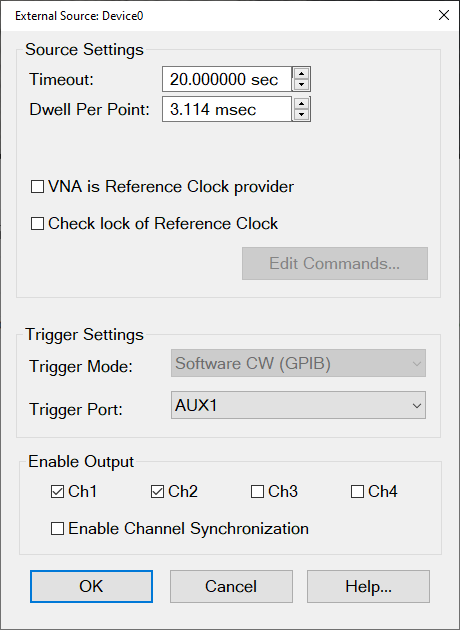
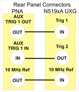
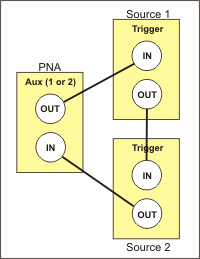
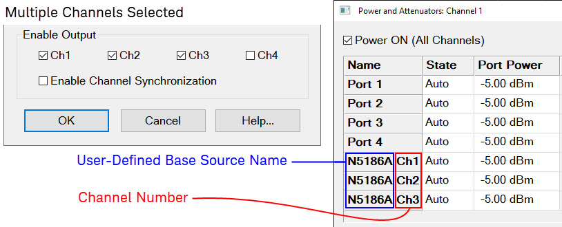
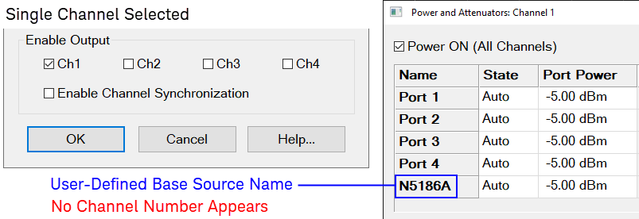
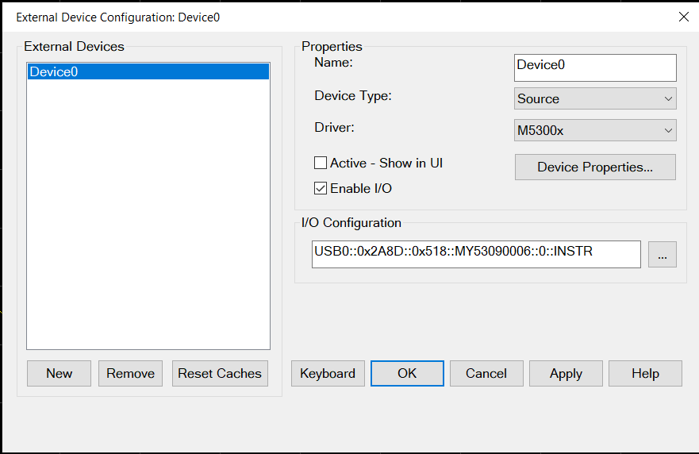
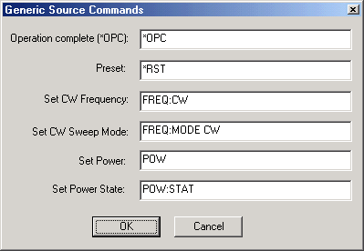

# External Source Configuration

* * *

Once configured, an external source appears in VNA dialogs as though it were
an internal source. This capability requires FOM Option S93080A.

In this topic:

  * [How to Configure an External Source](Configure_an_External_Source.md#SelectExtSource)

  * Important Notes

  * Trigger Settings and Physical Connection diagrams

  * Generic Source Commands dialog

* * *

#### How to Configure an External Source

  1. Important: Create an External Source device by name (one-time). [Learn how.](Configure_an_External_Device.md)(Separate topic)
  2. Then click Device Properties to [Configure the External Source](Configure_an_External_Source.md#ext_source_config). (This topic)

[VNA Applications](../Applications/Applications.md) have additional methods
of launching this dialog.  
---  
Using Hardkey/SoftTab/Softkey |  Using a mouse  
  
  1. Press Setup > External Hardware > External Device...
  2. Click Device Properties to [Configure the External Source](configure_an_external_source.md#ext_source_config).

|

  1. Click Instrument
  2. Select Setup
  3. Select External Hardware
  4. Select External Device...

  
 See [Remotely Specifying a Source
Port](../Programming/Remotely_Specifying_a_Source_Port.htm)  
  
External Source Device dialog box help  
---  
 This dialog box is used to make external source settings. |  Important Notes about External Sources

  * First create an External Source (device) by name (one-time). [Learn how.](Configure_an_External_Device.md)(Separate topic)
  * Once you create and activate an external source from the [Configure an External Device](Configure_an_External_Device.md) dialog, it becomes available from the following VNA dialog boxes as well as the softkeys and entry toolbar, as if it were an internal VNA source.   
Use the following dialogs to set the state, frequency, and power level of the
external RF source:

  *     * [Power and Attenuators dialog](../S1_Settings/Power_Level.md#Advanced)
    * [FOM dialog](../FreqOffset/Frequency_Offset_Mode.md#FreqOffsDiag)
    * [New Trace / Receivers tab dialog](../S1_Settings/Measurement_Parameters.md#NewTraceDiag)
  * By default, an external source is de-activated when the VNA is Preset or when a Instrument State is recalled. This behavior can be changed with a [Preference setting.](Preferences.md)
  * External Keysight sources are usually limited to 1601 points with List-sweep mode. To 'work around' this limitation, divide the measurement among multiple channels. For example, to attain a sweep of 3200 points, create two channels of 1600 points. You can also use manual source control which supports Step-sweep mode. In this mode an external source can have up to 65,535 points. See [Synchronize an External Source](../Tutorials/Synchronize_an_External_PSG_Source.md) for help with manual source control.
  * External sources should always share the same [10 MHz Reference signal](../Rear_Panel/XRtour.md#10M) as the VNA. Connect a BNC cable from the VNA 10 MHz Ref Output to the External Source Input.
  * All newly-activated sources are preset, with source power OFF. Source power must be turned ON in the [Power dialog](../S1_Settings/Power_Level.md). Frequency Offset must be enabled in the [FOM dialog](../FreqOffset/Frequency_Offset_Mode.md).
  * The same source can NOT be used more than once in the same channel.
  * The VNA automatically controls all trigger settings for the external source.
  * [See EXG Sources configuration note](Configure_an_External_Source.md#EXG).

  
---  
  
### Source Settings

Timeout (sec) Sets the VISA timeout and will stop processing additional SCPI
commands on the first error and will put the measurement into hold.

Dwell per point (ms) Applies a dwell in Hardware List triggering ONLY. Set the
time (in milliseconds) the external source will wait before data acquisition.

Enable Modulation Control \- Enables modulation of an external modulation
source to be controlled from a source dialog.

VNA is Reference Clock provider \- Checking this box uses the VNA as the
reference clock for the specified external source.

Check Lock of Reference Clock IN \- (SA and Modulation Distortion source
drivers) Checks for the VNA's reference clock at the external source. The
reference clock is checked at external source driver startup. If the clock is
not available, an error message is displayed. If a dual hardware source is
used (for example, M8190+PSG), the reference clock inputs of both sources are
tested. In the case of the USB chassis (P9336A), the reference clock is tested
at the rear 10 MHz chassis input if the P9336A 10 MHz chassis reference is
selected.

Edit Commands Provides a method to send SCPI commands to AGGeneric (not
listed) sources.

### Trigger Settings and Physical Connection diagrams

Note: The VNA controls ALL external source trigger settings automatically
(except for those on this dialog). All settings in the [External
Trigger](../S1_Settings/External_Triggering.htm#ExternalDiag) dialog are
ignored.

Trigger Mode

Software CW (GPIB) Slowest method.

  * The external source receives each CW frequency from the VNA over GPIB, USB, or LAN. No other trigger cables are required. Although a Trigger Port selection may be available, it is NOT used.

Hardware List (BNC) Fastest method.

  * NOT available for AGGeneric (not listed) sources.

  * The external source receives a list of CW frequencies from the VNA, then receives trigger signals though a rear-panel connector when appropriate from the VNA.

  * If the number of data points used in the measurement exceeds the capability of the external source, the VNA automatically switches to Software CW (GPIB) trigger mode. This will slow the measurement significantly.

Trigger Port Used ONLY for Hardware List Trigger Mode. Select the VNA rear
panel connector to be used for triggering. The sources must be connected as
follows:

  * For ONE or TWO external sources, connect each source to an AUX trigger pair. [See rear panel Aux connectors](../Rear_Panel/XRtour.md#ExternalTrig).

  *     * Source Trig Out connects to VNA Aux Trig In

    * Source Trig In connects to VNA Aux Trig Out

The following diagram shows the connections between the PNA (AUX TRIG 1 or 2
can be used) and N519xA UXG signal generator.

  * For more than TWO sources, some will need to be connected using the following daisy chain image. For example, with three external sources, two could be daisy-chained to Aux 1 while the third is connected by itself to Aux 2.

Notes

  * Source 1, which receives the trigger out of the VNA, must be the first source listed on the [External Devices Configuration](Configure_an_External_Device.md#ExtDevConfig) dialog box. Devices are listed in the order in which they are created. You may have to delete, then re-create a source to move it down on the list.

  * Connect EXG sources as follows:

    1.        * EXG rear-panel label TRIG 1 connects to VNA AUX TRIG 1 OUT

       * EXG rear-panel label TRIG 2 connects to VNA AUX TRIG 1 IN

Note: The VNA AUX TRIG 2 can be used instead of VNA AUX TRIG 1.

### Enable Output

This feature is available for connected external sources with one or more
channels. Some measurements, such as wideband active load pull (WALP), require
a source with multiple channels. A set of check boxes (Ch1, Ch2, Ch3, and Ch4)
are provided for enabling these channels on the VNA. Each directly correspond
to the RF output connectors of the source. For example, when an N5186A MXG is
the external source, Ch1 controls the "1 RF Out" port. The dialog always
displays four check boxes, even if the connected source has less than four RF
outputs. In all cases, Ch1 is checkmarked by default.

The channels you select appear in other related VNA dialogs, such as [Power
and Attenuators](../S1_Settings/Power_Level.htm#Advanced), [Offsets and
Limits](Power_Limit_and_Power_Offset.htm#GPLDiag), and [Frequency
Offset](../FreqOffset/Frequency_Offset_Mode.htm#FreqOffsDiag).

In these cases, when there is more than one channel selected, the user-defined
channel names are decorated, using “<Base Source Name> Ch <Chan Number>,” as
shown below.

Enable Channel Synchronization \- Click this checkbox if your external source
supports channel-phase synchronization.

Note: If you are using Arbitrary Load Control (ALC) software with a VXG signal
generator as the external source, channel-phase synchronization works for
channels 1 and 2 only.

When only a single channel is selected, the user-defined channel name is not
decorated, as shown below.

### External Source Dialog box for M5300x PXIe Source Driver

The **Driver** name is **M5300x**.

#### M5300x Device Properties

In the dialog above, click on the **Device Properties...** button to access
the following dialog:

**Select Outputs** A single M5300x has four outputs, so it may be used to
define up to four sources. Multi-channels can be selected at the same time.

**Timeout (sec)** Sets the VISA timeout and will stop processing additional
SCPI commands on the first error and will put the measurement into hold.

**Dwell Per Point (msec)** Applies a dwell in Hardware List triggering ONLY.
Set the time (in milliseconds) the external source will wait before data
acquisition.

**Reference Clock** There are two choices: Internal 2.4 GHz and External 2.4
GHz. Internal locks to the PXI_CLK100 backplane reference and generates
2.4GHz. External locks to the signal input on the "2.4GHz in" front panel
connector. Default is "Internal 2.4GHz"

**Check Lock of Reference Clock IN** (SA and Modulation Distortion source
drivers) Checks for the VNA's reference clock at the external source. The
reference clock is checked at external source driver startup. If the clock is
not available, an error message is displayed.  
  
Generic Source Commands dialog box help  
---  
 Enter the SCPI commands that
control the following functions on your AGGeneric (not listed) source. A field
without a SCPI command entered will be ignored and that function will not be
set. To launch this dialog, click Edit Commands on the [External Source
Properties](Configure_an_External_Device.htm#ext_source_config) dialog.
Operation Complete (*OPC) . Preset  Presets the source Set CW Frequency Sets
CW Frequency Set CW Sweep Mode Sets source sweep mode Set Power Sets source
power Set Power State Turns power ON or OFF  
  
* * *

* * *

