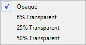
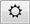
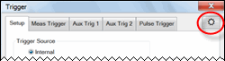
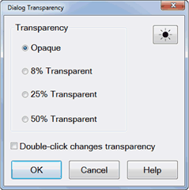

# Dialog Transparency

* * *

Most VNA dialogs can be made to appear with various amounts of transparency.
This allows you to view the VNA traces through the dialog as you make dialog
settings.

#### How to set Transparency Level

There are three ways to make the transparency level setting: 1\. Right-click
in any non-control area of a dialog that allows transparency to see the
following selections: 
2\. In tabbed dialogs, cycle through the above transparency settings by
pressing  multiple times.
 3\. Launch the Transparency
dialog (below) from the [Preferences](Preferences.md) dialog.  
---  
This setting is not programmable  
  
Dialog Transparency dialog box help  
---  
 Note: This single Transparency
setting applies to ALL supported VNA dialogs.

  * Opaque (NOT Transparent) - Default setting
  * 8% Transparency
  * 25% Transparency
  * 50% Transparency

Double-click changes transparency \- When checked, cycle through the above
transparency settings by double-clicking in any non-control area of a dialog
that allows transparency.

### Notes

  * The transparency setting is stored as a [VNA Preference](Preferences.md).
  * The setting survives a VNA Shutdown and Preset.
  * It is NOT saved and recalled with instrument state.

  
  
* * *

