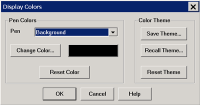
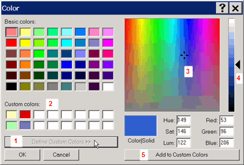

# Display Colors

* * *

You can modify the colors that are used to draw various elements on the VNA
screen and on a hardcopy print of the display.

### See Also

[Print Preview](Display_Colors.md#PrintPreview)

#### How to modify DISPLAY Colors

These settings can also be accessed from the [Preferences dialog
box](Preferences.htm).  
---  
Using Hardkey/SoftTab/Softkey  
  
  1. Press System > System Setup > Preferences... > Colors....
  2. Click Display Colors... in the Customize Display dialog box.

  
  

#### How to modify PRINT Colors  
  
---  
  
  1. Press System > System Setup > Preferences... > Colors....
  2. Click Print Colors... in the Customize Display dialog box.

  
  
  
Display and Print Colors dialog box help  
---  
The Display Colors and Print Colors dialog boxes function in exactly the same
manner. See [Print Preview](Display_Colors.md#PrintPreview) procedure below.

### Pen

"Pen" is a term used to describe the various elements. Each pen can have a
unique color. You can change the color of the following pens:

  * Background - The background color of the inactive windows.
  * New Active Background - The background color of the active window.
  * Grid - The inner lines of all grids in all windows, and the grid frame in inactive windows.
  * Active Labels, Grid Frame - The labels and grid frame colors in the active window. Note: when this pen is selected, the current window becomes inactive. Therefore, changes for this pen color will not be visible until OK is pressed.
  * Inactive Window Labels
  * Failed Trace - [Limit Line](../S4_Collect/Use_Limits_to_Test_Devices.md) failed traces or failure indicators (dots) and the word Fail.
  * The following pens for up to 8 Traces:
  *     * Data and Limits
    * Memory trace
    * Markers
    * Memory markers

About Trace Pens '1st Trace' is NOT always Trace1 (Tr1). For example, the
first trace in a window might be Tr2 which is drawn with the "1st Trace" pen.
The first 8 traces are drawn with the defined pen colors. The next eight
traces reuse the same colors, and so forth. For example, if all traces are
numbered sequentially, the 9th and 17th traces are drawn using the same color
as the 1st trace. Change Color Click the button or the color swatch to launch
the [Change Color](Display_Colors.md#Change) dialog. Reset Color Restores the
default color for the selected pen.

### Color Themes

A theme is a complete set of pens and their colors. The current theme persists
until you change it. Themes can also be saved to a file and then later
recalled.

  * Save Theme Click to save the current set of pens to a file.
  * Recall Theme Click to recall and use a saved theme.
  * Reset Theme Click to recall the default VNA color theme.

The colors for the following Display elements can NOT be changed: toolbars,
softkeys, menus, dialogs and popup messages.  
  

Change Color dialog box help  
---  
To use a basic color, click the color from the 'Basic colors' pallette, then
click OK. To define and use a custom color:

  1. Click Define Custom Colors>> to open the right side of the dialog.
  2. Optionally, pick a Custom color slot to replace. Otherwise, the replacement will occur at the first slot location and continue with subsequent custom color definitions.
  3. Click the color pane, or drag the crosshairs, to the location of the custom color.
  4. Drag the arrow to the desired saturation level of the custom color.
  5. Click Add to Custom Colors
  6. Continue to define more colors, or click OK to close the Color dialog.

After a custom color has been assigned to a VNA pen, the custom color can be
changed. The VNA pen color remains unchanged.  
  
### Print Preview Procedure

Use the following procedure to preview your Print Colors on the VNA screen:

  1. From the Print Colors dialog, select Reset Theme then Save Theme. Name the new theme “MyPrintTheme.colors”. This will give you a starting point equal to the default print colors.

  2. Launch the Display Colors dialog, select Recall Theme, then select “MyPrintTheme.colors”. The display will now show the default print theme.

  3. Customize the display colors. You will be previewing how the hardcopy will appear when printed.

  4. Save the customized display colors to “MyPrintTheme.colors”.

  5. Go to the Print Colors dialog and Recall “MyPrintTheme.colors.

* * *

