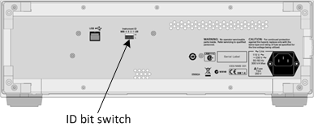
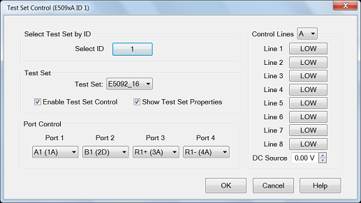

# E5092A Test Set Control

* * *

  * [Overview](E5091_TestSet_Control.md#Overview)

  * [Connecting the E5092A](E5091_TestSet_Control.md#Connecting)

  * [How to make E5092A test set Control Settings](E5091_TestSet_Control.md#How)

  * [Calibrating with the E5092A](E5091_TestSet_Control.md#Calibrating)

[Other System Configuration Topics](System_Topics.md)

Overview

The E5092A multiport test set can be controlled with the firmware of the
4-port PNA Series, 4-port E5080, and M980xA PXI VNAs with more than 4 ports
(assuming the port-1 to 4 are connected to the E5092A). The E5092A control
functions of GUI settings or corresponding SCPI commands can switch the
E5092A’s RF paths and the control line outputs at the beginning of each
channel’s sweep. These E5092A control functions associated with the channel
are available only in the standard class.

Notes:

  * To control the E5092A with the M980xA firmware, the M980xA firmware must be A.15.xx.xx and above, and the S94702A AMX VNA Plugin license is required in the PXI controller. 

  * The E5092A can be controlled only with the single firmware instance.

  * The E5080B 4 port with two E5092As can configure up to 40 ports or 16 port full crossbar.

  * The switching of the test set paths and control line outputs occurs just before the channel is triggered. If the [channel trigger state is Hold](../S1_Settings/Trigger.md#channel_state), the switching for that channel does not occur.

  * • In addition to the E5092A control functions associated with the channel, there are SCPI commands which switch the E5092A’s RF paths and control line outputs independently of the channel when the commands are executed ([CONTrol:MULTplexer](../Programming/GP-IB_Command_Finder/Control_Multiplexer.md) commands). These commands are effective in the measurement classes other than the standard class.

Connect and Configure the E5092A

The E5092A can be connected to any one of the VNA USB ports. When first
installed, Windows will automatically launch the "Add New Hardware" wizard.
Click Next to install the E5092A test set.

Note: See the [power handling limitations](../Rear_Panel/XRtour.md#usbHub) of
the VNA USB ports.

Connect the VNA test ports to the E5092A test ports. Match VNA test port 1 to
E5092A test port 1, and so forth.

### Selecting ID for E5092A

The VNA can control up to two E5092A test sets. Set the Instrument ID bit
switch to 1 or 2. The test sets will then be identified automatically and
referred to by the DIP switch setting on the E5092A rear-panel. Change the ID
bit switch setting before connecting to the VNA USB.

  
---  
  
### Power ON

Immediately after power-on, all of the port connection indicator LEDs of the
E5092A go ON. Then, after the VNA detects the E5092A, the four LEDs that
indicate the connected test ports remain ON. If the VNA is not powered on or
if the E5092A is not connected using a USB cable, all of the LEDs stay ON.

#### How to make E5092A test set Control Settings  
  
---  
Using Hardkey/SoftTab/Softkey | Using a mouse  
  
  1. Press Setup > External Hardware > External Testset > E5092A...

|

  1. Click Instrument
  2. Select Setup
  3. Select External Hardware
  4. Select External Testset
  5. Select E5092A...

  
  
  

E5092A test set control dialog box help  
---  
The title of the dialog shows the test set model and ID number of the active test set.. Select ID ID of the test set to be configured. Up to two E5092A test sets can be controlled. Click to change test set ID. [Learn how to set the test set ID](E5091_TestSet_Control.md#SetID). Enable Test Set Control When cleared, port switching and control line settings are disabled. This selection affects all channels using the selected test set. | Selection | Configuration  
---|---  
E5092_13 | Select the 13-port configuration of the E5092A  
E5092_16 | Select the 16-port configuration of the E5092A  
E5092_22 | Select the 22-port configuration of the E5092A  
E5092_28 | Select the switching independently in the E5092A  
E5092_X10 | Select the 10-port full crossbar configuration of the E5092A  
  
Show Test Set Property When checked, a second row on the status bar appears
which indicates the test set that is being controlled and the current port
control selection. For example, the following image shows the status bar when
controlling an E5092A test set.

  1. Configured channel

  2. Port Control settings for E5092A

  3. Test set Label. E5092A control does not use this field. It is shared between [Interface Control](Interface_Control.md#InterfaceDiag) and [External test set Control.](External_Testset_Control.md#ExternalTSControlDiag) The two labels are separated by /.

Control of the second status bar is completely separate from the first status
bar, which is controlled from the [View, Status
Bar](../S1_Settings/Customize_Your_Analyzer_Screen.htm#status_bar) menu.

Port Mapping Notes

  * Port Control and Control Line settings affect the channel of the active (selected) measurement. These settings will occur as the channel is being measured.
  * Correction is NOT turned OFF when port mappings are changed. However, the calibration is NO LONGER VALID!

  
---  
  
Control Lines Specifies the values of individual control lines. These general
purpose control lines on the test set front-panel can be used in your test
setup. Each button toggles the control line HIGH and LOW. When first opened,
the selections reflect the current control lines. See your test set
documentation for more information about the control lines.

OK  When clicked, the changes to the dialog box are implemented and the port
selections and control values are immediately sent to the specified test sets.
The Port Control and Control line settings are stored with other channel data
and used when those channels are swept.

Cancel (or Escape) Changes to the dialog are not implemented and revert to the
settings before the dialog box was opened.  
  
Calibrating with the E5092A

The following are a few changes in the way you calibrate the VNA with the
E5092A connected:

  1. Create the measurements for the channel and configure the Port Control (switching) on the E5092A Test Set Control dialog box. Enable Show Test Set Property.

  2. To calibrate, start the Calibration wizard and select a Calibration method (ECAL, SmartCal, Basic Cal).

  3. Select the DUT connectors that are used at the E5092A measurement reference plane.

  4. When prompted to connect a standard to a VNA port, instead connect the standard to the E5092A port as indicated on the test set status bar. For example, when the cal wizard prompts to connect the standard to port 1, if the status bar indicates A1 in the E5092_22 configuration, connect the standard to port A1 (5A) of the E5092A.

* * *

