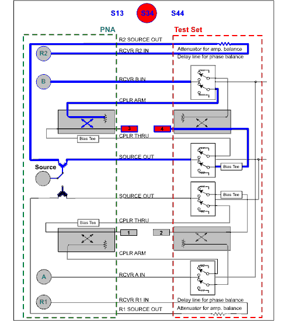
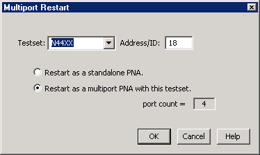
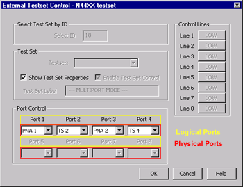
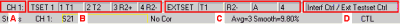
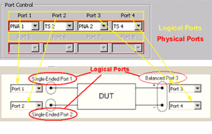

# External Multiport Test Set Control

* * *

Test sets are designed to be controlled by the VNA. There is a switch matrix
that is controlled over GPIB/LAN/USB interface. They are independent
instruments and do not require the PNA/PNA-X.

The VNA with a test set controlled over the test set interface can run in
either multiport VNA or standalone VNA mode.

You need to run in multiport VNA mode with option S93551A/B. You cannot use
any application measurement class in this mode.

_If you want to use an application measurement class with a test set attached
to the PNA, you need to run in standalone mode. The VNA does not know the
presence of the test set in this mode, and you can use any application
measurement classes you wish, but keep in mind that losses through the test
set may be significant. To ensure that the test set is routing signals to the
PNA ports (and not the test set ports), create the VBS script shown below and
run it on the analyzer._

Set app = CreateObject("AgilentPNA835x.Application")

Set TS = app.GetExternalTestSetIO

TS.WriteData 0, 0

TS.WriteData 16, 0

TS.WriteData 32, 0

TS.WriteData 64, 0

  * [Supported Test Sets](External_Testset_Control.md#Supported)

  *     * [Option S93551A/B](External_Testset_Control.md#551)

    * [E5092A](E5091_TestSet_Control.md) (separate topic)

  * Procedure

  *     1. [Connect Test Set](External_Testset_Control.md#Connecting)

    2. [Restart as Multiport](External_Testset_Control.md#Restart)

    3. [Optional External Test Set Control Settings](External_Testset_Control.md#ExternalSettings)

  * [External Test Set Control and other Functions](External_Testset_Control.md#interaction)

[Other System Configuration Topics](System_Topics.md)

Supported Test Sets

The list of test sets that provide integrated solutions with the VNA is
constantly growing. For a current list of supported multiport test sets, see
[www.Keysight.com/find/multiport](http://www.Keysight.com/find/multiport)

### Option S93551A/B

  * With Option S93551A/B enabled on your VNA, any supported multiport test set (such as the U3042A E12) can be controlled directly from the VNA to make fully integrated measurements at ALL of the available test ports. To understand what test ports are available to source and receive, see the test set documentation.

  * Without Option S93551A/B, basic operation depends on the number of VNA test ports.

  *     * For a 2-port VNA, configure two available test ports.

    * For a 4-port VNA, configure four available test ports.

Option 550 is no longer available.

Note: By default, the system logical test ports are mapped as follows:  
---  
  
  
  * Port 1 \- VNA port 1
  * Port 2 \- Test Set port 2
  * Port 3 \- VNA port 2
  * Port 4 \- Test Set port 4

The ports can be remapped using the [Port Control
Setting.](External_Testset_Control.htm#PortControl)  
  
Block Diagram of a 2-port VNA and N44xx Test Set

Click one of the S-parameters to see switch and path changes. Because the test
set does NOT contain receivers, [measurement
speed](External_Testset_Control.htm#Measurements) and
[calibration](External_Testset_Control.md#Calibration) can be affected.

Procedure - How to enable full Multiport Capability

  1. [Enable Option S93551A/B.](../Support/Option_Enable.md)

  2. Connect the test set to the VNA using the documentation that was shipped with the test set.

  3. [Restart as Multiport VNA](External_Testset_Control.md#Restart)

  4. [Make optional External Test Set Control Settings](External_Testset_Control.md#ExternalSettings)

Connect and Configure the Test Set

Connect the test set to the VNA using the test set documentation. Most test
set documentation can found at [www.Keysight.com](http://www.Keysight.com)

### Test Set I/O-controlled test sets

Test sets that are controlled using the [Test Set I/O
connector.](../Rear_Panel/XRtour.htm#TestSetIO) have NO return communication
capability. The VNA sends commands out the rear panel connector. It is assumed
that the test set is responding appropriately. The "Active" LED, located on
the test set front panel, should light when the test set is addressed in
Multiport Mode or manual operation. When the test set is not in use, the
Active LED will be OFF.

### GPIB-controlled test sets

Connect the test set to the GPIB using one of the following methods:

  * If the VNA will NOT be controlled by a remote computer using GPIB, then the test set can be connected directly to the VNA GPIB port. The VNA is automatically switched to [System Controller](../Programming/Learning_about_GPIB/How_to_Configure_for_GPIB_SCPI_and_SICL.md#configure) mode.

  * If the VNA WILL be controlled by a remote computer using GPIB, [then learn how to connect the test set](External_Testset_Control.md#ExternalTSControlDiag)

Restart as Multiport VNA

#### How to Enable Multiport capability

Note: If Option S93551A/B has not been enabled, the following Multiport
Capability menu selection will NOT be available.  
---  
Using Hardkey/SoftTab/Softkey | Using a mouse  
  
  1. Press Setup > External Hardware > Multiport > Multiport Configuration...

|

  1. Click Instrument
  2. Select Setup
  3. Select External Hardware
  4. Select Multiport
  5. Select Multiport Configuration...

  
  
  
Multiport Restart dialog box help  
---  
 See Also [External Test Set
Control and other VNA Functions](External_Testset_Control.htm#interaction)
After the test set is connected and [VNA Option S93551A/B is
enabled](../Support/Option_Enable.htm), the following settings are used to
enable Multiport operation. Test Set Select the test set file to load. Only
the files that are appropriate for use on that VNA model are displayed.

Address Enter the test set address if the test set is connected to GPIB.
Connections over the Test Set I/O connector are determined by their sequence.

  * Restart as a standalone VNA. The VNA shuts down and restarts as a standard VNA. If the test set is left connected to the VNA, switch the test set OFF, then back ON to ensure that the test set routes signals to ports 1 and 2 of the VNA. In this condition, there is more loss in the test paths than without a test set connected. If the power switch is OFF, there is SIGNIFICANTLY more loss in the test paths.
  * Restart as a multiport VNA with this testset. The VNA shuts down and restarts as a multiport VNA with the selected test set.

Click OK The VNA shuts down and restarts in the selected configuration. To
learn how to change port mapping, see [Port
Control](External_Testset_Control.htm#PortControl).

### Problems

If the VNA cannot find the test set, the following error is displayed on the
VNA: GPIB ERROR Address xx cannot open VISA session. To correct the problem,
verify the following:

  * The test set is connected to the VNA using [one of the methods described above.](External_Testset_Control.md#Connecting)
  * The correct test set address is set.
  * The test set is turned ON.

Important: After the problem has been fixed:

  1. On the External Test Set Control dialog, click [Enable Test Set Control](External_Testset_Control.md#ExternalTSControlDiag).
  2. Restart Triggering - press Trigger > Main > Continuous.
  3. The VNA again tries to find the test set.

  
  
External Test Set Control Settings

The following External Test Set Control Settings are used to configure
Multiport test sets. For the N44xx test sets, the only setting that is
necessary is port control.

#### How to access the External Test Set Control Settings  
  
---  
Using Hardkey/SoftTab/Softkey | Using a mouse  
  
  1. Press Setup > External Hardware > Multiport > Other Testset Setup...

|

  1. Click Instrument
  2. Select Setup
  3. Select External Hardware
  4. Select Multiport
  5. Select Other Testset Setup...

  
  
  
External Test Set Control dialog box help  
---  
 | Important Notes:

  * With Option S93551A/B, first use the Multiport Restart dialog to Restart as Multiport VNA with this test set. The test set file is loaded and the test set is enabled automatically.
  * When using GPIB to control an external test set, the VNA is automatically put in [System Controller mode](../Programming/Learning_about_GPIB/How_to_Configure_for_GPIB_SCPI_and_SICL.md#SICL).
  * See also [External Test Set Control and other VNA Functions](External_Testset_Control.md#interaction)

  
---  
  
Select ID

  * For N44xx test sets: the GPIB address

  * For other Multiport test sets: either GPIB address or 0 for Test Set I/O controlled test sets.

Enable Test Set Control When cleared, port switching and control line settings
are disabled. This selection affects all channels using the selected test set.
When checked, the 'Show Test Set Properties' checkbox is also checked
automatically.

Load Test Set File For operating without Option S93551A/B.

If your Test Set is not visible, see [Add a new Test
Set](External_Testset_Control.htm#AddTS).

The selected test set file is loaded.

  1. Navigate to the folder: C:\Program Files(x86)\Keysight\Network Analyzer\testsets\

  2. Select a test set control file.

The title of the dialog shows the model of the test set file that is currently
loaded.

[See a list of supported test sets.](External_Testset_Control.md#Supported)

Show Test Set Properties This box becomes checked by default when the Enable
Test Set Control is checked. When checked, a second row on the [status
bar](../S1_Settings/Customize_Your_Analyzer_Screen.htm#status_bar) appears
which indicates the test set that is being controlled and the current port
control selection. For example, the following image shows the status bar when
controlling an [E5091A](E5091_TestSet_Control.md) test set and a Z5623A K64
test set:

  1. Configured channel

  2. Port Control settings for E5091A

  3. Port Control settings for Z5623A K64

  4. Test Set Label. This field is shared between [Interface Control](Interface_Control.md#InterfaceDiag) and External Test Set Control. The two labels are separated by /.

Control of the second status bar is completely separate from the first status
bar, which is controlled from the [View, Status
Bar](../S1_Settings/Customize_Your_Analyzer_Screen.htm#status_bar) menu.

Test Set Label NOT available with option S93551A/B. Add text to appear on the
second status bar when Show Test Set Properties is checked. See image above.

Port Control Controls mapping of Physical ports to Logical ports. ([Refer to
image of dialog box
above](External_Testset_Control.htm#ExternalTSControlDiag).)

  * Physical ports are the port numbers that are labeled on the test set front panel.

  * Logical ports are the port numbers that are referred to by most of the VNA application prompts and dialog boxes.

Port Mapping Notes

  * Port Control and Control Line settings effect the channel of the active (selected) measurement. These settings occur as the channel is being measured.
  * Correction is turned OFF when port mappings are changed.
  * After the physical ports are mapped to logical ports, all VNA references to port numbers refer to LOGICAL port numbers. The only exception to this is during calibrations.

  
---  
  
Control Lines For use with the U30xxA test sets. Specifies the values of
individual control lines. These general purpose control lines on the test set
front-panel can be used in your test setup. Each button toggles the control
line HIGH and LOW. When first opened, the selections reflect the current
control lines. See your test set documentation for more information about the
control lines.

OK  When clicked, the changes to the dialog box are implemented and the port
selections and control values are immediately sent to the specified test set.
The Port Control and Control line settings are stored with other channel data
and used when those channels are swept.

Cancel (or Escape) Changes to the dialog are not implemented and revert to the
settings before the dialog box was opened.  
  
External Test Sets and other VNA Functions

The following features may work differently with a test set connected to the
VNA.

### Remote Commands

  * See [SCPI](../Programming/GP-IB_Command_Finder/Sense/Multiplexer.md) and [COM](../Programming/COM_Reference/Objects/ExternalTestsets_Collection.md) commands for controlling an External Test Set.

  * Use [*OPT?](../Programming/GP-IB_Command_Finder/Common_Commands.md#opcq) (SCPI) or [NumberofPorts](../Programming/COM_Reference/Properties/NumberOfPorts_Testset_Property.md) (COM) to query the number of ports for a VNA/External Test set.

  * Use [logical receiver notation](../S1_Settings/Measurement_Parameters.md#RecNotation) to refer to double-digit ports.

  * Use [CALC:PAR:DEF:EXT](../Programming/GP-IB_Command_Finder/Calculate/Parameter.md#DefineExtend) instead of CALC:PAR:DEF.

### Sweep Settings

To compensate for additional cable lengths:

  * Set to [Stepped sweep](../S1_Settings/Sweep.md#Stepped)

  * Set [Dwell time](../S1_Settings/Sweep.md#Dwell) to at least 5 microseconds.

### Interface Control

When both [Interface Control](Interface_Control.md) and External Test Set
Control are configured, the commands on the Interface Control Before Sweep
Start tab are sent out before any External Test Set Control commands are
executed on that channel. Similarly, commands on the After Sweep End tab are
sent after Test Set Control commands.

### Calibration

With an External Test Set connected, calibration is performed exactly like a
VNA with the following exceptions:

  * Correction is turned OFF when port mappings are modified. This also applies to Source Power Cal.

  * Beginning with VNA Rev. A.07.50, for [TRL Cal](../S3_Cals/TRL_Calibration.md), [QSOLT](../S3_Cals/Select_Cal.md#QSOLT), or [Unknown Thru](../S3_Cals/Calibration_THRU_Methods.md#UnknownThru) cals with external test sets:

  *     * Use of a [Delta Match Calibration](../S3_Cals/Delta_Match_Calibration.md) from a User Cal Set is NOT required. However, for PNA-L models that require Delta match, a [Global Delta Match Cal](../S3_Cals/Delta_Match_Calibration.md#Global) must be present. The Global Delta Match Cal can only be performed in stand-alone mode.

    * You can NOT perform any of those 3 cal types on JUST a pair of ports that share a test port receiver, such as Port 1 and Port 2 of a [4-port system](External_Testset_Control.md#N44xx). You would need to include an additional port in the calibration.

  * With an External Test Set connected, you may be required to perform more than [3 THRU connections](../S3_Cals/Errors.md#4-Port).

  * A test set such as the Z5623A K44 which is used with 4-port VNA models, does not terminate ports that are not currently in the source path. Because a ports load match on this system is not constant for all possible ports it can be paired with, when calibrating more than two total ports it may be necessary to make Thru measurements on more than the usual minimum number of Thru paths for a VNA calibration. The VNA will ensure that multiport calibrations use a sufficient set of Thru paths so that the calibration can correct for those variations in load match on this type of multiport system.

  * As with ALL VNA calibrations, when error correction is ON, both forward and reverse sweeps are required for EACH port pair that is corrected, even if only one reflection measurement is displayed. For example, any displayed measurement with full 4-port calibration ON will require 12 measurement sweeps. [Learn more.](../S2_Opt/Fast_Swp.md#cal)

### Source Power Cal

[Source power calibration](../S3_Cals/PwrCalibration.md#SourcePowerCal)
involves adjusting the source so that the power at an output port is flat
across a frequency range. Because of additional loss through some of the test
set paths, it may NOT be possible to obtain corrected output power because of
limitations on the source signal.

During a Source Power Cal, you are prompted when and where to connect the
power sensor. When one of the supported test sets are connected, the prompt
refers to the PHYSICAL port number, NOT the LOGICAL port number. To help with
translating physical to logical port mappings, enable [Show Test Set
Properties](External_Testset_Control.htm#ExternalTSControlDiag).

### Measurements with Shared Receivers

External test sets do not contain receivers. The VNA receivers are always used
to measure signals at the external test set ports. Therefore, when a channel
contains two measurements that share a VNA [test port
receiver](../Glossary.htm#TestPortRec), additional sweeps are necessary.

For example, to make S34 and S44 measurements in the same channel with
correction OFF:

  * On a 4-port VNA, only ONE sweep is required using the C (port 3), D (port4), and R (reference for All receivers).

  * On a N44xx system, TWO sweeps are required since both measurements use the B and R2 receivers. [See interactive block diagram above.](External_Testset_Control.md#Block)

### Create Ratioed and Unratioed Measurements

When using an external test set, it IS possible to create a Ratioed
measurement using two logical receivers that share the same physical VNA
receiver. However, this measurement data is NOT valid. Invalid measurement
traces show all data at -200 dB (in Log mag format). [Learn about Logical
Receiver Notation](../S1_Settings/Measurement_Parameters.htm#RecNotation)

### Logical Port References

When an external test set is enabled, all references to VNA port numbers and
test set port numbers (except during calibrations) refer to LOGICAL port
numbers. Logical ports can be remapped using the [Port Control
settings.](External_Testset_Control.htm#PortControl) During a calibration, you
are prompted to connect standards to physical port numbers.

### Balanced Port Mapping

"Logical Ports" is a term that is used with both External Test Sets and
balanced measurements. While the concept is the same, they refer to different
scenarios. The two can be easily confused when making Balanced measurements
with an External Test Set connected. The important principle to remember is
the order in which the logical ports for each are mapped:

  1. In the [External Test Set - Port Control settings dialog](External_Testset_Control.md#ExternalTSControlDiag), the physical VNA ports and test set ports are mapped to logical ports as noted above.

  2. In the [Balanced Topology Dialog](../S1_Settings/Measurement_Parameters.md#topology), the new (step 1) logical ports are mapped again to become Balanced logical ports.

1\. External Test Set Mapping Dialog |   
---|---  
2\. Balanced Topology Dialog  
  
### Preset

[Instrument Preset](../S1_Settings/Preset_the_Analyzer.md) will reset [Port
Control](External_Testset_Control.htm#PortControl) settings to defaults and
remove the [test set label](External_Testset_Control.md#Show). All other
settings remain. To maintain port control settings and the test set label,
create a [User
Preset](../S1_Settings/Preset_the_Analyzer.htm#PresetUserDefined).

### Instrument State Save and Recall

[Instrument State files](../S5_Output/SaveRecall.md#Binary) include Test Set
model, Enable and Status bar settings, and Port mappings and DUT control
values for each channel.

If an Instrument State recall requires that a test set configuration file be
loaded, recall time may be significant. For example, this would occur if a
2-port VNA with attached test set is configured as a 2-port VNA and then
recalls a state file which requires 4-port operation.

### Recall Cal Sets

If a Cal Set is saved while an external test set is enabled, when the Cal Set
is recalled, then the external test set must be enabled or an error message is
displayed.

### Copy Channel

[Copy Channel](../S1_Settings/CopyChannels.md) copies all relevant test set
data from the source channel to the target channel.

### Applications

No VNA applications are supported with External Test Set Control. These
include FCA (opt S93083A/B), SMC (opt S93082A/B), GCA (opt S93086A/B), NFA
(opt S93029A/B), Pulsed (opt H08).

### Print

Port mapping information appears on the [Channel Settings
Table](../S5_Output/Print.htm#PrintOptDiag) when printing.

### Save sNp Files

To save sNp data with an [external test set](External_Testset_Control.md)
enabled, click File, [Save As](../S5_Output/SaveRecall.md#SaveAsDiag), then
select Snp File(*.s*p), then complete the [Choose ports
dialog](../S5_Output/SaveRecall.htm#ChoosePorts).

* * *

