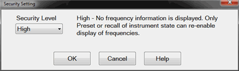

# Frequency Blanking

* * *

For security reasons, you can prevent frequency information from appearing on
the screen and printouts.

#### How to set Frequency Blanking  
  
---  
Using Hardkey/SoftTab/Softkey | Using a mouse  
  
  1. Press System > Main > Security....

|

  1. Click Utility.
  2. Select System.
  3. Select Security....

  
  
  
Security Setting dialog box help  
---  
 | Notes

  * An ECal Data Wipe Utility destroys all user data per US DoD 5220.22-M. 
  * VNA 'Undo' is disabled with High and Extra security levels. [Learn more](../S1_Settings/Undo.md).

  
---  
  
### Security Levels

None - All frequency information is displayed on the screen and printouts.

Low security level - Frequency information is blanked from the following:

  * Display annotation

  * Calibration properties

  * All tables

  * All toolbars

  * All printouts

  * [External sources](Configure_an_External_Device.md#SelectExtSource) \- See Also: [Preference to Deactivate External Devices on Preset.](Preferences.md#ExtDevActivate) Note: Frequency Blanking is fully supported ONLY on Keysight MXG sources with option 006\. On MXG models without option 006 and all PSG models, the window state is turned OFF. When the “local” button is clicked on the source, then frequency is re-displayed.

High security level - Low security level settings PLUS:

  * [GPIB console](../Programming/Learning_about_GPIB/How_to_Configure_for_GPIB_SCPI_and_SICL.md#console) is inactive

Extra security level \- High security level settings PLUS:

  * All ASCII [data saving](../S5_Output/SaveRecall.md#ASCII) capability (.snp, .prn, .cti) is saved without frequency information. The X-axis information is replaced with data point numbers. Before A.08.50, saving these file types was NOT allowed.

  * [Mixer setup files](../Applications/MixerConverter_Setup.md#AboutMxr) (*.mxr) can NOT be saved.

### For ALL security levels:

Frequency information is NOT blanked from the following:

  * [Service Adjustment Programs](../Support/Adjust_Overview.md)

  * Your COM or SCPI programs.

### Instrument State and Cal Sets

The security level is always saved and recalled with an instrument state.
However, the instrument state may contain a Cal Set or link to a Cal Set.
[Learn more](../S5_Output/SaveRecall.md#State). This may influence the
security level when the instrument state is recalled. Here is how.

  * When a new Cal Set is created at the end of a calibration, the current system security level is stored with it.

  * The only way to change an existing Cal Set’s security level is by writing a new calibration into the Cal Set.

  * When later applied to a channel, if the Cal Set has a higher security level than the current system security level, the system security level will become upgraded to that of the Cal Set.

  * When saving an instrument state to either a *.csa or *.cst file, the security levels of the system and Cal Set are saved separately. When recalled, the higher security level of the two is applied.

  * To view the security level of a Cal Set, see [Cal Set Properties](../S3_Cals/Cal_Sets.md#CalSetProps).

### Re-displaying frequency information

  * When in Low security level, do any of the following:
  *     * Revisit this dialog box and select None
    * Perform an [instrument preset](../S1_Settings/Preset_the_Analyzer.md)
    * Recall an Instrument State/Cal Set with security level of None.
  * When in High or Extra security level, do any of the following:
  *     * Perform an [instrument preset](../S1_Settings/Preset_the_Analyzer.md)
    * Recall an Instrument State/Cal Set with security level of None.

  
---  
  
* * *

