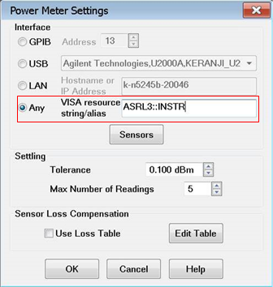
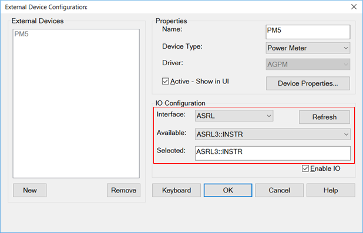

# Install VDI PM5 Driver

* * *

VDI’s ‘PM5’ power meter MAY work with the VNA. However, because there are many
factors out of our control, we can not guarantee the functionality or
performance.

**N** ote: The minimum required firmware version of the VDI PM5 power sensor
is VC1501.

**Note:** VNA firmware between A.11.00.xx and A.13.20.xx do NOT include this
capability. Ideally, the VNA should have the most recent VNA Firmware that is
supported by your VNA.

To enable the use of the PM5 power meter with the VNA Source Power Cal and
Power Meter-As-Receiver (PMAR) features, you must first install _on your VNA_
the software that VDI supplies on a USB stick with the PM5. The procedure for
installing that software on the VNA is the same as installing it on a PC,
which is detailed in the manual for the PM5 which can be found here:
<http://www.vadiodes.com/images/Products/PowerMeter/PM5manual/VDI-724-PM5-Manual.pdf>

Once that software is installed on the VNA, the PM5 is accessed via Source
Power Cal and PMAR by the VISA resource string “ASRL3::INSTR”. The following
dialogs illustrate how to specify that in the VNA’s Power Meter Settings
dialog for Source Power Cal and the VNA’s External Devices dialog for PMAR.

For more information, refer to the [Power Meter
Settings](../S3_Cals/PwrCalibration.htm#pwrMeterIm) dialog description.

For more information, refer to the [External Device
Configuration](Configure_an_External_Device.htm#ExtDevConfig) dialog
description.

* * *

