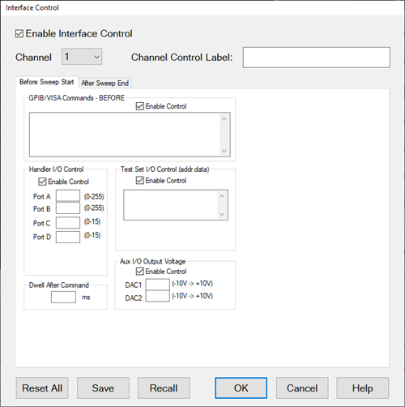

# Interface Control

* * *

The Interface Control feature allows you to send remote commands and data to
the following VNA rear-panel Interfaces: GPIB, Material Handler I/O, Test Set
I/O, and Auxiliary I/O.

  * [Overview](Interface_Control.md#Overview)

  * [How to Access Interface Control Settings](Interface_Control.md#How)

  * [Interface Control Dialog Box](Interface_Control.md#InterfaceDiag)

  * [Z5623A H08 Test Set Commands](Interface_Control.md#Z5326A)

[Other System Configuration Topics](System_Topics.md)

Overview

The Interface Control feature allows you to send data to control external
equipment such as GPIB instruments, a material handler, test set, or other
equipment, without needing to create a remote program. The VNA manages the
timing and required interface setup. See [Rear Panel
Tour.](../Rear_Panel/XRtour.htm)

  * A unique set of control data can be sent for each channel. In addition, a unique set of control data can be sent before the channel sweep starts, and after the sweep ends.

  * Interface Control settings can be saved and recalled from the [Interface Control dialog box](Interface_Control.md#InterfaceDiag), or with [Instrument State Save and Recall](../S5_Output/SaveRecall.md#FileTypes).

  * Interface Control settings can be copied to other channels using [Copy Channels.](../S1_Settings/CopyChannels.md)

  * Control data can only be WRITTEN to the interfaces, NOT READ from the interfaces.

  1. [GPIB Interface](Interface_Control.md#GPIB)

  2. [Material Handler Interface](Interface_Control.md#Material)

  3. [Test Set Interface](Interface_Control.md#TestSet)

  4. [Aux Interface](Interface_Control.md#Aux)

  5. [Dwell Time](Interface_Control.md#Dwell)

#### How to access Interface Control settings  
  
---  
Using Hardkey/SoftTab/Softkey |  Using a mouse  
  
  1. Press Setup > Internal Hardware > Interface Control...

|

  1. Click Instrument
  2. Select Setup
  3. Select Internal Hardware
  4. Select Interface Control...

  
  
  
Interface Control dialog box help  
---  
  

 GPIB and VISA Commands |  Notes:

  * GPIB instruments CAN be connected to the VNA using a USB/GPIB adapter.
  * Any type of interface (LAN, USB, GPIB) is available through the VISA connection string.
  * GPIB/VISA Queries are NOT supported. Commands can be sent only.

  
---  
  
Enable Control Enables and disables sending commands out the GPIB or VISA
interface.

Multi-line edit control Each line contains a GPIB or VISA command using the
following syntax:

address command

Where:

address

  * A number between 0 and 31. The VNA will look through all of the GPIB interfaces for an instrument connected to the specified address. If an instrument with that address is not recognized, an error is returned.

  * A valid VISA connection string.

command a SCPI command, with or without enclosing quotes. Enclosing quotes are
ignored.

Address and command are separated by at least one space.

Commands should be separated by a new line, or carriage return. For example:

19 ":init:cont off"  
16 init:imm

TCPIP0::141.121.78.100::inst0::INSTR outp:ON

The front-panel Enter key inserts a new line into the field.

The number of GPIB/VISA commands that can be entered is limited only by the
available memory of the VNA.

See [Z5326A H08 Test Set Commands](Interface_Control.md#Z5326A).

Material Handler I/O

Enable Control Enables and disables sending data out the [Material Handler I/O
connector](../Programming/HandlerIO_Connector.htm) (PNA), Handler IO Connector
(ENA)

Ports [A, B](../Programming/HandlerIO_Connector.md#Output), [C,
D](../Programming/HandlerIO_Connector.htm#inOut) Sends values to the
respective Handler I/O port. Although ports C and D are normally
bidirectional, ONLY Output mode is allowed using the Interface Control
feature. It cannot read from these, or any other, ports.

Note: When [Handler Port A](../S1_Settings/Sweep.md#Handler_Port_A) is
enabled in the Segment Table dialog, Handler I/O Control is managed by the
segment table and is inactive (grayed out).

Test Set I/O

Note: The VNA has a separate interface for [controlling the E5091A Test
Set](E5091_TestSet_Control.htm).

Enable Control Enables and disables sending data out the [External Test Set
I/O connector](../Programming/TestSetIO_Connector.htm).

Multi-line edit control Each line contains a Write command using the following
syntax:

address.value

Where:

address any positive integer.

value numeric character. Entries that require alpha characters should use the
[GPIB interface](Interface_Control.md#GPIB).

Address and value are separated by a period. For example:

18.2  
27.3

Entries should be separated by a new line, or carriage return. The VNA front-
panel Enter key inserts a new line into the field.

All entries are sent out the Test Set I/O port using the [WriteData
Method.](../Programming/COM_Reference/Methods/WriteData_Method.htm)

The number of entries is limited only by the available memory of the VNA.

Aux I/O Output Voltage

Note: The 9-pin PWR I/O (Power I/O) D connector on the rear-panel replaces
much of the functionality of the AUX I/O connector on older VNA models. The
Power I/O voltages can be set using the following methods:  
  
\- [CONTrol:AUXiliary:OUTPut:VOLTage](../Programming/GP-
IB_Command_Finder/ControlAux.htm#output) or [put_OutputVoltage
Method](../Programming/COM_Reference/Methods/put_OutputVoltage_Method.htm) (no
GUI equivalent, global scoped, and settings not saved as part of the
instrument state)  
\- [SOURce:DC:START](../Programming/GP-IB_Command_Finder/SourceDC.md#start)
and [SOURce:DC:STOP](../Programming/GP-IB_Command_Finder/SourceDC.md#stop)
([DC Source dialog](../S1_Settings/DC_Control.md#DCControl) is the GUI
equivalent, channel scoped, and settings saved as part of the instrument
state)  
\- Interface Control dialog (no remote equivalent, channel scoped, and
settings saved as part of the instrument state)  
  
To avoid unexpected behavior, choose one method only to set the Power I/O
voltages.

Enable Control Enables and disables sending data out the Auxiliary I/O
connector.

DAC1, DAC2 Sets voltages on the Aux I/O connector pins 2 (DAC1) and pin 3
(DAC2).

Dwell After Command Specifies a wait time, in milliseconds, after all commands
to all interfaces are sent. Any positive integer is allowed. This is used to
allow all external devices to settle before beginning a measurement. An
erratic trace could indicate that more settling time is necessary.

Reset All Sets ALL fields on ALL channels to their default values.

Save and Recall Saves and recalls the contents of this dialog box. If the
Interface Control dialog box is populated with settings during an [Instrument
State Save](../S5_Output/SaveRecall.htm), the settings are automatically
recalled with the Instrument State settings.

Interface control uses an *.xml file type. An example file is stored on the
VNA hard drive. You can recall it into the dialog, or you can open and edit it
with a word processor, such as Word Pad.

OK Applies the settings and closes the dialog box.

Cancel Does not apply changes that were made, and closes the dialog box.  
  
### Z5623A H08 Test Set Commands

The following table lists the commands that are used to control the popular
Keysight Z5623A H08 Test Set. These commands can be entered into the [GPIB
Interface](Interface_Control.htm#GPIB) control.

Connection Path |  Test Set Command  
---|---  
Reflection to Port 1 |  refl_01  
Reflection to Port 2 |  refl_02  
Reflection to Port 3 |  refl_03  
Reflection to Port 4 |  refl_04  
Reflection to Port 5 |  refl_05  
Reflection to Port 6 |  refl_06  
Reflection to Port 7 |  refl_07  
Reflection to Port 8 |  refl_08  
Transmission to Port 1 |  tran_01  
Transmission to Port 2 |  tran_02  
Transmission to Port 3 |  tran_03  
Transmission to Port 4 |  tran_04  
Transmission to Port 5 |  tran_05  
Transmission to Port 6 |  tran_06  
Transmission to Port 7 |  tran_07  
Transmission to Port 8 |  tran_08  
Reset |  *rst  
Reflection Termination |  *r_term  
Transmission Termination |  *t_term  
All Termination |  *all_term  
  
* * *

