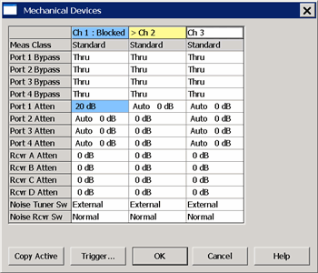

# Mechanical Devices

* * *

  * [Overview](Mechanical_Devices.md#Overview)

  * [How to access Mechanical Devices settings](Mechanical_Devices.md#How)

  * [Mechanical Devices dialog](Mechanical_Devices.md#MechanicalDialog)

[Other System Configuration Topics](System_Topics.md)

Overview

Note: To prevent premature wear, the VNA does not allow attenuators or other
mechanical switches to switch continuously. These mechanical devices are set
for the entire channel. When more than one channel is used, and a mechanical
device setting is NOT the same for all channels, only the ACTIVE channel is
allowed to sweep. All other channels are Blocked \- NOT allowed to sweep.
Blocked channels will resume sweeping when they are made ACTIVE, or when the
conflict is resolved. Press Trigger > Main > Restart to cause ALL channels to
sweep once. Then the active channel will resume sweeping continuously.  
---  
  
The Mechanical Devices dialog shows the settings of all of the switches and
attenuators in the VNA. The settings for all active channels are shown side-
by-side for easy comparison. This dialog allows you to determine the settings
which would cause mechanical devices to switch between states on consecutive
sweeps, potentially leading to device wear-out. It also allows you to
determine if the conflict can be resolved to enable continuous sweeps on all
channels.

The following are the mechanical devices that are potentially shown in the
dialog. These components may not appear in your VNA model:

  * Port 1 through Port 4 Bypass Switches

  * Port 1 through Port 4 Source Attenuator settings

  * Receiver A through Receiver R Attenuator settings

  * Port 1 Noise Tuner Switch and Port 2 Noise Receiver Switch

How to access Mechanical Devices settings  
---  
Using Hardkey/SoftTab/Softkey |  Using a mouse  
  
  1. Press Setup > Internal Hardware > Mechanical Devices...

|

  1. Click Instrument
  2. Select Setup
  3. Select Internal Hardware
  4. Select Mechanical Devices...

  
Remote commands SCPI: [SENSe<cnum>:SWEep:BLOCked?](../Programming/GP-
IB_Command_Finder/Sense/Sweep_SCPI.htm#BLOCked_) COM: [IsBlocked
Property](../Programming/COM_Reference/Properties/IsBlocked_Property.htm)  
  
Mechanical Devices dialog box help  
---  
 See Mechanical Devices Overview (scroll
up) The devices that appear in the table depend on the VNA model and options.
> Yellow highlighted cell indicates the Active channel. Blue highlighted cells
indicate the following:

  * The channel is NOT able to sweep. Blocked is shown in the top row.
  * The highlighted device settings differ from that of the sweeping channels.

To modify entries in the table, click a cell. When a selection is changed, the
new setting is applied immediately.

### Limitations

  * [Measurement Class](../S1_Settings/Measurement_Classes.md) can NOT be changed from this dialog.
  * The dialog does NOT report device settings for [multiport test sets](External_Testset_Control.md).
  * This dialog does NOT report device settings for [external sources](Configure_an_External_Device.md).

Copy Active Available ONLY when there is a conflict which causes at least one
channel to be Blocked. When clicked, the mechanical device settings of the
Active channel are copied to the Blocked channels. A warning message appears
to remind you that power to one or more channels may be increased. Exception:
When one or more Noise channels are present, then the settings of the two
Noise switches are be determined by the lowest-numbered Noise channel if none
are the active channel. Trigger Launches the Trigger dialog box. OK Closes the
dialog box. Cancel Does not apply changes that were made, and closes the
dialog box.  
  
* * *

