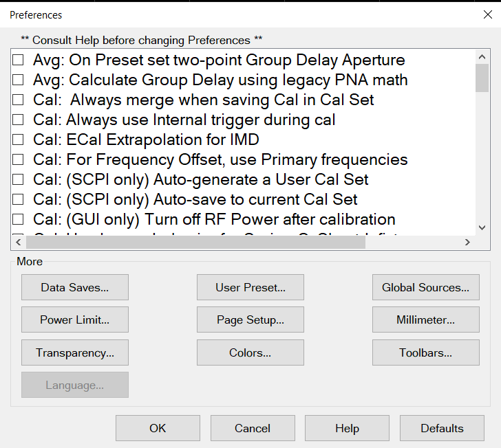

# Preferences

* * *

Preferences are settings that survive a Preset or Shutdown. Preferences are
listed on this page with links to locations that provide more information.

#### How to set Preferences  
  
---  
Using Hardkey/SoftTab/Softkey |  Using a mouse  
  
  1. Press System > System Setup > Preferences....

|

  1. Click Utility.
  2. Select System.
  3. Select System Setup.
  4. Select Preferences.

  
  
  
Preferences  dialog box help  
---  
 Preferences survive a Preset and a
Shutdown. A checked box makes the following statements true unless stated
otherwise.  
 Avg: On PRESET set two-point group
delay aperture (default) - Group delay aperture is set to 11 points.
 Avg: On PRESET set two-point group delay
aperture - Group delay aperture set to 2 points. [Learn
more.](../Tutorials/Group_Delay6_5.htm#aperture)  
 Avg: Calculate Group Delay using
legacy PNA Math (default) \- Do not use legacy group delay aperture
computation methods.  Avg: Calculate Group
Delay using legacy PNA Math - Use legacy group delay aperture computation
methods.  
 Cal: Always merge when saving Cal in
Cal Set (default) - Merge if final cal set covers ≤ 4 ports. In this case, cal
sets will be appended. If > 4 ports, erase the existing cal set before saving.
 Cal: Always merge when saving Cal in Cal
Set \- Merge cal sets. This is primarily for multiport systems and can take a
significant amount of time to merge.  
 Cal: Always use Internal Trigger
during cal (default) - Only use Internal Trigger source
 Cal: Always use Internal Trigger during cal
-use the other Trigger source  
 Cal: ECal Extrapolation for IMD
(default)  Cal: ECal Extrapolation for IMD -
Allows Swept IMD and IMDx channels to be calibrated beyond the stop frequency
of the ECal module by extrapolating the error terms. [Learn
more](../Applications/Swept_IMD.htm#ECalExtrap).  
 Cal: For Frequency Offset, use Primary
Frequencies (default)  Cal: For Frequency
Offset, use Primary Frequencies - Use when making mmWave measurements without
a test set. [Learn more.](../IFAccess/mmWave_Measurement_w_No_Test_Set.md)  
This setting only affects calibrations performed using SCPI. Cals performed
from the User Interface ALWAYS offer a choice to save to a named Cal Set.
 Cal: (SCPI only) Auto-generate a User
Cal Set (default) - Completed calibrations are automatically saved to Cal
Registers; NOT to User Cal Sets.  Cal: (SCPI
only) Auto-generate a User Cal Set - Completed calibrations are automatically
saved to an auto-named User Cal Set. Caution: this can cause a lot of saved
User Cal Sets. [Learn more.](../S3_Cals/Cal_Sets.md)  
The following message appears when both the Cal Set choices above and below
are selected: "Cal: Auto-save preferences conflict " Cal: (SCPI) Auto-save to
User Cal Set (above)- or - Cal: (SCPI) Auto-save to current Cal Set (below)
Uncheck one of these.  
This setting only affects calibrations performed using SCPI. Cals performed
from the User Interface ALWAYS offer a choice to save to a named Cal Set.
 Cal: (SCPI) Auto-save to current Cal Set -
Always automatically save a completed Cal to the Cal Set that is currently
selected on the specified channel, which could be the channel Cal Register. If
the channel does not yet have a selected Cal Set, the Cal will be saved to a
new User Cal Set with an automatically-generated name.
 Cal: (SCPI) Auto-save to current Cal
Set (default)\- Do NOT automatically save a completed Cal to the Cal Set that
is currently selected on the specified channel.  
 **Cal: (GUI only) Turn off RF Power after
calibration** \- Set to turn off the RF power after all calibrations. This
includes all S-parameter and Power calibrations. This includes all
calibrations using mechanical standards, Ecals or power meters. This function
is GUI only feature. SCPI users need to call OUTPUT OFF at the end of
calibration.   **Cal: (GUI only) Turn
off RF Power after calibration**(default) - Do NOT turn off the power after
calibration.  
 Cal: Use legacy behavior for Series-C &
Shunt-L fixtures - Legacy operation provided as a user-convenience for
backward compatibility. When both of two components of Series-C are set to 0,
they are defined as "Short".  when both of two components of Shunt-L are set
to 0, they are defined as "Open".  Cal:
Use legacy behavior for Series-C & Shunt-L fixtures (default) \- Do NOT use
legacy operation.  
 Cal: Use Unknown thru math for SOLT methods
- Error terms are computed using the unknown thru method.
 Cal: Use Unknown thru math for SOLT
methods (default) \- Error terms are computed using the definition of the
defined thru. Default is checked for the following VNAs: E5080B ENA E5081A
ENA-X M980xA PXI VNA M981xAS PXI VNA P50xxA USB Streamline VNA P50xxB USB
Streamline VNA P937xB USB Streamline VNA P938xB USB Streamline VNA Default is
unchecked for the following VNAs: PNA family (PNA-L, PNA, PNA-X) M937xA PXI
VNA P937xA USB Streamline VNA  
 Display: Selected trace changes width
briefly. (default) - The selected trace does NOT change width briefly in order
to improve visibility.  Display: Selected
trace changes width briefly.  
 Display: Selected Trace is wider.
(default) \- The selected trace is the narrow, default size.
 Display: Selected Trace is wider. The
active (selected) trace is always wider.  
 Display: Touchscreen ON (default) -
Selections can be made by touching the screen.
 Display: Touchscreen ON \- Selections
can NOT be made by touching the screen.  
 Ext Device: De-activate on PRESET and
recall. External devices are de-activated when the VNA is Preset or when a
Instrument State is recalled.  Ext
Device: De-activate on PRESET and recall. External devices remain active when
the VNA is Preset or when a Instrument State is recalled. [Learn more about
External Devices.](Configure_an_External_Device.htm)  
 Ext Reference: Modify Settings on Preset
and Recall \- External Reference settings will be affected by Recall/Preset.
 Ext Reference: Modify Settings on
Preset and Recall \- External Reference settings will be maintained until
changed.  
 Limit: Draw failed trace segments in red
Failed segments are drawn in red. [Learn
more](../S4_Collect/Use_Limits_to_Test_Devices.htm#dots).
 Limit: Draw failed trace segments in
red Failed data points (dots) are drawn in red.  
 Limit: Draw Limit Lines in Red  Limit
lines are drawn in the same color as the trace.
 Limit: Draw Limit Lines in Red All Limit
limes are drawn in Red.  
 Limit: Test the nearest measurement point -
When the stimulus of measurement point is not the same as the limit test
point, the nearest limit test point is used for pass/fail judgement.
 Limit: Test the nearest measurement
point - The pass/fail is judged at only the stimulus of limit test point.  
******Markers: Coupling controls on|off
state of markers -** Turning a marker on or off will have no effect on the
markers on other traces. ******Markers:
Coupling controls on|off state of markers -** With Coupled Markers ON, when a
marker is turned on, the same-numbered marker on all coupled traces will also
be turned on. Likewise, turning off a marker will turn it off on all coupled
traces.  
**Markers: On Preset, Coupled Markers
is ON -** Coupled Markers is OFF after Preset
******Markers: On Preset, Coupled Markers is
ON -** Coupled Markers is ON after Preset  
******Markers: On Preset, Coupling
Method is Channel -** Marker Coupling Method is set to ALL after Preset.
******Markers: On Preset, Coupling Method is
Channel -** Marker Coupling Method is set to Channel after Preset.  
******Marker: On Preset, set BW/Notch search reference to Peak -** **BW/Notch
marker search reference is set to current marker position after Preset.**
**Marker: On Preset, set BW/Notch search reference to Peak - BW/Notch marker
search reference is set to peak after Preset.**  
******Marker: Programming treats Mkr 10 as
Reference** A marker programming command that includes 10 as its marker number
argument will operate on the Reference Marker (NOT the general-purpose Marker
10). [See Marker commands](../Programming/CF_Markers_Commands.md).
** Marker: Programming treats Mkr 10 as
Reference** A marker programming command that includes 10 as its marker number
argument will operate on the general-purpose Marker 10 (NOT the Reference
marker).  
****Marker: Use single marker for marker
search (default) - Use one marker for marker search. Sub Marker is displayed
and used for Bandwidth, Notch searches.
 Marker: Use single marker for marker
search - Use multi marker for marker search.  
 Meas: Mathematical offset for receiver
attenuation The reported test port receiver power is mathematically offset by
the amount of receiver attenuation. Default for all models.
 Meas: Mathematical offset for receiver
attenuation The reported test port receiver power is NOT mathematically offset
by the amount of receiver attenuation. [Learn
more.](../S1_Settings/Power_Level.htm#Receiver_Atten)  
 Meas: Mathematical offset for source
attenuation The reported reference receiver power is mathematically offset by
the amount of source attenuation. 
Meas: Mathematical offset for source attenuation The reported reference
receiver power is NOT mathematically offset by the amount of source
attenuation.. [Learn more.](../S1_Settings/Power_Level.md#SrcOffset)  
 Memory: Data Math 8510 Mode  Standard
data processing chain.  Memory: Data Math
8510 Mode Simulate the Keysight 8510 data processing chain as it pertains to
Trace Math and Memory. [Learn more.](../S4_Collect/Math_Operations.md#8510)  
 Memory: Interpolate ON is default
condition  Set memory interpolation to OFF as the default.
 Memory: Interpolate ON is default condition
Set memory interpolation to ON as the default. [Learn
more.](../S4_Collect/Math_Operations.htm#MemoryTraceInterpolation)  
 Power: On Preset turn power on Instrument
Preset always turns source power ON. 
Power: On Preset turn power on When the current source power setting is OFF,
source power remains OFF after Preset. When the current power setting is ON,
source power is turned ON after Preset. [Learn
more.](../S1_Settings/Power_Level.htm#PowerStatePreset)  
For SCPI behavior only. [Learn more.](../Programming/GP-
IB_Command_Finder/System.htm#unlevel) 
Power: Report source unleveled events as errors Source unleveled events are
reported as errors.  Power: Report
source unleveled events as errors Source unleveled events are NOT reported as
errors.  
 Power: Report when receiver is overloaded
A warning message is displayed on the VNA screen indicating that a receiver is
overloaded or in compression. The displayed data is probably not accurate. One
error per sweep appears and is reported in the [Error
Log](../Support/About_Error_Messages.htm#errorLogDiag).
 Power: Report when receiver is
overloaded Do NOT show overload warnings on the screen or report these errors
in the error log.  
 Power: Force RF power Off at end of sweep -
Turn RF power Off during a retrace of single-band frequency or segment sweeps.
 Power: Force RF power Off at end of
sweep (default) \- Leave RF power On during a retrace of single-band frequency
or segment sweeps. [Learn more.](../S1_Settings/Power_Level.md#PowerONOFF)  
 Power: Turn Source Power Off when
receiver is overloaded. (Default) \- Power remains ON when a receiver is
overloaded.  Power: Turn Source Power Off
when receiver is overloaded. Turn OFF power to ALL ports when a receiver is
overloaded. A notification dialog appears. Click OK, then lower the power
level, then turn power ON. (Click Stimulus, then Power)  
 Power: Use Start Power during Power Sweep
retrace At the end of a power sweep, while waiting to trigger the next sweep,
the VNA maintains source power at the start power level.
 Power: Use Start Power during Power
Sweep retrace Maintain source power at the STOP power level. [Learn
more.](../S1_Settings/Power_Level.htm#PowerONOFF)  
 Preset: Confirm preset \- When Preset
hardkey button is pressed, VNA firmware immediately presets (Hardkey is
required only).  Preset: Confirm preset
(default) \- When Preset > Preset is pressed, VNA firmware immediately presets
(Hardkey and Softkey are required).  
 Preset: On Preset enable TDR. Enable
TDR on preset and power-up.  Preset: On
Preset enable TDR. Do not enable TDR on preset and power-up.  
 Preset: On Preset show Quick Start dialog
\- Open Quick Start dialog on Preset. 
Preset: On Preset show Quick Start dialog \- Do not open Quick Start dialog on
Preset.  
 Recall: Softkey order is most recently used
- Recall softkey order which is most recently used.
 Recall: Softkey order is most recently
used (default) - Do NOT recall softkey order which is most recently used.  
 Scale: On Preset Couple scale to Window \-
Scale coupling is set to Window when Preset.
 Scale: On Preset Couple scale to
Window (default) \- Scale coupling is set to Off by default when Preset.  
 Sweep: On Preset set Sweep Mode to Stepped
\- Sweep Mode set to Stepped after Preset.
 Sweep: On Preset set Sweep Mode to
Stepped \- Sweep Mode set to Auto after Preset.  
 Sweep: Use only ramp sweeps for Auto Sweep
Mode \- Auto Sweep Mode set to use continuous ramp sweeps after Preset.
 Sweep: Use only ramp sweeps for Auto
Sweep Mode \- Auto Sweep Mode set to not use ramp sweeps after Preset.  
 System: Enable sound (default) - Instrument
speaker turns ON.  System: Enable sound
- Instrument speaker turns OFF.  
 System: On Power-on show dialog if detect
mm testset - Display the Millimeter Configuration dialog after power-on if a
millimeter test set is detected. 
System: On Power-on show dialog if detect mm testset - Hide the Millimeter
Configuration dialog after power-on if a millimeter test set is detected.  
 System: On Power-on show Keys toolbar -
Display softkey toolbar after power-on.
 System: On Power-on show Keys toolbar
- Hide softkey toolbar after power-on.  
System: On VNA Start-up Run Self Tests
(default) - Module self tests and connection checks are executed at start up
System: On VNA Start-up Run Self Tests
- Module self tests and connection checks are NOT executed at start up  
 System: Use keyboard to navigate softkeys
\- Enable the keyboard to browse the softkeys.
 System: Use keyboard to navigate
softkeys (default) \- Disable the keyboard to browse the softkeys.  
 System: Optimize memory for use with many
channels \- (M9485A only) The maximum number of channels will be extended but
measurement speed may be decreased. The maximum number of channels depends on
PC memory, NOP and traces.  System:
Optimize memory for use with many channels (default) \- (M9485A only) Standard
mode (No memory optimization)  
 System: Use parallel processing (default) -
Enable parallel processing in the CPU which provides higher calculation
speeds.  System: Use parallel
processing \- Disable parallel processing in the CPU.  
 System: Set front panel remote state when a
SCPI command is received \- Enable changing from local to remote status when a
SCPI command is received.  System: Set
front panel remote state when a SCPI command is received \- Disable changing
from local to remote status when a SCPI command is received.  
Sets the scope of External Trigger Output signal properties. The VNA is Preset
after changing this setting.  Trigger:
External Trigger OUT is Global Channels can have different External Trigger
OUT settings. Default for PNA-X and N522xA models. On the Trigger Setup
dialog, Trigger Mode = Point is ignored for external triggering.
 Trigger: External Trigger OUT is Global All
channels have same External Trigger OUT settings. Default for VNA “C” and
PNA-L models. Aux Trig OUT properties apply to all channels except the Per
Point setting. To set Per Point for specific channels: On the [Trigger
Setup](../S1_Settings/Trigger.htm#TriggerDiag) dialog, set Trigger Scope =
Channel, under Channel Trigger State, select the channel, and set Trigger Mode
= Point. [See External Triggering
dialog.](../S1_Settings/External_Triggering.htm)  
  
The More buttons launch dialogs that contain predefined preferences:  
---  
Data Saves... - Define Data Saves \- While not explicitly called Preferences,
all of these settings survive a shutdown. [Learn
more.](../S5_Output/SaveRecall.htm#DefineDiag)  
Power Limit Offsets and Limits \- Sets Power Limits and Offsets. [Learn
more](Power_Limit_and_Power_Offset.htm).  
Transparency... Dialog Transparency \- Some dialogs can be viewed in various
levels of transparency. [Learn more](Dialog_Transparency.md).  
Language... Help \- Sets the language of the built-in help (English or other
localized language). [Learn more](../S0_Start/Using_Help.md#Help_languages).  
User Preset... User Preset \- Specify the Instrument State file that the
analyzer will use when Preset. [Learn
more.](../S1_Settings/Preset_the_Analyzer.htm)  
Page Setup... Page Setup \- Standard printer settings (Paper, Orientation, and
Size) do NOT survive a shutdown. All other settings DO survive a shutdown.
[Learn more.](../S5_Output/Print.md#printoptions)  
Colors... Display Colors \- Sets display items to custom colors. [Learn
more.](../Programming/GP-IB_Command_Finder/Display_Colors.htm) Print Colors \-
Sets print items to custom colors. [Learn more.](../Programming/GP-
IB_Command_Finder/Display_Colors.htm)  
Toolbars... Show Toolbars/Other Bars \- Select toolbars to display.  
Defaults \- Restore preferences to their default values.  
Global Sources... \- Allows a source to be set globally and retain its
settings even after an instrument preset. [Learn
more.](../S1_Settings/Global_Source.htm)  
Millimeter settings Sets MM Wave configurations. [Learn
more.](../IFAccess/External_Test_Head_Configuration.htm#MillimeterDiagHelp)  
  
Although they are called preferences, the following settings do NOT survive a
shutdown.

Calibration |  UI Setting  
---|---  
Show or not, the first 'Method' Page of the Cal Wizard. |  [Cal Preferences](../S3_Cals/Calibration_Preferences.md)  
Set and order default Cal Types |  [Cal Preferences](../S3_Cals/Calibration_Preferences.md)  
Perform orientation of the ECal module during calibration? |  [ECal Wizard](../S3_Cals/Using_ECal.md#Orient)  
Specify ECal port mapping when orientation is OFF |  [ECal Wizard](../S3_Cals/Using_ECal.md#Orient)  
Show or hide custom Cal Windows during Cal |  [Cal Window](../S3_Cals/Calibration_Wizard.md#CalWindow) (remote commands only)  
  
* * *

