# Time Domain

* * *

Note: Time Domain measurements are only available on analyzers with S9x010A.
See [Configurations](../Support/Configurations.md)

Time Domain allows you to view a device response as a function of time. The
following are discussed in this topic:

  * [Overview](TimeDomain.md#Overview)

  * [How the Analyzer Measures in the Time Domain](TimeDomain.md#How)

  * [Calibration for Time Domain](TimeDomain.md#Calibration)

  * [Transmission Measurements](TimeDomain.md#Transmission)

  * [Measurement Response Resolution](TimeDomain.md#resolution)

  * [Measurement Range and Alias Responses](TimeDomain.md#Range)

  * [How to make Time Domain Settings](TimeDomain.md#How to set)

  * [Gating](TimeDomain.md#Gating)

  * [Coupling](TimeDomain.md#Coupling)

  * [Marker](TimeDomain.md#Distance)

  * [Advanced Settings](TimeDomain.md#Windowing)

See the updated App Note: [Time Domain Analysis Using a Network
Analyzer](http://literature.cdn.Keysight.com/litweb/pdf/5989-5723EN.pdf).

Overview

In normal operation, the analyzer measures the characteristics of a test
device as a function of frequency. With Time Domain (opt S9x010A), the
frequency information is used to calculate the inverse Fourier transform and
display measurements with time as the horizontal display axis. The response
values appear separated in time, allowing a different perspective of the test
device's performance and limitations.

The graphic below compares the same cable reflection measurement data in both
the frequency and time domain. The cable has two bends. Each bend creates a
mismatch or change in the line impedance.

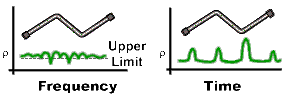

  * The frequency domain S11 measurement shows reflections caused by mismatches in the cable. It is impossible to determine where the mismatches physically occur in the cable.

  * The time domain response shows both the location and the magnitude of each mismatch. The responses indicate that the second cable bend is the location of a significant mismatch. This mismatch can be [gated out](TimeDomain.md#Gating), allowing you to view the frequency domain response as if the mismatch were not present. Distance Markers can be used to pinpoint the distance of the mismatch from the reference plane.

How the Analyzer Measures in the Time Domain

Time domain transform mode simulates traditional Time-Domain Reflectometry
(TDR), which launches an impulse or step signal into the test device and
displays the reflected energy on the TDR screen. By analyzing the magnitude,
duration, and shape of the reflected waveform, you can determine the nature of
the impedance variation in the test device.

The analyzer does not launch an actual incident impulse or step. Instead, a
Fourier Transform algorithm is used to calculate time information from the
frequency measurements. The following shows how this occurs.

A single frequency in the time domain appears as a sine wave. In the following
graphic, as we add the fundamental frequency (F0), the first harmonic (2F0),
and then the second harmonic (3F0), we can see a pulse taking shape in the Sum
waveform. If we were to add more frequency components, the pulse would become
sharper and narrower. When the analyzer sends discrete frequencies to the test
device, it is in effect, sending individual spectral pieces of a pulse
separately to stimulate the test device.

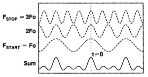

During an S11 reflection measurement, these incident signals reflect from the
test device and are measured at the A receiver. This is when the time domain
transform calculations are used to add the separate spectral pieces together.

For example, consider a short length of cable terminated with an open. All of
the power in the incident signal is reflected, and the reflections are 'in-
phase' with the incident signal. Each frequency component is added together,
and we see the same pattern as the simulated incident would have looked
(above). The magnitude of the reflection is related to the impedance mismatch
and the delay is proportional to the distance to the mismatch. The x-axis
(time) scale is changed from the above graphic to better show the delay.

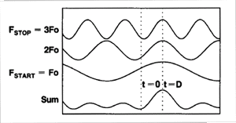

Alternately, the same cable terminated with a short also reflects all of the
incident power, but with a phase shift of 180 degrees. As the frequency
components from the reflection are added together, the sum appears as a
negative impulse delayed in time.

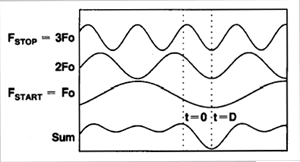

Calibration for Time Domain

For simplicity, we have discussed incident signals reflecting off
discontinuities in the test device. By far the most common network analyzer
measurement to transform to time domain is a
[ratioed](../S1_Settings/Measurement_Parameters.md#S_Params) S11 measurement.
An S11 reflection measurement does not simply display the reflections measured
at the A receiver - it displays the ratio (or difference) of the A receiver to
the Reference receiver. In addition, the S11 measurement can also be
calibrated to remove [systematic errors](../S3_Cals/Errors.md#errsys) from
the ratioed measurement. This is critical in the time domain as the
measurement plane, the point of calibration, becomes zero on the X-axis time
scale. All time and distance data is presented in reference to this point. As
a result, both magnitude and time data are calibrated and very accurate.

The following shows where the time domain transform occurs in the analyzer
data flow: (see [Data Access Map](../Programming/DataMapSet.md))

  1. Acquire raw receiver (A and R1) data

  2. Perform ratio (A/R1)

  3. Apply calibration

  4. Transform data to time domain

  5. Display results

Therefore, although a time domain trace may be displayed, a calibration is
always performed and applied to the frequency domain measurement which is not
displayed.

Transmission Measurements

The most common type of measurement to transform is an S11 reflection
measurement. However, useful information can be gained about a test device
from a transformed S21 transmission measurement. The frequency components pass
through the test device and are measured at the B receiver. If there is more
than one path through the device, they would appear as various pulses
separated in time.

For example, the following transmission measurement shows multiple paths of
travel within a Surface Acoustic Wave (SAW) filter. The largest pulse (close
to zero time) represents the propagation time of the shortest path through the
device. It may not be the largest pulse or represent the desired path. Each
subsequent pulse represents another possible path from input to output.

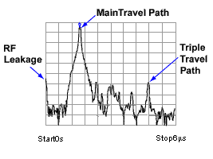

Triple travel is a term used to describe the reflected signal off the output,
reflected again off the input, then finally reappearing at the output. This is
best seen in a time domain S21 measurement.

Measurement Response Resolution

In the previous paragraphs, we have seen that using more frequency components
causes the assembled waveform to show more detail. This is known as
measurement response resolution, which is defined as the ability to
distinguish between two closely spaced responses.

Note: Adjusting the [transform time settings](TimeDomain.md#Time) improves
display resolution, but not measurement resolution.

The following graphic shows the effect of both a narrow and wide frequency
span on the response resolution. The wider frequency span enables the analyzer
to resolve the two connectors into separate, distinct responses.

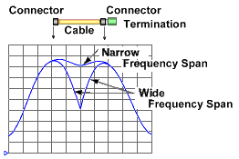

### Resolution Formula

For responses of equal amplitude, the response resolution is equal to the 50%
(−6 dB) points of the impulse width, or the step rise time which is defined as
the 10 to 90% points as shown in the following image.

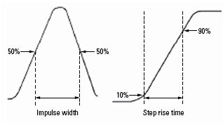

The following table shows the approximated relationship between the frequency
span and the window selection on response resolution for responses of equal
amplitude.

Window | Low-pass step (10% to 90%) | Low-pass impulse (50%) | Bandpass impulse  
---|---|---|---  
Minimum | 0.45 / f span | 0.60 / f span | 1.20 / f span  
Normal | 0.99 / f span | 0.98 / f span | 1.95 / f span  
Maximum | 1.48 / f span | 1.39 / f span | 2.77 / f span  
  
For example, using a 10 GHz wide frequency span and a normal window in
Bandpass impulse mode, response resolution (in time) equals:

  * Time Res = 1.95 / frequency span

  * Time Res = 1.95 / 10 GHz

  * Time Res = 195 ps

To calculate the physical separation (in distance) of the responses which can
be resolved, multiply this value times the speed of light (c) and the relative
velocity (Vf) of propagation in the actual transmission medium. In this case,
Vf = 0.66 for polyethylene dielectric.

  * Distance Res = 195 ps x c x Vf

  * Distance Res = 195 ps x (2.997925 E8 m/s) x .66

  * Distance Res = 38 mm

For reflection measurements, because of the 2-way travel time involved, this
means that the minimum resolvable separation between discontinuities is half
of this value or 19 mm.

Although a wider frequency span causes better measurement resolution, the
[measurement range](TimeDomain.md#Range) becomes limited. Also, increasing
the frequency range can cause a measurement calibration to become invalid. Be
sure to adjust the frequency span BEFORE performing a calibration.

Measurement Range and Alias Responses

Measurement range is the length in time in which true time domain responses
can be seen. The measurement range should be large enough to see the entire
test device response without encountering a repetition (alias) of the
response. An alias response can hide a true time domain response.

To increase measurement range in both modes, change either of these settings:

  * Increase the number of points

  * Decrease the frequency span

Notes:

  * After making these settings, you may need to adjust the [transform time settings](TimeDomain.md#Time) to see the new measurement range.

  * Decreasing the frequency span degrades [measurement resolution](TimeDomain.md#resolution).

  * Make frequency span and number of points settings BEFORE calibrating.

  * Maximum range also depends on loss through the test device. If the returning signal is too small to measure, the range is limited regardless of the frequency span.

### Alias Responses

An alias response is not a true device response. An alias response repeats
because each time domain waveform has many periods and repeats with time (see
[How the Analyzer Measures in the Time Domain](TimeDomain.md#How)). Alias
responses occur at time intervals that are equal to 1/ frequency step size.

The analyzer adjusts the [transform time settings](TimeDomain.md#Time) so
that you should only see one alias free range on either side (positive and
negative) of zero time. However, these settings are updated only when one of
the toolbar settings are changed.

### 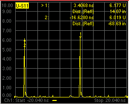

To determine if a response is true, put a marker on the response and change
the frequency span. A true device response will not move in time. An alias
response will move.

For example, in the above graphic, the marker 1 response occurs at 14.07
inches. When the frequency span is changed, this response remains at 14.07
inches. The marker 2 response moves.

### Range Formula

You can calculate the alias-free measurement range (in meters) of the analyzer
using the following formula for TDR (reflection) measurements:

Range (meters) = (1/Δf) x Vf x c

Where:

  * Δf = frequency step size (frequency span/number of points-1)

  * Vf = the velocity factor in the transmission line

  * c = speed of light = 2.997925 E8 m/s

For example: For a measurement with 401 points and a span of 2.5 GHz, using a
polyethylene cable (Vf = 0.66)

  * Range = (1 / (2.5E9 / 400)) x 2.997925 E8 m/s x 0.66

  * Range = 160E-9 x 2.997925 E8 m/s x 0.66

  * Range = 32 meters

In this example, the range is 32 meters in physical length. To prevent the
time domain responses from overlapping or aliasing, the test device must be 32
meters or less in physical length for a transmission measurement.

To calculate the one-way distance for a reflection measurement rather than
round-trip distance, simply divide the length by 2. In this case, the alias-
free range would be 16 meters.

#### How to make Time Domain Settings  
  
---  
Using Hardkey/SoftTab/Softkey  
  
  1. Press Math > Time Domain > Time Domain Setup....

  
  
  
Transform dialog box help  
---  
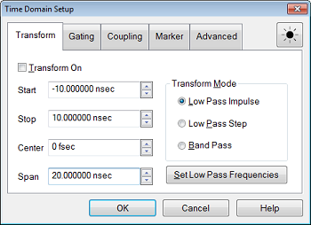 Transform On Turns time domain
transform ON and OFF.

### Time Settings

The following settings adjust the display resolution, allowing you to zoom IN
or OUT on a response. They do NOT adjust [measurement
range](TimeDomain.htm#Range) or [measurement
resolution](TimeDomain.htm#resolution). These settings automatically update
(when one of these values are updated) to limit the display to one [alias-free
response](TimeDomain.htm#Alias) on either side of zero time. Start Sets the
transform start time that is displayed on the analyzer screen.  Note: Zero (0)
seconds is always the [measurement reference
plane](../S3_Cals/Accurate.htm#refplane). Negative values are useful if moving
the reference plane. Stop Sets the transform stop time that is displayed on
the analyzer screen. Center Sets the transform center time that is displayed
in the center of the analyzer screen. Span Sets the transform span time that
is split on either side of the Center value.

### Transform Mode

Transform modes are three variations on how the time domain transform algorithm is applied to the frequency domain measurement. Each method has a unique application. | Mode | Benefit - application | Limitation  
---|---|---  
Low pass Impulse | Highest resolution. Most useful for seeing small responses in devices that pass low frequencies, such as cables. | In both Low pass modes, frequencies down to DC and negative frequencies are extrapolated. Therefore, the Start frequency is adjusted when you click [Set Freq.Low Pass](TimeDomain.md#Set) Because this will affect calibration accuracy, be sure to calibrate AFTER completely setting up your time domain measurement.  
Low pass Step | Easiest to identify inductive and capacitive discontinuities in devices that pass low frequencies, such as cables.  
Band pass Impulse | Easiest method - can be used with any frequency sweep. Most useful for measuring band limited devices such as filters and DC blocked cables. | Does NOT show capacitive and inductive reactance For the same frequency span and number of points, band pass mode has twice the impulse width, which hides closely spaced responses degrading the response resolution.  
  
The following chart shows how to interpret results from various discontinuity
impedances using Low pass Step and either Low pass or Band pass Impulse modes.

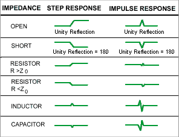

Effect on Measurement Range

Band pass mode - measurement range is inversely proportional to frequency step
size.

Low pass mode - measurement range is inversely proportional to the fundamental
(start ) frequency AFTER clicking Set Freq. Low Pass.

Set Low Pass Frequencies USE ONLY IN LOW PASS MODES

Recomputes the start frequency and step frequencies to be harmonics of the
start frequency. Start frequency is computed by the following formula: Low
Pass Start Frequency = Stop Frequency / Number of points.

The computed value must always be greater than or equal to the analyzer's
minimum frequency.

Note: The number of points or stop frequency may be changed in order to
compute this value.  
  
Gating

Perhaps the most beneficial feature of time domain transform is the Gating
function. When viewing the time domain response of a device, the gating
function can be used to "virtually" remove undesired responses. You can then
simultaneously view a frequency domain trace as if the undesired response did
not exist.. This allows you to characterize devices without the effects of
external devices such as connectors or adapters.

Note: When a discontinuity in a test device reflects energy, that energy will
not reach subsequent discontinuities. This can "MASK", or hide, the true
response which would have occurred if the previous discontinuity were not
present. The analyzer Gating feature does NOT compensate for this.

The following measurements images show a practical example how to use and
perform gating. The test device is a 10inch cable, then a 6 dB attenuator,
terminated with a short. The following four discontinuities are evident in
window 2, from left to right:

  1. A discontinuity in the test system cable which appeared after calibration. It is identified by marker 2 at -10.74 inches (behind the reference plane).

  2. A discontinuity in the 10 inch device cable shortly after the reference plane.

  3. The largest discontinuity is the attenuator and short shown by marker 1 at -12.67 dB ( 6 dB loss in both forward and reverse direction).

  4. The last discontinuity is a re-reflection from the device cable.

We will gate IN the attenuator response. All other responses will be gated
OUT.

Window 1. Create original S11 frequency domain trace. Shows ripple from all of
the reflections.

Window 2. Create a new S11 trace \- same channel; new window. Turn Transform
ON.

Window 3. On the transformed trace, turn gating ON. Center the gate on the
large discontinuity (2.500ns). Adjust gate span to completely cover the
discontinuity. Select Bandpass gating type.

Window 4. On the original frequency measurement, turn Gating ON (Transform
remains OFF). View the measurement without the effects of the two unwanted
discontinuities. The blue trace is a measurement of the 6 dB attenuator with
the unwanted discontinuities PHYSICALLY removed. The difference between the
two traces in window 4 is the effect of "masking".

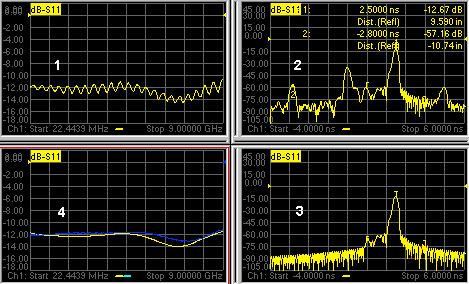

[Learn how to launch the Transform dialog box](TimeDomain.md#How to set)

Transform Gating dialog box help  
---  
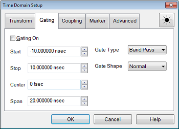 Gating Turns Gating ON and OFF.
Start Specifies the start time for the gate. Stop Specifies the stop time for
the gate. Center Specifies the value at the center of the area that is
affected by the gating function. This value can be anywhere in the analyzer
range. Span Specifies the range to either side of the center value of area
that is affected by the gating function. Gate Type Defines the type of
filtering that will be performed for the gating function. The gate start and
stop flags on the display point toward the part of the trace you want to keep.

  * Bandpass - KEEPS the responses within the gate span.
  * Notch - REMOVES the responses with the gate span.

Gate Shape Defines the filter characteristics of the gate function. Choose from Minimum, Normal, Wide, Maximum 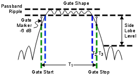 | Gate Shape | Passband Ripple | Sidelobe Levels | Cutoff Time | Minimum Gate Span  
---|---|---|---|---  
Minimum | ±0.1 dB | -48 dB | 1.4/Freq Span | 2.8/Freq Span  
Normal | ±0.1 dB | -68 dB | 2.8/Freq Span | 5.6/Freq Span  
Wide | ±0.1 dB | -57 dB | 4.4/Freq Span | 8.8/Freq Span  
Maximum | ±0.01 dB | -70 dB | 12.7/Freq Span | 25.4/Freq Span  
  
Cutoff time -- is the time between the stop time (-6 dB on the filter skirt)
and the peak of the first sidelobe. The diagram below shows the overall gate
shape and lists the characteristics for each gate shape.

  * T1 is the gate span, which is equal to the stop time minus the start time.

  * T2 is the time between the edge of the passband and the 6 dB point, representing the cutoff rate of the filter.

  * T3 is the time between the 6 dB point and the edge of the gate stopband.

  * For all filter shapes T2 is equal to T3, and the filter is the same on both sides of the center time.

Minimum gate span -- is twice the cutoff time. Each gate shape has a minimum
recommended gate span for proper operation. This is a consequence of the
finite cutoff rate of the gate. If you specify a gate span that is smaller
that the minimum span, the response will show the following effects:

  * distorted gate shape that has no passband

  * distorted shape

  * incorrect indications of start and stop times

  * may have increased sidelobe levels

  
  
To launch the Coupling dialog box, click Coupling tab on the Time Domain Setup
dialog box.

Trace Coupling Settings dialog box help  
---  
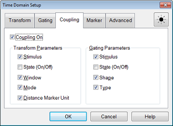 Trace coupling allows you to
change time domain parameters on a measurement, and have the same changes
occur for all other measurements in the channel. For example: If you are
simultaneously viewing a frequency domain measurement and time domain
measurement, and Coupling is enabled in this dialog box, and ALL Gating
Parameters are checked in this dialog box, and on the time domain measurement
you change the Gate Span parameter, Then the frequency domain measurement will
automatically change to reflect the time domain gated span. Note: Trace
coupling applies ONLY to the Y-axis scale/reference settings. There are no
changes to your data as a result of trace coupling. Coupling On Check to
enable coupling. All of the measurements in the active channel are coupled.
The following parameters are available for coupling: Transform Parameters
Stimulus Start, Stop, Center, and Span TIME settings. State (On/Off) Transform
ON and OFF Window Window Type (including Kaiser Beta / Impulse Width settings
for Kaiser Window) Mode Low Pass Impulse, Low Pass Step, Band Pass Gating
Parameters Stimulus Start, Stop, Center, and Span TIME settings. State
(On/Off) Gating ON and OFF Shape Minimum, Normal, Wide, and Maximum Type
Bandpass and Notch  
  
To launch the Distance marker dialog box, click Dist. Marker Settings on the
Transform dialog box.

Distance Marker Settings dialog box help  
---  
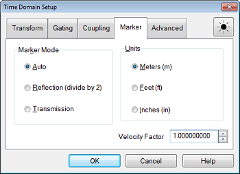 When markers are present on a time
domain measurement, distance is automatically displayed on the marker readout,
[marker
table](../S1_Settings/Customize_Your_Analyzer_Screen.htm#marker_table), and
[print copy](../S5_Output/Print.md#printoptions). To learn how to create
markers on your measurement see [marker
settings](../S4_Collect/Markers.htm#HowMarkerDiag). You can read out impedance
versus time by creating a marker on a Time Domain trace, then changing the
marker format to R+jX. [Learn how](../S4_Collect/Markers.md#MarkerDiag). This
dialog box allows you to customize the time domain distance marker readings.
These settings affect the display of ALL markers for only the ACTIVE
measurement (unless Distance Marker Unit is coupled on the Trace Coupling
dialog box. Marker Mode Specifies the measurement type in order to determine
the correct marker distance.

  * Select Auto for [S-Parameter](../S1_Settings/Measurement_Parameters.md#S_Params) measurements.
  * Select Reflection or Transmission for [arbitrary ratio](../S1_Settings/Measurement_Parameters.md#arb_ratio) or [unratioed](../S1_Settings/Measurement_Parameters.md#Unratioed_Power) measurements.

Auto If the active measurement is an S-Parameter, automatically chooses
reflection or transmission. If the active measurement is a non S-Parameter,
reflection is chosen. Reflection Displays the distance from the source to the
receiver and back divided by two (to compensate for the return trip.)
Transmission Displays the distance from the source to the receiver. Units
Specifies the unit of measure for the display of marker distance values.
Velocity Factor  Specifies the velocity factor that applies to the medium of
the device that was inserted after the measurement calibration. The value for
a polyethylene dielectric cable is 0.66 and 0.7 for PTFE dielectric. 1.0
corresponds to the speed of light in a vacuum. This is useful in Time Domain
for accurate display of time and distance markers. This setting can also be
made from the [Electrical Delay](../S2_Opt/Phase_Accy.md#ElectricalDiag) and
[Port Extensions](../S3_Cals/Port_Extensions.md#PortDiag) dialog boxes.  
  
Advanced Settings

Transform \- Advanced dialog box help  
---  
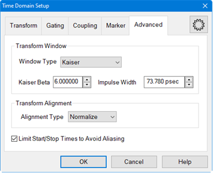 Transform Window The window type
selects the window for time domain transform.

  * Kaiser window has relatively high dynamic range.
  * Rectangle window has unity amplitude for all time samples and has the same effect as not applying a window. 
  * Hamming window does not attenuate signal at both ends to zero and will have slight discontinuity.
  * Hann (Hanning) window attenuates signal at both ends to zero and removes any discontinuity.
  * Bohman window is a product of a triangle window with a single cycle of a cosine with the same period. A corrective term is added that sets the first derivative to zero at the ends.

The following methods set window size. For best results, view the time domain
response while making these settings.

  * Kaiser Beta Changes window size using a Kaiser Beta (KB) value. A value of 0 gives no window, and a value of 6 is the normal value.
  * Impulse Width Changes window size using an Impulse Width value

Transform Alignment Alignment Type

    * Legacy \- The DC value is extrapolated using three data points. The transform offset is calculated using the delay of the first frequency point. This is the same algorithm used in the HP 8510 network analyzer.
    * Normalize \- The DC value is extrapolated using three data points. The transform offset is set to zero at t=0 minus six rise-times. This mode requires that a good S-parameter calibration has been performed, which can be verified by observing a flat time-domain response at t=0 when measuring a load located at the physical point corresponding to t=0. Setting the time domain trace to zero at a time before t=0 stabilizes the trace for determining impedances after time t=0, resulting in improved behavior compared to Legacy mode. This method is similar to that used with PLTS, and is very useful in determining the time-domain-transform response of transmission lines and printed-circuit-board characteristics.

Limit Start/Stop Times to Avoid Aliasing \- Check to limit the start/stop
times to avoid aliasing.  
  
#### How to launch the [Time Domain
Toolbar](../s1_settings/customize_your_analyzer_screen.htm#Time)  
  
---  
Using Hardkey/SoftTab/Softkey  
  
  1. Math > Time Domain > TD Toolbar

  
  
  

On the toolbar, click More... to launch the [Time Domain
dialog](timedomain.htm#TransformDiag) box

* * *

