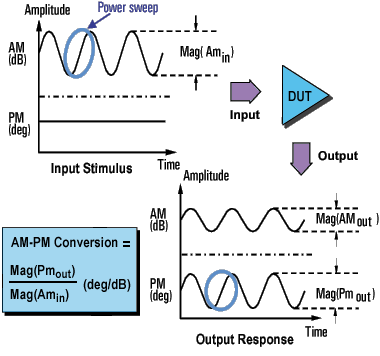
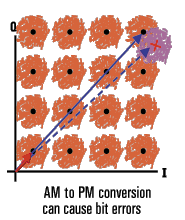

# AM-PM Conversion

* * *

The AM-PM conversion of an amplifier is a measure of the amount of undesired
phase deviation (PM) that is caused by amplitude variations (AM) inherent in
the system.

  * [What Is AM-PM Conversion?](AM-PM.md#WhatIs)

  * [Why Measure AM-PM Conversion](AM-PM.md#why)

  * [Accuracy Considerations](AM-PM.md#meas)

  * [How to Measure AM-PM Conversion](AM-PM.md#How)

[Other Tutorials topics](Tutorials1.md)

What Is AM-PM Conversion?

AM-to-PM conversion measures the amount of undesired phase deviation (PM) that
is caused by amplitude variations (AM) of the system. For example, unwanted
phase deviation (PM) in a communications system can be caused by:

### Unintentional amplitude variations (AM)

  * Power supply ripple

  * Thermal drift

  * Multipath fading

### Intentional modulation of signal amplitude

  * QAM

  * Burst modulation

AM-to-PM conversion is usually defined as the change in output phase for a
1-dB increment in the power-sweep applied to the amplifier's input (i.e. at
the 1 dB gain compression point). It is expressed in degrees-per-dB (°/dB). An
ideal amplifier would have no interaction between its phase response and the
power level of the input signal.

Why Measure AM-PM Conversion

AM-to-PM conversion is a critical parameter in systems where
[phase](JavaScript:hhctrl.TextPopup\(Phase,'Arial,8',10,10,00000000,0xc0ffff\))
(angular) modulation is used, such as:

  * FM

  * QPSK

  * 16QAM

It is a critical parameter because undesired phase deviation (PM) causes
analog signal degradation, or increased bit-error rates (BER) in digital
communication systems. While it is easy to measure the BER of a digital
communication system, this measurement alone does not help you understand the
underlying causes of bit errors. AM-to-PM conversion is one of the fundamental
contributors to BER, and therefore it is important to quantify this parameter
in communication systems.

Refer to the I/Q diagram below for the following discussion on how AM-to-PM
conversion can cause bit errors.

  * The desirable state change is from the small solid vector to the large solid vector.

  * With AM-to-PM conversion, the large vector may actually end up as shown with the dotted line. This is due to phase shift that results from a change in the input power level.

  * For a 64QAM signal as shown (only one quadrant is drawn), we see that the noise circles that surround each state would actually overlap, which means that statistically, some bit errors would occur.

Accuracy Considerations

With this method of measuring AM-to-PM conversion, the modulation frequency is
approximately the inverse of the sweep time. Even with the fastest power sweep
available on most network analyzers, the modulation frequency ends up being
fairly low (typically less than 10 Hz). This could cause a slight temperature
change as the sweep progresses, especially if the amplifier has low thermal
mass, typical of an unpackaged device. Results using this method could differ
slightly if the nonlinear behavior of an amplifier is extremely sensitive to
thermal changes.

  * The amplifier may respond very differently at various temperatures. The tests should be done when the amplifier is at the desired operating temperature.

  * The output power of the amplifier should be sufficiently attenuated if necessary. Too much output power could:

  *     * damage the analyzer receiver

    * exceed the input compression level of the analyzer receiver, resulting in inaccurate measurements

  * Attenuation of the amplifier's output power can be accomplished using:

  *     * Attenuators

    * Couplers

  * The frequency-response effects of the attenuators and couplers must be accounted for during calibration since they are part of the test system. Proper error-correction techniques can reduce these effects.

  * The frequency response is the dominant error in an AM-to-PM conversion measurement setup. Performing a thru-response measurement calibration significantly reduces this error. For greater accuracy, perform a 2-port measurement calibration.

How to Measure AM-PM Conversion

  1. Preset the analyzer.

  2. Select an S21 measurement in the power-sweep mode.

  3. Enter the start and stop power levels for the analyzer's power sweep. The start power level should be in the linear region of the amplifier's response (typically 10-dB below the 1-dB compression point). The stop power should be in the compression region of the amplifier's response.

  4. Select an external attenuator (if needed) so the amplifier's output power will be sufficiently attenuated to avoid causing receiver compression or damage to the analyzer's port 2.

  5. Connect the amplifier as shown in the following graphic, and provide the dc bias.

  6. Select the analyzer settings for your amplifier under test in order to perform a swept-power gain compression measurement at a chosen frequency. See [Gain Compression](Gain_Comp.md).

  7. Remove the amplifier and perform a measurement calibration. Be sure to include the attenuator and cables in the calibration setup if they will be used when measuring the amplifier.

  8. Save the instrument state to memory.

  9. Reconnect the amplifier.

  10. Use a reference marker to target the amplifier's input power at the 1-dB gain compression point. Select a second marker and adjust its stimulus value until its response is 1-dB below the reference marker.

  11. Change the S21 measurement from a log magnitude format to a phase format (no new calibration is required).

  12. Find the phase change between the markers. The value is the AM-to-PM conversion coefficient at the 1-dB gain compression point.

  13. Print the data or save it to a disk.

