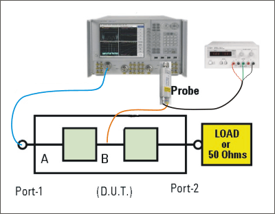

# Active Probing with the VNA

* * *

You can use passive and active, single and differential probes with the VNA.

RF Probes are available from Keysight, including the U1818A/B active probe
with a maximum frequency of 12 GHz. [Learn more at the Keysight
website](http://www.home.Keysight.com/Keysight/product.jspx?cc=US&lc=eng&ckey=1728905&nid=-33908.0.00&id=1728905&pselect=SR.GENERAL).

Note: The VNA does NOT have a probe power port. Therefore, order the U1818A/B
with banana plugs (Opt 002) for powering with an external power supply, such
as the Keysight E3620A Dual Output Power Supply or equivalent.  
---  
  
### See Also

  * [App Note 5990-4387EN](http://literature.cdn.Keysight.com/litweb/pdf/5990-4387EN.pdf): High Frequency Probing Solutions for Time and Frequency Domain Applications.

  * [U1818A/B Technical Overview](http://literature.cdn.Keysight.com/litweb/pdf/5990-4148EN.pdf)

### Procedure

Use the following general procedure to make VNA measurements with ONE U1818B
active probe:

  1. Connect the U1818A/B banana plugs to an external power supply. Power requirements for the U1818A/B are +15V (at 42mA) and -12.6V (at 12 mA).

  2. Connect the U1818A/B to the VNA port 2 directly, or using an adapter or short cable.

  3. Connect your DUT input connector to the VNA port 1 directly, or using an adapter or short cable.

  4. On the VNA, press Preset.

  5. Press Meas > S-Param > S21 (transmission measurement).

  6. Press Freq, then select the Start and Stop frequency range of the measurement. The maximum frequency of the U1818B is 12 GHz.

  7. Connect the probe tips as close as possible to the DUT input connector (point A in the above image).

Note: The probe tip has two pins:

  * One pin is connected to the signal trace.
  * The other pin is connected to the ground trace.

  
---  
  
  8. Press Cal > Other Cals > Smart Cal....

  * This calibration removes the losses (from the VNA test ports to the DUT) from subsequent measurements. [Learn more about VNA calibration](../S3_Cals/Calibration.md).

  * When correctly calibrated, the S21 measurement should show a flat response at 0 dB across the frequency range.

  * Connect the probe tips anywhere in the DUT path to view the frequency response between the DUT input and the probe tips.

  * To view the response in Time Domain, press Math > Time Domain > Transform. Learn about [Time Domain measurements](../Time/TimeDomain.md).

* * *

* * *

