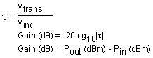
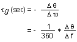
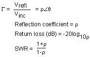
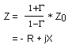
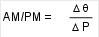

# Amplifier Parameters Reference

* * *

  * [Gain](Amp_Param.md#gain)

  * [Gain Flatness](Amp_Param.md#flat)

  * [Reverse Isolation](Amp_Param.md#revisol)

  * [Gain Drift Versus Time](Amp_Param.md#gaindrift)

  * [Deviation from Linear Phase](Amp_Param.md#devia)

  * [Group Delay](Amp_Param.md#gdelay)

  * [Return Loss (SWR, r)](Amp_Param.md#rloss)

  * [Complex Impedance](Amp_Param.md#cimped)

  * [Gain Compression](Amp_Param.md#gcomp)

  * [AM-to-PM Conversion](Amp_Param.md#ampm)

### See Also

  * [High-Gain Amplifiers](High-Gain_Amplifier_Measurements.md)

  * [High Power with PNA-X](High_Power_PNA-X.md)

Gain

The ratio of the amplifier's output power (delivered to a Z0 load) to the
input power (delivered from a Z0 source). Z0 is the characteristic impedance,
in this case, 50W.

For small signal levels, the output power of the amplifier is proportional to
the input power. Small signal gain is the gain in this linear region.

As the input power level increases and the amplifier approaches saturation,
the output power reaches a limit and the gain drops. Large signal gain is the
gain in this nonlinear region. See [Gain Compression](Gain_Comp.md).

Gain Flatness

The variation of the gain over the frequency range of the amplifier. See
[Small Signal Gain and Flatness](Gain_Flat.md).

Reverse Isolation

The measure of transmission from output to input. Similar to the gain
measurement except the signal stimulus is applied to the output of the
amplifier. See [Reverse Isolation](Rev_Isol.md).

Gain Drift versus Time (temperature, bias)

The maximum variation of gain as a function of time, with all other parameters
held constant. Gain drift is also observed with respect to other parameter
changes such as temperature, humidity or bias voltage.

Deviation from Linear Phase

The amount of variation from a linear
[phase](JavaScript:hhctrl.TextPopup\(Phase,'Arial,8',10,10,00000000,0xc0ffff\))
shift. Ideally, the phase shift through an amplifier is a linear function of
frequency. See [Deviation from Linear Phase](Phase_Devi.md).

Group Delay

The measure of the transit time through the amplifier as a function of
frequency. A perfectly linear phase shift would have a constant rate of change
with respect to frequency, yielding a constant group delay. See [Group
Delay](Group_Delay6_5.htm).

Return Loss (SWR, r)

The measure of the reflection mismatch at the input or output of the amplifier
relative to the system Z0 characteristic impedance.

Complex Impedance

Complex impedance (1+G). The amount of reflected energy from an amplifier is
directly related to its impedance. Complex impedance consists of both a
resistive and a reactive component. It is derived from the characteristic
impedance of the system and the reflection coefficient. See [Complex
Impedance](Comp_Imped.htm).

Gain Compression

See [Gain Compression](../Applications/Gain_Compression_Application.md)
Application.

AM-to-PM Conversion Coefficient

The amount of phase change generated in the output signal of an amplifier as a
result of an amplitude change of the input signal.

The AM-to-PM conversion coefficient is expressed in units of degrees/dB at a
given power level (usually P1dB, which is the 1 dB gain compression point).
See [AM-PM Conversion](AM-PM.md).

* * *

