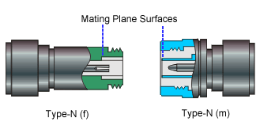
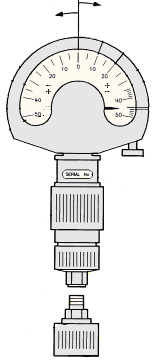
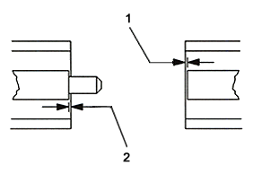
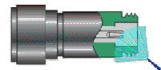
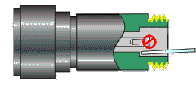
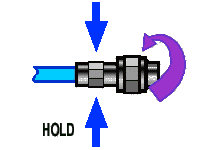
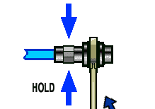
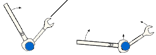
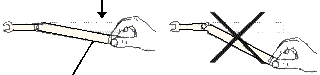

# Connector Care

* * *

Proper connector care is critical for accurate and repeatable measurements.
The following information will help you preserve the precision and extend the
life of your connectors - saving both time and money.

  * [Connector Care Quick Reference Guide](Connector_Care.md#Reference_Guide)

  * [Connector Cleaning Supplies](Connector_Care.md#Reference_Supplies)

  * [Safety Reminders](Connector_Care.md#Reference_Safety)

  * [About Connectors](Connector_Care.md#All)

  * [Gaging Fundamentals](Connector_Care.md#Concepts_Gaging)

  * [Connector Care Procedures](Connector_Care.md#Making)

Important Note All of the copper N5247A front-panel loops are EXTREMELY
FRAGILE.   A maximum 8 inch/lbs of
torque should be applied to these connectors. If more torque is applied,
damage to the copper semi-rigid cables WILL occur, causing measurement
inaccuracy.  
---  
  
Preventing Test Port Connector Damage

Handling and Storing Connectors  
---  
Do | Do Not  
Keep connectors clean Protect connectors with plastic end caps Keep connector temperature same as analyzer | Touch mating-plane surfaces Set connectors contact-end down Store connectors loose in box or drawer  
Visual Inspection  
Do | Do Not  
Inspect connectors with magnifying glass. Look for metal debris, deep scratches or dents | Use a connector with a bent or broken center conductor Use a connector with deformed threads  
Cleaning Connectors  
Do | Do Not  
Clean surfaces first with clean, dry compressed air Use lint-free swab or brush Use minimum amount of alcohol Clean outer conductor mating surface and threads | Use high pressure air (>60 psi) Use any abrasives Allow alcohol into connector support beads Apply lateral force to center conductor  
Gaging Connectors  
Do | Do Not  
Inspect and clean gage, gage primary and device tested Use correct torque wrench zero gage before use Use multiple measurements and keep record of readings | Use an out of specification connector Hold connector gage by the dial  
Making Connections  
Do | Do Not  
Align connectors first Rotate only the connector nut Use correct torque wrench | Cross thread the connection Twist connector body to make connection Mate different connector types  
  
Connector Care and Cleaning Supplies

Description | Web Site  
---|---  
Swabs | <https://berkshire.com/product-category/cleanroom-cleaning-swabs/>  
Wipes | <https://www.techspray.com/wipes>  
Aerosol Duster | <https://www.techspray.com/techspray-air-duster>  
Isopropyl | <https://www.techspray.com/isopropyl-alcohol-ipa>  
Nitrilite Gloves and Finger Cots | <https://www.techni-tool.com>  
  
Safety Reminders

When cleaning connectors:

  * Always use protective eyewear when using compressed air or nitrogen.
  * Keep isopropyl alcohol away from heat, sparks and flame. Use with adequate ventilation. Avoid contact with eyes, skin and clothing.
  * Avoid electrostatic discharge (ESD). Wear a grounded wrist strap (having a 1 MW series resistor) when cleaning device, cable or test port connectors.
  * Cleaning connectors with alcohol shall only be done with the instruments power cord removed, and in a well-ventilated area. Allow all residual alcohol moisture to evaporate, and the fumes to dissipate prior to energizing the instrument.

About Connectors

  * [Connector Service Life](Connector_Care.md#concepts_life)

  * [Connector Grades and Performance](Connector_Care.md#Concepts_Grades)

  * [Adapters as Connector Savers](Connector_Care.md#Concepts_Saver)

  * [Connector Mating Plane Surfaces](Connector_Care.md#Concepts_plane)

### Connector Service Life

Even though calibration standards, cables, and test set connectors are
designed and manufactured to the highest standards, all connectors have a
limited service life. This means that connectors can become defective due to
wear during normal use. For best results, all connectors should be inspected
and maintained to maximize their service life.

Visual Inspection should be performed each time a connection is made. Metal
particles from connector threads often find their way onto the mating surface
when a connection is made or disconnected. See
[Inspection](Connector_Care.md#Procedures_Inspection) procedure.

Cleaning the dirt and contamination from the connector mating plane surfaces
and threads can extend the service life of the connector and improve the
quality of your calibration and measurements. See
[Cleaning](Connector_Care.md#Procedures_Cleaning) procedure.

Gaging connectors not only provides assurance of proper mechanical tolerances,
and thus connector performance, but also indicate situations where the
potential for damage to another connector may exist. See
[Gaging](Connector_Care.md#Procedures_Gaging) procedure.

Proper connector care and connection techniques yield:

• | Longer Service Life | • | Higher Performance | • | Better Repeatability  
---|---|---|---|---|---  
  
### Connector Grades and Performance

The three connector grades (levels of quality) for the popular connector
families are listed below. Some specialized types may not have all three
grades.

  * Production grade connectors are the lowest grade and the least expensive. It is the connector grade most commonly used on the typical device under test (DUT). It has the lowest performance of all connectors due to its loose tolerances. This means that production grade connectors should always be carefully inspected before making a connection to the analyzer. Some production grade connectors are not intended to mate with metrology grade connectors.

  * Instrument grade is the middle grade of connectors. It is mainly used in and with test instruments, most cables and adapters, and some calibration standards. It provides long life with good performance and tighter tolerances. It may have a dielectric supported interface and therefore may not exhibit the excellent match of a metrology grade connector.

  * Metrology grade connectors have the highest performance and the highest cost of all connector grades. This grade is used on calibration standards, verification standards, and precision adapters. Because it is a high precision connector, it can withstand many connections and disconnections and, thus, has the longest life of all connector grades. This connector grade has the closest material and geometric specifications. Pin diameter and pin depth are very closely specified. Metrology grade uses an air dielectric interface and a slotless female contact which provide the highest performance and traceability.

Note: In general, Metrology grade connectors should not be mated with
Production grade connectors.

### Adapters as Connector Savers

Make sure to use a high quality (Instrument grade or better) adapter when
adapting a different connector type to the analyzer test ports. It is a good
idea to use an adapter even when the device under test is the same connector
type as the analyzer test ports. In both cases, it will help extend service
life, and protect the test ports from damage and costly repair.

The adapter must be fully inspected before connecting it to the analyzer test
port and inspected and cleaned frequently thereafter. Because calibration
standards are connected to the adapter, the adapter should be the highest
quality to provide acceptable RF performance and minimize the effects of
mismatch.

### Connector Mating Plane Surfaces

An important concept in RF and microwave measurements is the reference plane.
For a network analyzer, this is the surface that all measurements are
referenced to. At calibration, the reference plane is defined as the plane
where the mating plane surfaces of the measurement port and the calibration
standards meet. Good connections (and calibrations) depend on perfectly flat
contact between connectors at all points on the mating plane surfaces (as
shown in the following graphic).

Gaging Fundamentals

Connector gages are important tools used to measure center conductor pin depth
in connectors. Connector pin depth, measured in terms of recession or
protrusion, is generally the distance between the mating plane and the end of
the center conductor, or the shoulder of the center conductor for a stepped
male pin.

### Typical Connector Gage

RECESSION | PROTRUSION  
---|---  
  
  
### Recession and Protrusion

Pin depth is negative (recession) if the center conductor is recessed below
the outer conductor mating plane, usually referred to as the "reference
plane". Pin depth is positive (protrusion) if the center conductor projects
forward from the connector reference plane.

### Pin Depth

1\. Recession of female contact

2\. Recession of male pin shoulder

### Difference with Type-N Connectors

Type-N connectors have the mating plane of the center conductors offset from
the connector reference plane. In this case the zero setting "gage primarys"
generally offset the nominal distance between the center conductor mating
plane and the connector reference plane.

### When to Gage Connectors

  * Before using a connector or adapter the first time.
  * When visual inspection or electrical performance suggests the connector interface may be out of range.
  * After every 100 connections, depending on use.

### Connector Gage Accuracy

Connector gages (those included with calibration and verification kits), are
capable of performing coarse measurements only. This is due to the
repeatability uncertainties associated with the measurement. It is important
to recognize that test port connectors and calibration standards have
mechanical specifications that are extremely precise. Only special gaging
processes and electrical testing (performed in a calibration lab) can
accurately verify the mechanical characteristics of these devices. The pin
depth specifications in the Keysight calibration kit manuals provide a
compromise between the pin depth accuracy required, and the accuracy of the
gages. The gages shipped with calibration and verification kits allow you to
measure connector pin depth and avoid damage from out-of-specification
connectors.

Note: Before gaging any connector, the mechanical specifications provided with
that connector or device should be checked.

### To Gage Connectors

  1. Wear a grounded wrist strap (having a 1 MW series resistor).

  2. Select proper gage for device under test (DUT).

  3. Inspect and clean gage, gage primary, and DUT.

  4. Zero the connector gage.

     1. While holding gage by the barrel, carefully connect gage primary to gage. Finger-tighten connector nut only.

     2. Use proper torque wrench to make final connection. If needed, use additional wrench to prevent gage primary (body) from turning. Gently tap the barrel to settle the gage.

     3. The gage pointer should line up exactly with the zero mark on gage. If not, adjust "zero set" knob until gage pointer reads zero. On gages having a dial lock screw and a movable dial, loosen the dial lock screw and move the dial until the gage pointer reads zero. Gages should be zeroed before each set of measurements to make sure zero setting has not changed.

     4. Remove gage primary.

  5. Gage the device under test.

     1. While holding gage by the barrel, carefully connect DUT to gage. Finger-tighten connector nut only.

     2. Use proper torque wrench to make final connection and, if needed, use additional wrench to prevent DUT (body) from turning. Gently tap the barrel to settle the gage.

     3. Read gage indicator dial for recession or protrusion and compare reading with device specifications.

Caution: If the gage indicates excessive protrusion or recession, the
connector should be marked for disposal or sent out for repair.

  6. For maximum accuracy, measure the device a minimum of three times and take an average of the readings. After each measurement, rotate the gage a quarter-turn to reduce measurement variations.

  7. If there is doubt about measurement accuracy, be sure the temperatures of the parts have stabilized. Then perform the cleaning, zeroing, and measuring procedure again.

Connector Care Procedures

  * [Inspecting Connectors](Connector_Care.md#Procedures_Inspection)

  * [Cleaning Connectors](Connector_Care.md#Procedures_Cleaning)

  * [Making Connections](Connector_Care.md#Procedure_Connections)

  * [Using a Torque Wrench](Connector_Care.md#Procedures_Torque)

  * [Handling and Storing Connectors](Connector_Care.md#Procedures_Handling)

### To Inspect Connectors

Wear a grounded wrist strap (having a 1 MW series resistor).

Use a magnifying glass (>10X) and inspect connector for the following:

  * Badly worn plating or deep scratches

  * Deformed threads

  * Metal particles on threads and mating plane surfaces

  * Bent, broken, or mis-aligned center conductors

  * Poor connector nut rotation

Caution: A damaged or out-of-specification device can destroy a good connector
attached to it even on the first connection. Any connector with an obvious
defect should be marked for disposal or sent out for repair.

### To Clean Connectors

  1. Wear a grounded wrist strap (having a 1 MW series resistor).

  2. Use clean, low-pressure air to remove loose particles from mating plane surfaces and threads. Inspect connector thoroughly. If additional cleaning is required, continue with the following steps.

  3. Moisten–do not saturate–a lint-free swab with isopropyl alcohol. See Cleaning Supplies for recommended type.

  4. Clean contamination and debris from mating plane surfaces and threads. When cleaning interior surfaces, avoid exerting pressure on center conductor and keep swab fibers from getting trapped in the female center conductor.

  5. Let alcohol evaporate–then use compressed air to blow surfaces clean.

  6. Inspect connector. Make sure no particles or residue remains.

  7. If defects are still visible after cleaning, the connector itself may be damaged and should not be used. Determine the cause of damage before making further connections. 

### To Make Connections

  1. Wear a grounded wrist strap (having a 1 MW series resistor).

  2. Inspect, clean, and gage connectors. All connectors must be undamaged, clean, and within mechanical specification.

  3. Carefully align center axis of both devices. The center conductor pin–from the male connector–must slip concentrically into the contact finger of the female connector.

  4. Carefully push the connectors straight together so they can engage smoothly. Rotate the connector nut (not the device itself) until finger-tight, being careful not to cross the threads.

  5. Use a torque wrench to make final connection. Tighten until the "break" point of the torque wrench is reached. Do not push beyond initial break point. Use additional wrench, if needed, to prevent device body from turning.

### To Separate a Connection

  1. Support the devices to avoid any twisting, rocking or bending force on either connector.

  2. Use an open-end wrench to prevent the device body from turning.

  3. Use another open-end wrench to loosen the connector nut.

  4. Complete the disconnection by hand, turning only the connector nut.

  5. Pull the connectors straight apart.

### To Use a Torque Wrench

  1. Make sure torque wrench is set to the correct torque setting.

  2. Position torque wrench and a second wrench (to hold device or cable) within 90° of each other before applying force. Make sure to support the devices to avoid putting stress on the connectors.

| HOLD |   
---|---|---  
  
CORRECT  
METHOD | INCORRECT METHOD  
| (TOO MUCH LIFT)  
  
  3. Hold torque wrench lightly at the end of handle–then apply force perpendicular to the torque wrench handle. Tighten until the "break" point of the torque wrench is reached. Do not push beyond initial break point.

TORQUING DIRECTION  
---  
  
STOP WHEN HANDLE BEGINS TO YIELD  
  
### To Handle and Store Connectors

  * Install protective end caps when connectors are not in use.

  * Never store connectors, airlines, or calibration standards loose in a box. This is a common cause of connector damage.

  * Keep connector temperature the same as analyzer. Holding the connector in your hand or cleaning connector with compressed air can significantly change the temperature. Wait for connector temperature to stabilize before using in calibration or measurements.

  * Do not touch mating plane surfaces. Natural skin oils and microscopic particles of dirt are difficult to remove from these surfaces.

  * Do not set connectors contact-end down on a hard surface. The plating and mating plane surfaces can be damaged if the interface comes in contact with any hard surface.

  * Wear a grounded wrist strap and work on a grounded, conductive table mat. This helps protect the analyzer and devices from electrostatic discharge (ESD).

* * *

