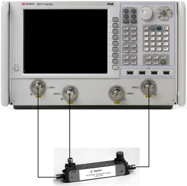
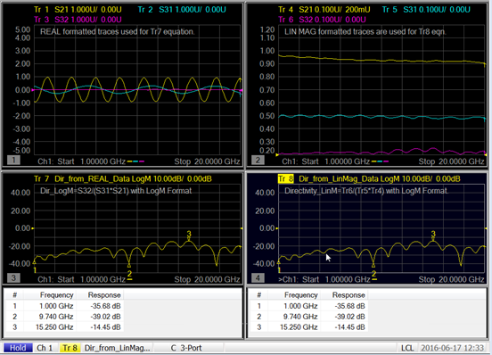

# 20 GHz Coupler Directivity Measurement Example

The purpose of this example is to show how to use the PNA Equation Editor to
create a directivity measurement trace, in order to measure a directional
coupler’s directivity easily. Two different methods, using measurement trace
data formatted differently are explained below. Results are displayed on the
bottom left and bottom right hand side windows of the PNA screen. It’s
important to note that either approach produces the same end result, as shown
with markers on both equation editor traces. Measurement trace selection and
formatting are _critical_ for making this work correctly.  _A user would only
need to use one method or the other, but both ways are explained._

  1. Set up the connections between the PNA and a directional coupler as shown below.

  1.      1. Connect PNA Port 1 to coupler's input port.

     2. Connect PNA Port 2 to coupler's output port.

     3. Connect PNA Port 3 to coupler's coupled port.

  2. Set up basic stimulus conditions for directional coupler's measurement.

     1. Preset the PNA.

     2. Set start frequency to 1 GHz.

     3. Set stop frequency to 20 GHz.

     4. Set power level to the default value.

     5. Set IFBW to 30 Hz.

  3. Make window setup, trace measurement, and formatting selections.

Establish four measurement windows on the display screen. Set up windows and
traces such that the left-hand side will show traces 1, 2, and 3 in upper left
window, as well as trace 7 in lower-left window. Corresponding to the DUT
connection diagram, traces 1, 2, and 3 will be S21, S31, and S32 measurements,
respectively; and all _must_ be formatted as **real**. Trace 7, an equation
editor trace, will be log magnitude formatted. Trace 7 will be a S11 trace
when it is created, but it will be modified to be a directivity equation trace
later.

For the right-hand side of the display screen, create traces 4, 5, and 6 in
upper-right window, as well as trace 8 in lower right window. Traces 4, 5, and
6, will also be S21, S31, and S32 measurements, respectively, but these traces
are formatted in **linear magnitude**. Trace 8, an equation editor trace, will
need to be log magnitude formatted, just like the lower-left window for
equation Trace 7. Trace 8 will be a S11 trace when it is created, but it will
be modified to be a directivity equation trace later, too.

  4. Create the directivity traces for Tr 7 and Tr 8 with the equation editor.

Tr 7 will use real formatted data from Tr 1, Tr2, and Tr3 in the equation.

  4.      1. Select Tr 7.

     2. From the Marker/Analysis menu, select Analysis, then Equation Editor....

     3. Enter the Equation as Dir_from_REAL_Data=S32/(S31*S21).

     4. Check the Enable Equation box.

     5. Click on OK.

Tr 8 will use linear magnitude formatted data from Tr 4, Tr 5, and Tr 6 in the
equation.

  1.      1. Select Tr 8.

     2. From the Marker/Analysis menu, select Analysis, then Equation Editor....

     3. Enter the Equation as Dir_from_LinMag_Data=Tr6/(Tr5*Tr4).

     4. Check the Enable Equation box.

     5. Click on OK.

Note: Window titles were added to show user comments about the traces in each
window. This is strictly optional, but if desired, window titles can be added
by doing the following:  
  
a. Select the Response menu, then choose Display, Labels, then Window
Title....  
b. In the Window Title dialog box, enter a meaningful title.  
c. Check the Enable box.  
d. Click on OK.

Note: To demonstrate the equivalent results of both equation editor methods
for directivity measurements, marker tables were set up for Tr 7 and Tr 8 in
windows 3 and 4, respectively. Again, this is optional, but recommended.

  5. Perform a 3-port calibration.

Note: An N4433A-010 ECal module was used in this example.

  6. Display directivity measurement results.

     1. Initiate a single sweep.

     2. Observe that Tr 7 and Tr 8 are the same.

## Discussion

In linear terms, the textbook equation for calculating a coupler's directivity
is:

_Directivity = Isolation - (Coupling + Loss)_

Using log rules, this equation becomes:

_Directivity = Isolation / (Coupling * Loss)_

The PNA equation editor has all the underlying data structures in complex
real/imag (linear) values. All the math in the textbook is also in linear
terms, so the equation needs to be Dir_from_LinMag_Data=Tr6/(Tr5*Tr4). That
equation was implemented in Tr 8.

The equation editor also returns the complex data structure in real/imag, so
to get directivity in dB, set the format to log magnitude for Tr 7 - just like
Tr 8. (And the equation is complex, so phase will be preserved for directivity
too, so you can think of this as directivity_re_im.)

For Tr 8 (in dB), the correct directivity is for isolation – (coupling +
loss). But since you cannot form this equation in equation editor, you have to
use the complex form. So you can refer to Tr 6, but the reference is to the
last complex result, not to the formatted trace.

This equation, Directivity_LogM=20*log(mag(S32/(S31*S21)), while correct (and
not used in this example), will result in the complex value being formed in dB
(you are formatting in the equation editor), so you would need to set the
format to real to see the dB value, oddly enough. So, it is best to use
Dir=S32/(S31*S21) and set the format as desired (e.g. Logmag) to get
directivity in dB.

