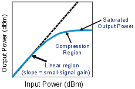
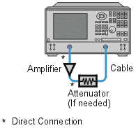

# Gain Compression

* * *

Gain compression measures the level of input power applied to an amplifier
that will cause a distorted output.

The [Gain Compression
Application](../Applications/Gain_Compression_Application.htm) (Opt S93086A/B)
makes fast and accurate compression measurements.

  * [What Is Gain Compression?](Gain_Comp.md#what)

  * [Why Measure Gain Compression?](Gain_Comp.md#why)

  * [Accuracy Considerations](Gain_Comp.md#accy)

  * [How to Measure Gain Compression](Gain_Comp.md#How)

[See other Amplifier Parameter topics](Amp_Param.md)

What Is Gain Compression?

Gain compression occurs when the input power of an amplifier is increased to a
level that reduces the gain of the amplifier and causes a nonlinear increase
in output power.

The analyzer has the ability to do power sweeps as well as frequency sweeps.
Power sweeps help characterize the nonlinear performance of an amplifier.
Refer to the graphic below (a plot of an amplifier's output power versus input
power at a single frequency) for the following discussion.

  * The amplifier has a linear region of operation where gain is constant and independent of power level. The gain in this region is commonly referred to as "small-signal gain."

  * As the input power increases, the amplifier gain appears to decrease, and the amplifier goes into compression.

  * The most common measurement of amplifier compression is the 1-dB compression point. This is defined as the input power (or sometimes the output power) which results in a 1-dB decrease in amplifier gain (relative to the amplifier's small-signal gain).

Why Measure Gain Compression?

When driven with a sinusoid, the output of an amplifier is no longer
sinusoidal in the compression region. Some of the amplifier output appears in
harmonics, rather than occurring only at the fundamental frequency of the
input signal.

As input power is increased even more, the amplifier becomes saturated, and
output power remains constant. At this point, further increases in amplifier
input power result in no change in output power.

In some cases (such as with TWT amplifiers), output power actually decreases
with further increases in input power after saturation, which means the
amplifier has negative gain.

Since gain is desired in amplifier operation, it is important to know the
limit of input signal that will result in gain compression.

Accuracy Considerations

The network analyzer must provide sufficient power to drive the amplifier into
saturation. If you need a higher input-power level than the source of the
analyzer can provide, use a preamplifier to boost the power level prior to the
amplifier under test. (See [High Power PNA-X](High_Power_PNA-X.md).) If using
a preamplifier, you can increase measurement accuracy in the following ways:

  * Use a coupler on the output of the preamplifier so that a portion of the boosted input signal can be used for the analyzer's reference channel. This configuration removes the preamplifier's frequency response and drift errors from the measurement (by ratioing).

  * Perform a thru-response calibration including the preamplifier, couplers, and attenuators in the test setup.

The output power of the amplifier should be sufficiently attenuated if
necessary. Too much output power could:

  * Damage the analyzer receiver

  * Exceed the input compression level of the analyzer receiver

Attenuation of the amplifier's output power can be accomplished using:

  * Attenuators

  * Couplers

The frequency-response effects of the attenuators and couplers must be
considered during calibration since they are part of the test system. Proper
error-correction techniques can reduce these effects.

  * The frequency response is the dominant error in a gain compression measurement setup. Performing a thru-response measurement calibration significantly reduces this error.

  * The amplifier may respond very differently at various temperatures. The tests should be done when the amplifier is at the desired operating temperature.

  * Reducing IF bandwidth or using measurement averages improves accuracy, at the expense of measurement speed.

How to Measure Gain Compression

This procedure shows you how to make the following three measurements used to
determine amplifier gain compression:

  1. A [Swept-Frequency Gain Compression](Gain_Comp.md#swout) measurement locates the lowest frequency at which the 1-dB gain compression first occurs.

  2. A [Swept-Power Gain Compression](Gain_Comp.md#swin) measurement shows the input power at which a in a 1-dB drop in gain occurs as a power ramp is applied to the amplifier at a particular frequency point (found in measurement 1).

  3. An [Absolute Power](Gain_Comp.md#absol) measurement shows the absolute power out (in dBm) at compression.

Swept-Frequency Gain Compression Measurement

A measurement of swept frequency gain compression locates the frequency point
where 1-dB compression first occurs.

  1. Preset the analyzer.

  2. Select an S21 measurement parameter.

  3. Set the analyzer's source power to be in the linear region of the amplifier's output response (typically 10-dB below the 1-dB compression point).

  4. Select an external attenuator (if needed) so the amplifier's output power will be sufficiently attenuated to avoid causing receiver compression or damage to the analyzer's port-2.

  5. Connect the amplifier as shown in the following graphic, and provide the dc bias.

  6. Select the analyzer settings for your amplifier under test. To reduce the effects of noise, you may want to specify a narrower IF bandwidth.

  7. Remove the amplifier and perform a thru-response calibration. Be sure to include the attenuator and cables in the calibration setup if they will be used when measuring the amplifier.

  8. Save the instrument-state to memory.

  9. Reconnect the amplifier.

  10. Position a marker at approximately mid-span.

  11. Adjust the analyzer's scale to 1 dB per division.

  12. Store the trace in memory and display Data/Mem.

  13. Gradually increase the source power until a 1-dB decrease in gain is observed at the first frequency over some portion of the trace.

  14. Use markers to locate the frequency where the 1-dB decrease in gain first occurs. Note this frequency for use in the following measurement.

  15. Print the data or save it to a disk.

Swept-Power Gain Compression Measurement

A swept-power gain compression measurement shows the input power resulting in
a 1-dB drop in gain as a power ramp at a particular frequency (found in step
13 of the previous measurement) is applied to the amplifier.

  1. If not already done, perform the previous measurement of swept-frequency gain compression.

  2. Setup an S21 measurement in the power-sweep mode. Include the following settings:

     * Set the CW frequency to the frequency noted in step 14 of the previous measurement of swept-frequency gain compression.

     * Enter the start and stop power levels for the sweep. The start power should be in the linear region of the amplifier's response (typically 10 dB below the 1-dB compression point). The stop power should be in the compression region of the amplifier's response.

  3. Adjust the scale to 1-dB per division.

  4. Use markers (including reference marker) to find the input power where the 1-dB decrease in gain occurs.

  5. Print the data or save it to a disk.

Absolute Output Power Measurement

An absolute-power measurement shows the absolute power-out (in dBm) of the
amplifier at compression.

  1. Select an unratioed (absolute) power measurement. Choose the B input if using the test setup in the previous graphic.

  2. Retain the CW frequency used in the previous measurement of swept-power gain compression.

  3. Set a marker to the input power level where the 1-dB decrease in gain occurs (found in step 4 of the previous measurement).

  4. Scale the displayed measurement for optimum viewing.

  5. Read the marker value to find the absolute output power of the amplifier (in dBm) where the 1-dB decrease in gain occurs.

  6. Print the data or save it to a disk.

Note: The measurement calibration does not apply to absolute power. Therefore,
if there is any attenuation external to the analyzer, you will have to correct
for it manually.

* * *

