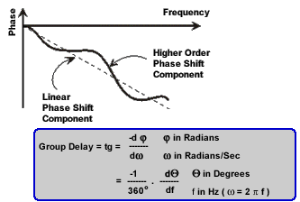
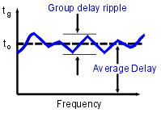
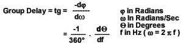
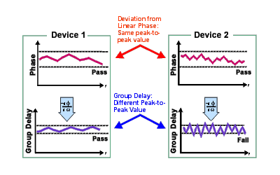
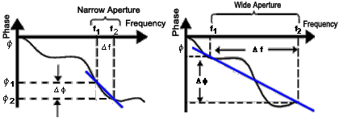
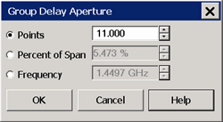
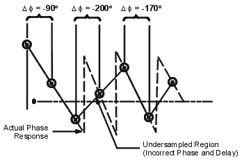

# Group Delay

* * *

Group delay is a measure of phase distortion. Group delay is the actual
transit time of a signal through a device under test as a function of
frequency. When specifying group delay, it is important to specify the
aperture used for the measurement.

  * [What is Group Delay?](Group_Delay6_5.md#group)

  * [Group Delay versus Deviation from Linear Phase](Group_Delay6_5.md#why)

  * [What Is Aperture?](Group_Delay6_5.md#aperture)

  * [Accuracy Considerations](Group_Delay6_5.md#accur)

  * [How to Measure Group Delay](Group_Delay6_5.md#How)

See also [Comparing the Delay
Functions.](Comparing_the_PNA_Delay_Functions.htm)

[See other Amplifier Parameter topics](Amp_Param.md)

What Is Group Delay?

Group delay is:

  * A measure of device phase distortion.

  * The transit time of a signal through a device versus frequency.

  * The derivative of the device's phase characteristic with respect to frequency.

Refer to the graphic below for the following discussion:

The phase characteristic of a device typically consists of both linear and
higher order (deviations from linear) phase-shift components.

Linear phase-shift component: |  Higher-order phase-shift component:  
---|---  
Represents average signal transit time. |  Represents variations in transit time for different frequencies.  
Attributed to electrical length of test device. |  Source of signal distortion.  
  
Refer to the graphic below for the following discussion:

In a group delay measurement:

  * The linear phase shift component is converted to a constant value (representing the average delay).

  * The higher order phase shift component is transformed into deviations from constant group delay (or group delay ripple).

  * The deviations in group delay cause signal distortion, just as deviations from linear phase cause distortion.

  * The measurement trace depicts the amount of time it takes for each frequency to travel through the device under test.

Refer to the following equation for this discussion on how group delay is
calculated:

  * Phase data is used to find the phase change (-df). 

  * A specified frequency aperture is used to find the frequency change (dw).

  * Using the two values above, an approximation is calculated for the rate of change of phase with frequency.

  * This approximation represents group delay in seconds (assuming linear phase change over the specified frequency aperture).

Group Delay versus Deviation from Linear Phase

Group delay is often a more accurate indication of phase distortion than
[Deviation from Linear Phase](Phase_Devi.md).

  
---  
Deviation from linear phase results are shown in the upper region of the
following graphic: Device 1 and device 2 have the same value, despite
different appearances.  
Group Delay results are shown in the lower region: Device 1 and device 2 have
different values of group delay. This is because in determining group delay,
the analyzer calculates slope of phase ripple, which is dependent on number of
ripples which occur per unit of frequency.  
  
What Is Aperture?

During a group delay measurement, phase is measured at two closely spaced
frequencies and then computes the phase slope. The frequency interval
(frequency delta) between the two phase measurement points is called the
aperture. Changing the aperture can result in different values of group delay.
The computed slope ( -delta phase / delta frequency) varies as the aperture is
increased. This is why when you are comparing group delay data, you must know
the aperture that was used to make the measurements.  
  
Refer to the graphic below for the following discussion:

Narrow aperture: |  Wide aperture:  
---|---  
Provides more detail in phase linearity. |  Provides less detail in phase linearity because some phase response averaged-out or not measured.  
Makes measurement susceptible to noise (smaller signal-to-noise ratio) and phase detector resolution. |  Makes measurement less susceptible to noise (larger signal-to-noise ratio).  
  
Group delay measurements can be made using the following [sweep
types](../S1_Settings/Sweep.htm#SweepTypeDiag):

  * Linear frequency

  * List frequency sweep segment - The group delay aperture varies depending on the frequency spacing and point density. Therefore the aperture is not constant in segment sweep. In segment sweep, extra frequency points can be defined to ensure the desired aperture.

#### How to set Group Delay Aperture  
  
---  
Using Hardkey/SoftTab/Softkey |  Using a mouse  
  
  1. Press Format > Format 1 > Group Delay Aperture...

|

  1. Click Response
  2. Select Format
  3. Select Group Delay Aperture

  
  
  

Group Delay Aperture dialog box help  
---  
Although the Group Delay Aperture is defined as the difference in frequency
between two data points (see [What Is
Aperture?](Group_Delay6_5.htm#aperture)), the group delay calculation can be
averaged over many adjacent data points, similar to the smoothing feature. The
number of adjacent data points can be set using any of the following methods:
Note: You can change the default Group Delay Aperture to two points using a
Preference. [Learn how.](../System/Preferences.md#Preferences) Points Number
of adjacent data points to average. Default setting is 11 points. Choose a
value between 2 and the current number of points in the channel. Percent of
Span The data points within this percentage of the current frequency span are
averaged. Choose a value between (2 points / current number of points) and 100
percent. The span must contain at least two data points. Frequency The data
points within this frequency range are averaged. The frequency range must
contain at least two data points. When the frequency span or number of points
is reduced so that the current Group Delay Aperture is NOT attainable, the
Aperture is adjusted to the new frequency span or number of points. OK Applies
setting changes and closes the dialog box. Cancel Closes the dialog. Setting
changes are NOT applied.  
  
  
Accuracy Considerations

It is important to keep the phase difference between two adjacent measurement
points less than 180° (see the following graphic). Otherwise, incorrect phase
and delay information may result. Undersampling may occur when measuring
devices with long electrical length. You can verify that the phase difference
measured between two adjacent points is less than 180° by adjusting the
following settings until the measurement trace no longer changes:

  * Increase the number of points

  * Narrow the frequency span

Electrical delay may also be used to compensate for this effect.

The frequency response is the dominant error in a group delay test setup.
Performing a thru-response measurement calibration significantly reduces this
error. For greater accuracy, perform a 2-port measurement calibration.

Particularly for an amplifier, the response may vary differently at various
temperatures. The tests should be done when the amplifier is at the desired
operating temperature.

How to Measure Group Delay

  1. Preset the analyzer.

  2. If your DUT is an amplifier, it may be necessary to adjust the source power:

     * Set the source power to be in the linear region of the amplifier's output response, typically 10 dB below the 1 dB compression point.

     * If needed, use an external attenuator so the amplifier output power will be sufficiently attenuated to avoid causing receiver compression or damage to test port 2.

  3. Connect the DUT as shown in the following graphic.

  4. Select an S21 measurement.

  5. Select the settings for your DUT:

     * frequency range

     * number of measurement points.

     * format: delay

     * scale: autoscale

  6. Remove the DUT and perform a measurement calibration.

  7. Reconnect the DUT.

  8. Scale the displayed measurement for optimum viewing.

  9. Use the Group Delay Aperture setting to increase the aperture, reducing noise on the trace while maintaining meaningful detail.

  10. Use the markers to measure group delay (expressed in seconds) at a particular frequency of interest.

  11. Print the data or save it to a disk.

* * *

